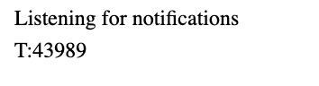

+++
title = "Lab 1: Artemis and Bluetooth"
date = 2026-02-03
weight = 12
[taxonomies]
tags = ["Robotics", "C++", "Sensors", "Python", "Embedded Software", "Microcontroller" ]
+++

## Lab 1A

During section 1A, I installed the Arduino IDE and the corresponding libraries and board manager following a given tutorial and hooked up a physical connection from my computer to communicate with the SparkFun RedBoard Artemis Nano. After selecting the correct Board (RedBoard Artemis Nano) and Port, I verified programming and serial communication by running the required example sketches:

* Basics_blink
* Apollo3_serial
* Apollo3_analogRead
* PDM_microphoneOutput

### Blink

The Artemis board flashed its onboard LED as expected.

<iframe width="450" height="315" src="https://youtube.com/embed/sc9GYfxh8Js" allowfullscreen></iframe> <figcaption>Blink test video</figcaption>

### Serial

The Artemis received a string over USB serial and echoed it back as I typed into the Serial Monitor, confirming serial RX/TX.

<iframe width="450" height="315" src="https://www.youtube.com/embed/2BgWrvYRqUY" allowfullscreen></iframe> <figcaption>Serial communication test</figcaption>

### AnalogRead with Temperature Sensor

The onboard temperature sensor responded to heat (touch/breath), showing changing readings over time. In this case, I was blowing hot air to increase the temperature.

<iframe width="450" height="315" src="https://youtube.com/embed/SCBCG4Kok9c" allowfullscreen></iframe> <figcaption>Temperature sensor test</figcaption>

### Microphone Output

The PDM microphone output changed with voice/whistle input, confirming the microphone pipeline works. In this case, I was whistling in the background to increase the sound frequency.

<iframe width="450" height="315" src="https://www.youtube.com/embed/r-GiDprUTt8" allowfullscreen></iframe> <figcaption>Microphone output test</figcaption>

Part A of this lab is mainly to set up and test if the microcontroller functions properly with the computer, which it does.

## Lab 1B

### Introduction

With regards to the prelab and background reading, this is what I understand:

Bluetooth Low Energy (BLE) enables a lightweight communication link between my computer and the Artemis board. At a high level:

* The Artemis acts as a BLE peripheral that advertises a service (UUID).
* The computer acts as the BLE central, connects to the advertised service, and interacts with characteristics.
* Characteristics support operations like Read, Write, and Notify. In this lab, I used Write to send commands to the Artemis and Notify to stream messages back to the laptop.

The code provided to me supports, including but not limited to, the following functionality:

* ble_arduino.ino: Arduino sketch running on the Artemis (defines service + RX/TX characteristics and command handling).
* RobotCommand.h: parses incoming command strings of the form `<cmd_type>:<value1>|<value2>|...`
* EString.h: safely constructs outgoing strings (including float formatting) without relying on printf float support.
* demo.ipynb: Python/Jupyter notebook used to connect, send commands, and receive notifications.

Useful functions:

* `ble.connect() / ble.disconnect()`
* `ble.send_command(cmd_type, data)`
* `ble.start_notify(uuid, handler)`
* `ble.bytearray_to_string(byteArray)`

### Setup

1. Installed virtual environment tooling: `python3 -m pip install --user virtualenv`
2. Created venv: `python3 -m venv FastRobots_ble`
3. Activated: `source FastRobots_ble/bin/activate`
4. Installed packages: `pip install numpy pyyaml colorama nest_asyncio bleak jupyterlab`
5. Started JupyterLab: `jupyter lab`
6. After running `uuid4()`, I updated connections.yaml with my Artemis MAC address (from the Serial Monitor) and a unique BLE service UUID.

<figure>

<figcaption>Artemis MAC address output</figcaption>
</figure>

<figure>

<figcaption>Updated connections.yaml (service UUID + MAC)</figcaption>
</figure>

7. Connected successfully to the Artemis Nano board in Python:

```python
ble = get_ble_controller()
ble.connect()

```

<figure>
 <figcaption>Successful BLE connection</figcaption>
</figure>

#### TASK 1

I sent a string from my computer using ECHO. The Artemis constructed an augmented reply and transmitted it back over the TX string characteristic.

Artemis:

```c++
/*
    * Add a prefix and postfix to the string value extracted from the command string
    */
case ECHO:
    // TASK 1 
    char char_arr[MAX_MSG_SIZE];

    // Extract the next value from the command string as a character array
    success = robot_cmd.get_next_value(char_arr);
    if (!success)
        return;

    tx_estring_value.clear();
    tx_estring_value.append("Robot says -> ");
    tx_estring_value.append(char_arr);
    tx_estring_value.append(" :)");
    tx_characteristic_string.writeValue(tx_estring_value.c_str());

    Serial.println(tx_estring_value.c_str());
    break;

```

Python:

```python
# TASK 1: Send an ECHO command with the string "Hello World!"
ble.send_command(CMD.ECHO, "Hello World!")
# Receive the echoed string from the RX_STRING characteristic and print it
echoed_string = ble.receive_string(ble.uuid['RX_STRING'])
print(echoed_string)

```

<figure>
 <figcaption>ECHO output received on laptop</figcaption>
</figure>

#### TASK 2

I sent three floats with SEND_THREE_FLOATS and extracted them on the Artemis.

Artemis:

```c++
case SEND_THREE_FLOATS:
    // TASK 2
    float float_c, float_d, float_e;

    // Extract the next value from the command string as a float
    success = robot_cmd.get_next_value(float_c);
    if (!success)
        return;

    // Extract the next value from the command string as a float
    success = robot_cmd.get_next_value(float_d);
    if (!success)
        return;

    // Extract the next value from the command string as a float
    success = robot_cmd.get_next_value(float_e);
    if (!success)
        return;

    Serial.print("Three Floats: ");
    Serial.print(float_c);
    Serial.print(", ");
    Serial.print(float_d);
    Serial.print(", ");
    Serial.println(float_e);

    break;

```

Python:

```python
# TASK 2 : Send a command to send 3 floats to the Artemis
ble.send_command(CMD.SEND_THREE_FLOATS, "11.0|-12.3|0.01")

```

<figure>
 <figcaption>SEND_THREE_FLOATS serial output</figcaption>
</figure>

#### TASK 3

I added `GET_TIME_MILLIS`, which replies with a timestamp string formatted as `T:<millis>`. The results of this task are shown in Task 4. I also had to add `GET_TIME_MILLIS` to `cmd_types.py` in the right order within the types file.

Artemis:

```c++
/*
    * Reply with the timestamp in a string
    */
case GET_TIME_MILLIS: {
    // TASK 3
    unsigned long now = millis();
    tx_estring_value.clear();

    char buf[MAX_MSG_SIZE];
    snprintf(buf, sizeof(buf), "T:%lu", now);
    tx_estring_value.append(buf);

    tx_characteristic_string.writeValue(tx_estring_value.c_str());
    // Serial.println(tx_estring_value.c_str());
    break;
}

```

#### TASK 4

I set up a minimal notification handler in Python to receive strings from the Artemis via BLE notifications.

Python:

```python
# TASK 4: Create a notification handler
def make_notification_handler(controller):
    def handler(sender: int, byte_array: bytearray):
        try:
            msg = controller.bytearray_to_string(byte_array)
            print(msg)
        except Exception:
            msg = bytes(byte_array).decode(errors="ignore")
        # Strip common C-string padding/line endings
        msg = msg.strip("\x00\r\n ")
    return handler

```

```python
# TASK 4: Test the notification handler by registering it and reading timestamps
handler = make_notification_handler(ble)
# ble.stop_notify(ble.uuid['RX_STRING'])
ble.start_notify(ble.uuid['RX_STRING'], handler)
print("Listening for notifications")
ble.send_command(CMD.GET_TIME_MILLIS, "") 

```

<figure>
 <figcaption>Notification handler receiving Artemis strings</figcaption>
</figure>

#### TASK 5

I ran a short for loop sending 50 `GET_TIME_MILLIS` repeatedly and used the timestamps received to estimate throughput. I wrote the for loop in the Jupyter notebook; equivalently, it is talking to the Artemis board 50 times via BLE.

Python:

```python
# TASK 5: Make a loop to send the GET_TIME_MILLIS command 50 times and process it using the notification handler
for i in range(50):
    ble.send_command(CMD.GET_TIME_MILLIS, "")

```

From the printed timestamps, the average inter-message gap was approximately 58.66 ms, corresponding to 17.05 messages/sec. Each message being 9 characters long means its payload is about 9 bytes (1 byte per character), giving an effective payload throughput of approximately:

data rate ≈ (messages/sec) × (bytes/message) = 153.43 bytes/sec

<figure>
 <figcaption>GET_TIME_MILLIS loop output</figcaption>
</figure>

#### TASK 6

I implemented an Arduino timestamp buffer (global array) of size 500 (arbitrary) and added `SEND_TIME_DATA` to send stored timestamps back to the laptop. You can request it for any integer number of times. It first stores the timestamps in the buffer by running `millis()` the requested number of times. Then it publishes the buffer results one by one to my computer. I added additional logic for handling the buffer overflow, which sends all the data once the buffer is full, then clears it and restarts the timestamp collection. This method balances the reliability of the data and the availability of data. Again, I had to add `SEND_TIME_DATA` to `cmd_types.py` in the right order within the types file.

* Advantage: Sampling happens locally without waiting for BLE round-trips.
* Implementation: Store up to capacity, then transmit and restart.

Artemis:

```c++
/*
    * SEND_TIME_DATA: Iterate over the stored timestamps and send each as a string
    */
case SEND_TIME_DATA:{
    // TASK 6 

    /* Serial.print("Sending ");
    Serial.println(" timestamps..."); */
    
    // Total number of timestamps wanted
    int interval;

    // Extract the next value from the command string as an int
    success = robot_cmd.get_next_value(interval);
    if (!success) return;

    int remaining = interval;

    while (remaining > 0) {

        // Number to sample in this chunk
        int n = remaining;
        if (n > TS_CAPACITY) {
            n = TS_CAPACITY;
        }

        // Fill buffer
        for (int i = 0; i < n; i++) {
            timestamps[i] = millis();
        }

        // Send this chunk
        for (int i = 0; i < n; i++) {
            tx_estring_value.clear();
            char ts_buf[MAX_MSG_SIZE];
            snprintf(ts_buf, sizeof(ts_buf), "T:%lu", timestamps[i]);
            tx_estring_value.append(ts_buf);
            tx_characteristic_string.writeValue(tx_estring_value.c_str());
        }

        remaining -= n;
    }

    break;
}

```

<figure>
 <figcaption>SEND_TIME_DATA output</figcaption>
</figure>

#### TASK 7

I added a second buffer array for temperature values (same length as timestamps = 500). Both are global arrays. Each index corresponds to a paired measurement. `GET_TEMP_READINGS` sends `T:<ms> , TEMP:<val>` on each line. It allows the users to request the number of times they want to get the data, and it fetches the current time and temp sequentially, ensuring their values are synchronized. The publishing and buffer overflow logic is handled just like TASK 6. Again, I had to add `GET_TEMP_READINGS` to `cmd_types.py` in the right order within the types file.

Artemis:

```c++
/*
    * GET_TEMP_READINGS: Send paired timestamp and temperature readings
    */
case GET_TEMP_READINGS: {
    // TASK 7
    
    // Total number of timestamp and temp readings wanted
    int interval;

    // Extract the next value from the command string as an int
    success = robot_cmd.get_next_value(interval);
    if (!success) return;

    int remaining = interval;

    while (remaining > 0) {

        // Number to sample in this chunk
        int n = remaining;
        if (n > TS_CAPACITY) {
            n = TS_CAPACITY;
        }

        // Fill buffer
        for (int i = 0; i < n; i++) {
            timestamps[i] = millis();
            tempreads[i] = getTempDegF();
        }

        // Send this chunk
        for (int i = 0; i < n; i++) {
            tx_estring_value.clear();
            tx_estring_value.append("T:");
            tx_estring_value.append(timestamps[i]);
            tx_estring_value.append(" , TEMP:");
            tx_estring_value.append(tempreads[i]);
            tx_characteristic_string.writeValue(tx_estring_value.c_str());
        }

        remaining -= n;
    }

    break;
}

```

<figure>
 <figcaption>Timestamp + temperature streaming</figcaption>
</figure>

#### TASK 8

Method 1 (Task 5) fetches and sends the data one at a time. It is definitely slower for recording because each sample depends on BLE command/response timing, wasting a lot of time sending and receiving communication. It is, however, useful for simple debugging and low-rate telemetry when real-time interaction matters. Especially, if we decided to have a really large buffer, the data might be stale by the time you get it on the computer side.

Method 2 (Tasks 6–7) fetches in volume and sends one at a time. It records data faster because the sampling is local; BLE is only used afterward to transmit stored results. This is ideal for burst logging and experiments where high-rate sampling matters more than immediate real-time feedback. The downside is the delayed availability of the data on the laptop, as I mentioned, and transmission can still be limited by notification throughput.

How quickly can Method 2 record data?
It is primarily limited by the sensor read and loop overhead on the Artemis. In my test sending 400 requests for `SEND_TIME_DATA`, recording 400 samples took approximately 13 ms, or roughly 0.03 ms/sample, which is almost 2000 times faster.

Memory estimate (384 kB RAM):
Each timestamp is 4 bytes (int), and each temp is 4 bytes (float) → 8 bytes per paired sample. Including the global variables I have, which take up 34,152 bytes, but ignoring other overhead, the theoretical upper bound is approximately:

349,848 bytes / 8 ≈ 43,731 sample pairs could potentially be stored in the array before the board runs out of dynamic memory.
A more realistic, safe capacity is lower, depending on current global/static memory usage reported by the Arduino IDE.

### Discussion and Conclusion

1. I learned how BLE services/characteristics map to read/write/notify behavior and how the Artemis acts as a peripheral device. I also learned to write commands to control the Artemis board using lower-level libraries like `RobotCommand.h`. Finally, I learned about the limits on how fast the Artemis's temperature sensor can be polled, which is really fast.
2. I implemented an interesting way of handling the buffer overflow for TASKS 6-7, balancing between the availability of data and the reliability of data.
3. The main debugging challenge was making sure that the environment was set up to run the Jupyter notebook. I spent way too long on it when it was just an easy fix. But now I really remember it. Also, I thought about perhaps sending the buffer information in one message, which would depend on how long I could make an EString. Theoretically, I can make it 255 bytes with the Arduino BLE limit, which for TASKS 5-6, is 20-30 messages depending on the length of the timestamp. Realistically, it would not impact the reliability of the data, because the data is already recorded in the buffer, but it can decrease the delay in the delivery of the data.

### Collaboration

I collaborated with: Ananya Jajodia.

I referenced: Lucca Correia's site for web design and lab writeup.

ChatGPT was used for: code debugging + website formatting.