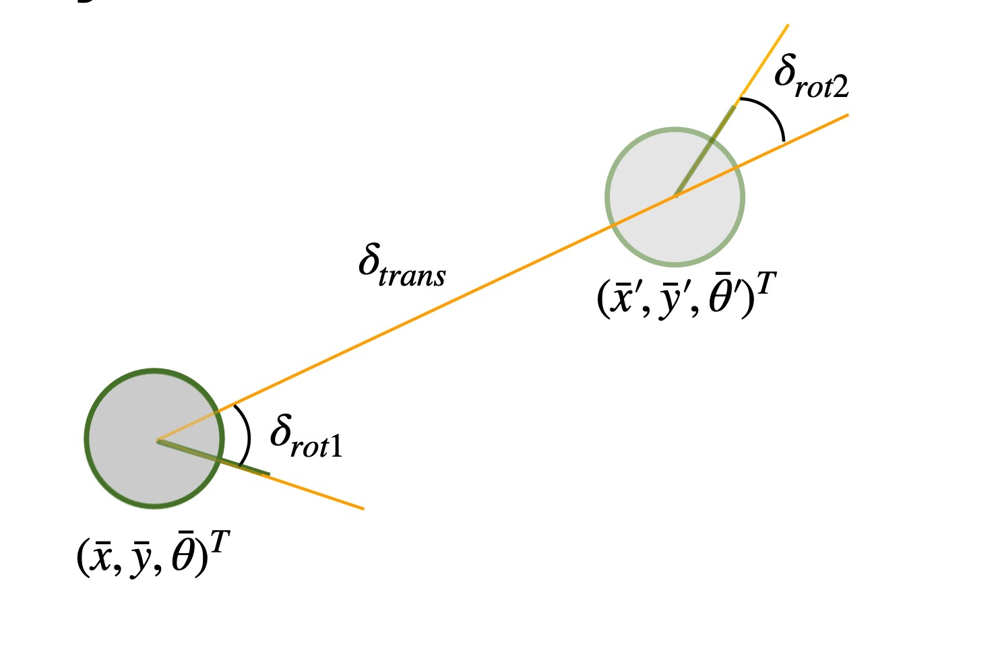

+++
title = "Lab 10: Grid Localization using Bayes Filter"
date = 2026-04-20
weight = 5
[taxonomies]
tags = ["Robotics", "Python", "Sensors", "Bayes Filter", "Algorithms"]
+++

## Overview

The robot doesn't know where it is on its own, so it has to figure out its position from ToF sensor readings, this is called localization. In this lab I implemented a Bayes filter, which keeps a running "belief" about where the robot thinks it is. Every time fresh sensor data or a control input comes in, the filter updates that belief through Bayesian inference. The goal of this lab is to get everything working in simulation before putting it on real hardware.

### Grid Localization Parameters

The robot's state is 3D: $(x, y, \theta)$. The arena spans roughly -5.5 to 6.5 ft in $x$, -4.5 to 4.5 ft in $y$, and $[-180°, +180°)$ in heading. Since we can't compute over a continuous space, the arena is chopped into a 3D grid of $(12, 9, 18)$ cells, each $1 \text{ ft} \times 1 \text{ ft} \times 20°$. Every cell holds a probability of the robot being there, and the whole grid sums to 1. After each update, the cell with the highest probability is our best guess at the robot's pose.


## Bayes Filter Architecture

The filter runs in a loop with two stages. The **prediction step** uses control inputs to forecast where the robot moved, and the **update step** corrects that guess by comparing expected sensor readings against the real ones.

<div style="background-color: #f4f4f4; padding: 20px; border-radius: 5px; font-family: 'Courier New', monospace; max-width: 600px; margin: 0 auto;">

**Algorithm** Bayes_Filter( $bel(x_{t-1}),\ u_t,\ z_t$ ) <br><br>
&nbsp;&nbsp;&nbsp;&nbsp;**for all** $x_t$ **do** <br>
&nbsp;&nbsp;&nbsp;&nbsp;&nbsp;&nbsp;&nbsp;&nbsp;$\overline{bel}(x_t) = \sum_{x_{t-1}} p(x_t \mid u_t, x_{t-1}) \, bel(x_{t-1})$ <br>
&nbsp;&nbsp;&nbsp;&nbsp;&nbsp;&nbsp;&nbsp;&nbsp;$bel(x_t) = \eta \, p(z_t \mid x_t) \, \overline{bel}(x_t)$ <br>
&nbsp;&nbsp;&nbsp;&nbsp;**end for** <br>
&nbsp;&nbsp;&nbsp;&nbsp;**return** $bel(x_t)$

</div>

### Odometry Motion Model

The control input $u$ is broken into an initial rotation, a translation, and a final rotation, which together describe any transition between two poses.

<figure>

<figcaption>Odometry model parameters: $\delta_{rot1}$, $\delta_{trans}$, and $\delta_{rot2}$.</figcaption>
</figure>

$$\delta_{rot1} = \operatorname{atan2}(\bar{y}' - \bar{y},\, \bar{x}' - \bar{x}) - \bar{\theta}$$

$$\delta_{trans} = \sqrt{(\bar{x}' - \bar{x})^2 + (\bar{y}' - \bar{y})^2}$$

$$\delta_{rot2} = \bar{\theta}' - \bar{\theta} - \delta_{rot1}$$


## Algorithm Implementation

### Compute Control & Motion Model

`compute_control()` pulls the three kinematic parameters out of two consecutive poses. `odom_motion_model()` then evaluates how likely a given transition is by plugging the actual and expected controls into Gaussians.

```python
import math
import numpy as np

def compute_control(cur_pose, prev_pose):
    x_prev, y_prev, yaw_prev = prev_pose
    x_cur, y_cur, yaw_cur = cur_pose

    delta_trans = math.hypot(x_cur - x_prev, y_cur - y_prev)
    delta_rot_1 = math.degrees(math.atan2(y_cur - y_prev, x_cur - x_prev)) - yaw_prev
    delta_rot_1 = mapper.normalize_angle(delta_rot_1)

    delta_rot_2 = yaw_cur - yaw_prev - delta_rot_1
    delta_rot_2 = mapper.normalize_angle(delta_rot_2)

    return delta_rot_1, delta_trans, delta_rot_2

def odom_motion_model(cur_pose, prev_pose, u):
    rot1, trans, rot2 = u
    delta_rot1, delta_trans, delta_rot2 = compute_control(cur_pose, prev_pose)

    p1 = loc.gaussian(delta_rot1, rot1, loc.odom_rot_sigma)
    p2 = loc.gaussian(delta_trans, trans, loc.odom_trans_sigma)
    p3 = loc.gaussian(delta_rot2, rot2, loc.odom_rot_sigma)

    return p1 * p2 * p3
```

### Prediction Step

This is the heavy computation stage. The grid has $12 \times 9 \times 18 = 1944$ cells, and a naive implementation considers every *(previous, current)* pair, so each tick loops over $1944^2 \approx 3.8$ million transitions. To keep things tractable, I skip any previous cell with belief below $0.0001$, since those barely contribute to the sum. The tradeoff is a small accuracy hit for a huge speedup. After accumulating the probabilities I normalize so the grid stays a valid distribution.

```python
def prediction_step(cur_odom, prev_odom):
    u = compute_control(cur_odom, prev_odom)
    loc.bel_bar = np.zeros((mapper.MAX_CELLS_X, mapper.MAX_CELLS_Y, mapper.MAX_CELLS_A))

    for cx in range(mapper.MAX_CELLS_X):
        for cy in range(mapper.MAX_CELLS_Y):
            for ca in range(mapper.MAX_CELLS_A):
                if loc.bel[cx, cy, ca] > 0.0001:
                    prev_pose = mapper.from_map(cx, cy, ca)
                    for cur_cx in range(mapper.MAX_CELLS_X):
                        for cur_cy in range(mapper.MAX_CELLS_Y):
                            for cur_ca in range(mapper.MAX_CELLS_A):
                                cur_pose = mapper.from_map(cur_cx, cur_cy, cur_ca)
                                prob = odom_motion_model(cur_pose, prev_pose, u)
                                loc.bel_bar[cur_cx, cur_cy, cur_ca] += prob * loc.bel[cx, cy, ca]

    loc.bel_bar /= np.sum(loc.bel_bar)
```

### Sensor Model & Update Step

I vectorized the update step to avoid looping over every cell. By reshaping the raw sensor readings and broadcasting them against the cached `mapper.obs_views` array, NumPy computes all 18 sensor likelihoods across the entire grid in one shot. This is a huge speedup over the nested-loop version if I used the sensor_model function and it still implements the same Bayesian update:

$$p(z_t \mid x_t, m) = \prod_{k=1}^{18} p(z_t^k \mid x_t, m)$$

```python
def update_step():
    actual_obs = loc.obs_range_data.flatten().reshape(1, 1, 1, mapper.OBS_PER_CELL)
    likelihoods = loc.gaussian(mapper.obs_views, actual_obs, loc.sensor_sigma)
    cell_likelihoods = np.prod(likelihoods, axis=3)

    loc.bel = cell_likelihoods * loc.bel_bar
    loc.bel /= np.sum(loc.bel)
```

## Simulation & Results

The video below shows the filter localizing along a pre-planned rectangular path. Red is the raw odometry estimate, green is ground truth, and blue is the Bayes filter's belief. The odometry drifts badly, you can see it shoot off the map entirely in the bottom right and overshoot again near the top, but the blue belief tracks green closely the whole way around the obstacle. The white cells behind the robot visualize the belief grid, brighter means higher probability, and I'm ignoring anything below $0.0001$.

<iframe width="450" height="315" src="https://youtube.com/embed/DMEheQDtAwY" allowfullscreen></iframe>
<figcaption>Bayes simulation tracking ground truth vs. odometry.</figcaption>

The filter works noticeably better near obstacles. This is probably because ToF sensors are more stable at short ranges, so readings there carry more useful information. In the open middle of the arena there aren't many nearby things to lock onto, and the belief gets a bit fuzzier. Still, across the full trajectory the Bayes estimate consistently tracked ground truth far better than odometry alone.

## Collaboration
I referenced Lucca Correia's site while debugging the filter and putting together the video demo.