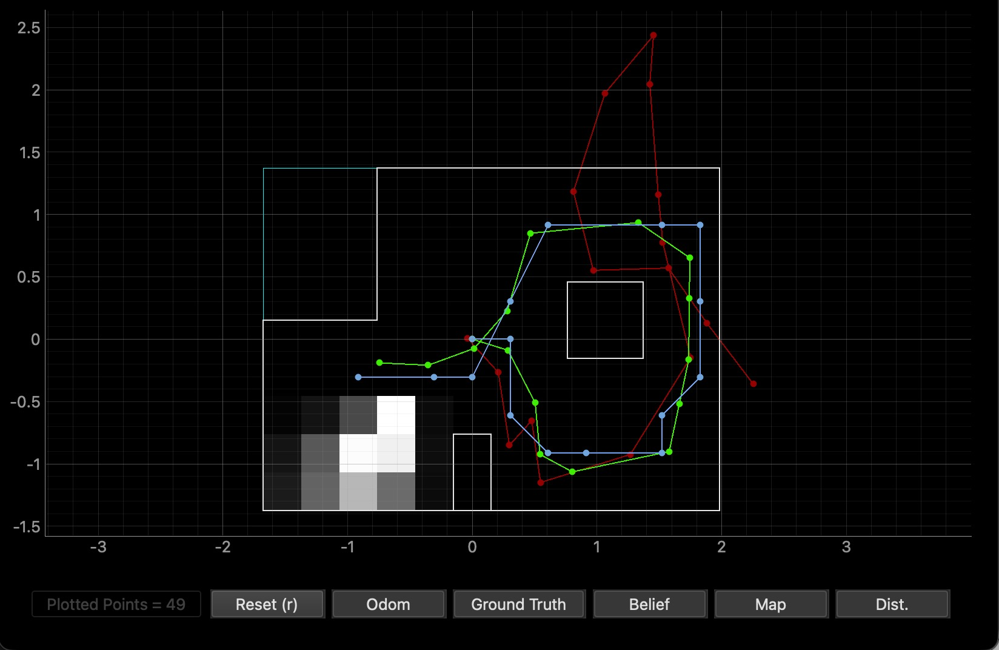
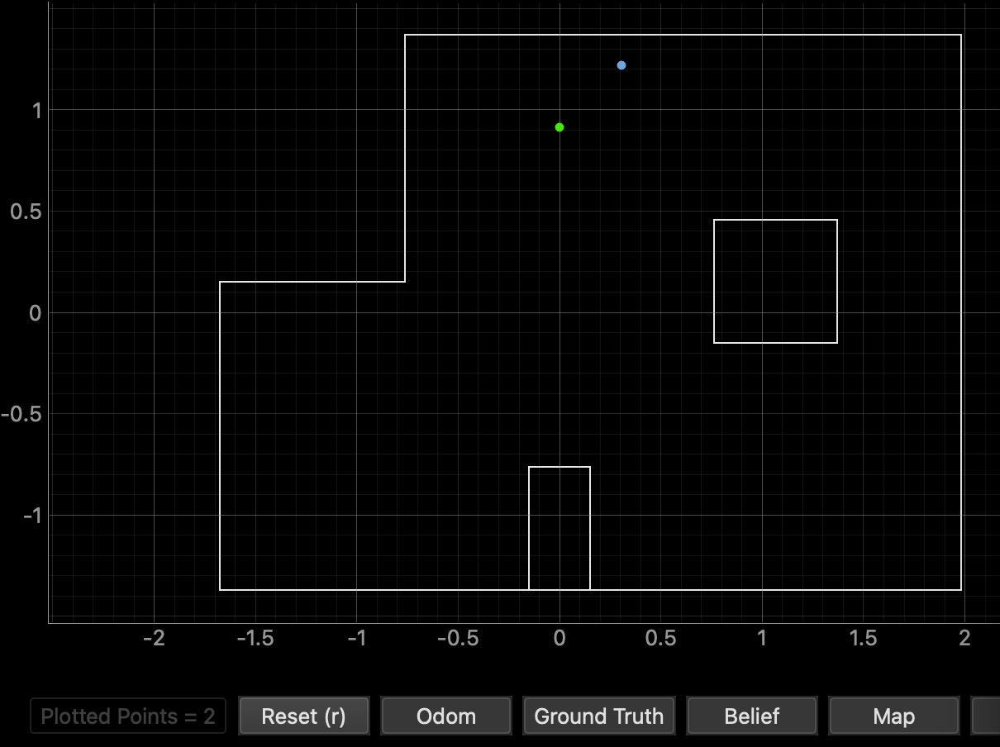
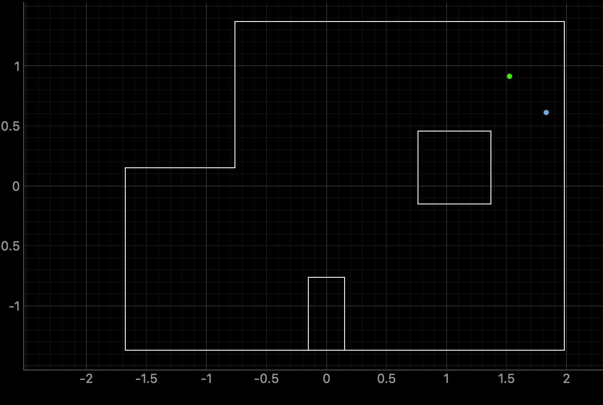
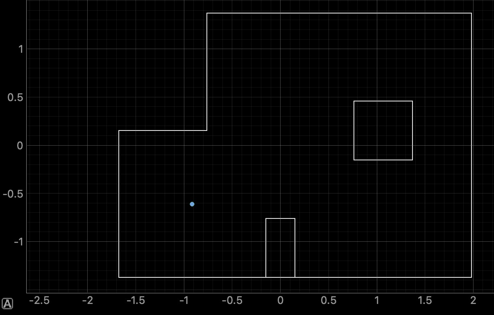
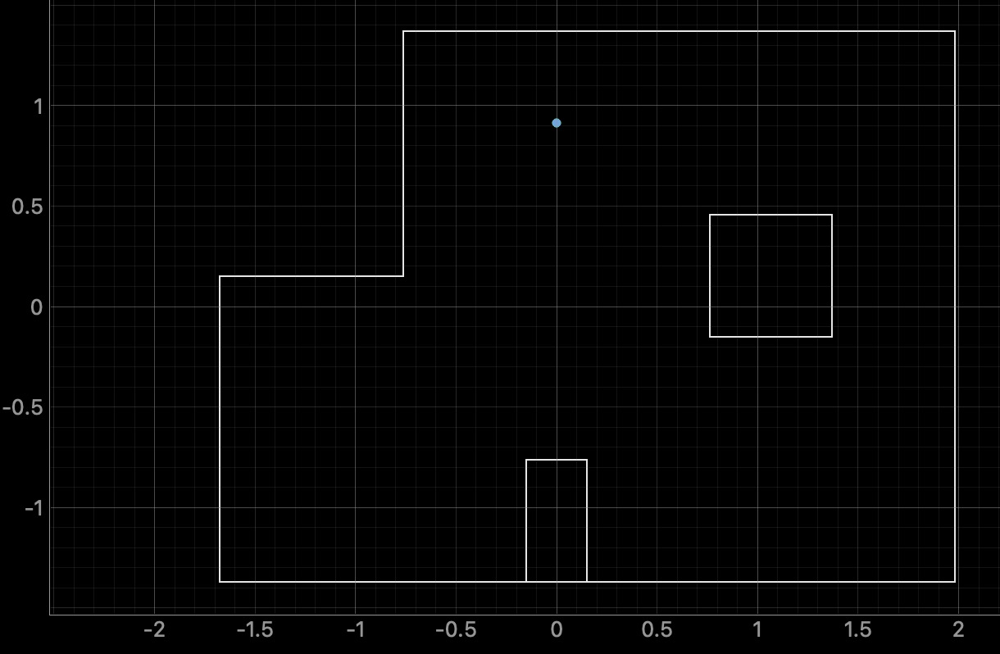
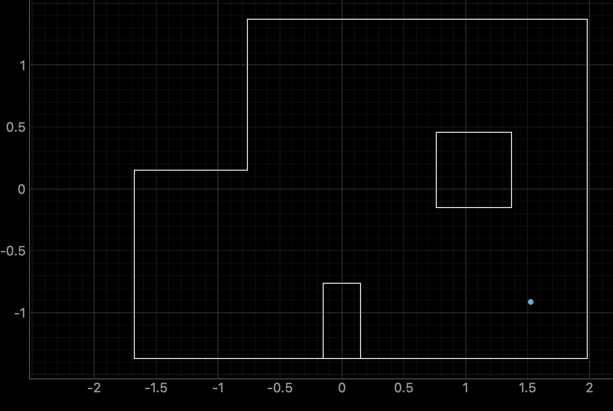
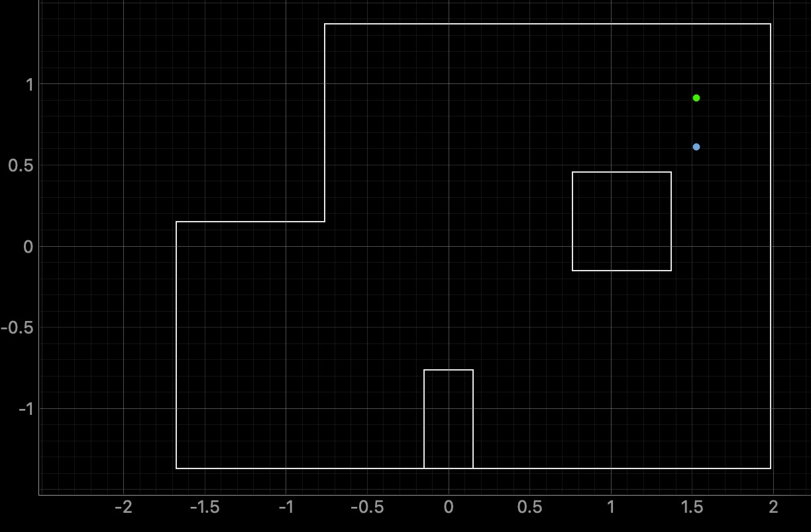
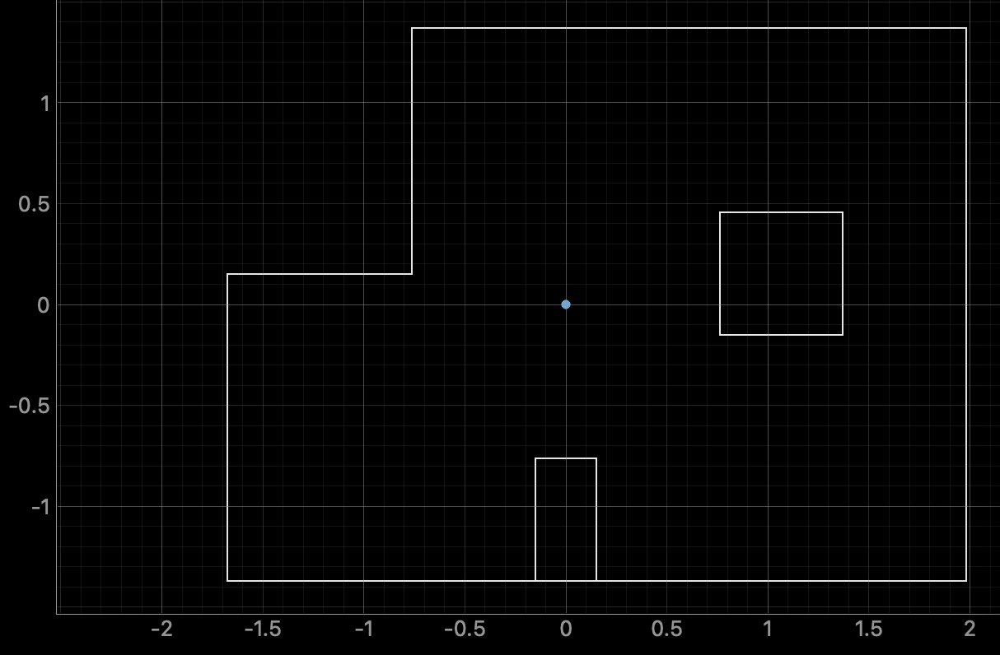

+++
title = "Lab 11: Localization on the Real Robot"
date = 2026-04-27
weight = 2
[taxonomies]
tags = ["Robotics", "C++", "Sensors", "Python", "Embedded Software", "Microcontroller", "Bayes Filter", "Localization" ]
+++

## Introduction

Lab 10 implemented the Bayes filter in simulation. This lab implements it directly on the RC car. Because the motion model is too noisy to be useful on the car, we only run the **update step** run, against a uniform prior. The robot does a single 360° scan, the filter processes 18 range readings, and we see how well a single observation can pin down position.

I am using the provided solution as an optimized filter (`localization_extras.py`), as well as an accurate map of the world. I need to implement the 360° scan and localize the robot in a discretized map using the Bayes filter.  

## Verifying the Filter in Simulation

Running `lab11_sim.ipynb` produced the expected behavior. The filter belief stays close to ground truth across the whole trajectory, even as the odometry drifts off course. This is very similar to the result I get from lab 10. 


<figcaption>Bayes filter trajectory in simulation</figcaption>

- **Blue:** filter belief
- **Red:** odometry-only estimate
- **Green:** ground truth

## Real Robot Pipeline

### Arduino: Single 360 degree Scan 

I added a new BLE command, `LOCALIZE`, alongside Lab 9's existing `MAP` command. Where mapping does a 720° dual-pass at 12° increments, localization does **18 readings spaced at 20°** for one full rotation.

The hardest part wasn't the rotation itself, because my PID is already tuned pretty well. It was knowing precisely when the robot was still enough to take a measurement. A fixed 2-second wait per setpoint left the robot oscillating at some turns when the ToF fired, adding noise to the angular accuracy of each reading. 

My fix to this was active settle detection. The PID drives toward each 20° target; once heading error stays within ±1.5° for 400 ms continuously, the motors brake hard for another 100 ms before the ToF capture fires. Only then does it advance to the next target. This made the scan reliable while still keeping it reasonably fast.

```cpp
while (rot_counter < 18 && BLE.central().connected()) {
    uint32_t step_start_time = millis();
    uint32_t in_tolerance_since = 0;
    bool settled = false;

    while (!settled && BLE.central().connected()) {
        uint32_t current_time = millis();

        readIMUFIFO();
        get_roll_pitch_yaw(0);
        float curr_yaw = yaw_readings[0];
        float e = curr_yaw - target_turn;
        if (e > 180.0)       e -= 360.0;
        else if (e < -180.0) e += 360.0;

        // Apply PID; brake if inside the deadband
        int motor_out = (int)(Kp*e + Ki*error_total + Kd*error_change);
        if (abs(e) < ANGLE_TOLERANCE) {
            brakeMotors();
        } else if (motor_out > 0) {
            motor_out = constrain(motor_out, PWM_FLOOR, PWM_CEILING);
            setMotors(motor_out, -motor_out);
        } else {
            motor_out = constrain(motor_out, -PWM_CEILING, -PWM_FLOOR);
            setMotors(motor_out, -motor_out);
        }

        // Settle detection: must stay in tolerance continuously
        if (abs(e) < ANGLE_TOLERANCE) {
            if (in_tolerance_since == 0) in_tolerance_since = current_time;
            if ((current_time - in_tolerance_since >= SETTLE_TIME_MS) &&
                (current_time - step_start_time >= MIN_STEP_MS)) {
                settled = true;
            }
        } else {
            in_tolerance_since = 0;
        }
    }

    // Capture ToF reading with the robot idle
    brakeMotors();
    delay(100);
    if (distanceSensor1.checkForDataReady()) {
        tof1_disc[disc_idx] = distanceSensor1.getDistance();
    }
    yaw_disc[disc_idx] = yaw_readings[0];
    disc_idx++;

    // Step the target 20° CCW; reset PID state between steps
    target_turn -= 20.0;
    if (target_turn < -180.0) target_turn += 360.0;
    error_total = 0;
    last_error  = 0;
    rot_counter++;
}
```

Two non-obvious details. First, my IMU reports yaw as decreasing during CCW rotation. I discovered this back in Lab 9 when my mapping function turned clockwise instead of CCW, and I had to flip my map across the y=x line to correct for it. So in this scan I decrement target_turn by 20° per step to physically rotate CCW. Second, resetting error_total between steps prevents integral windup from biasing the next approach.

### Python: Pass the Scan Into the Filter

`RealRobot.perform_observation_loop()` invokes the BLE scan, accumulates the 18 streamed readings, and returns them as column arrays. It also auto-corrects the rotation direction by inspecting the IMU sign convention from the data itself.

```python
def perform_observation_loop(self, rot_vel=120):
    self._ranges_m.clear(); self._yaws_deg.clear()
    self._receiving = False; self._done = False

    self.ble.start_notify(self.ble.uuid['RX_STRING'], self._localize_handler)
    self.ble.send_command(CMD.LOCALIZE, "1.5|0.05|0.1")  

    t0 = time.time()
    while not self._done and (time.time() - t0) < 60:
        time.sleep(0.2)
    self.ble.stop_notify(self.ble.uuid['RX_STRING'])

    ranges = np.array(self._ranges_m, dtype=float)
    yaws_unwrapped = np.rad2deg(np.unwrap(np.deg2rad(np.array(self._yaws_deg))))

    # Detect IMU rotation convention from the data itself
    if np.mean(np.diff(yaws_unwrapped)) > 0:
        yaws_rel_deg = yaws_unwrapped - yaws_unwrapped[0]
    else:
        yaws_rel_deg = -(yaws_unwrapped - yaws_unwrapped[0])

    if len(ranges) > 18:
        ranges = ranges[:18]; yaws_rel_deg = yaws_rel_deg[:18]

    return ranges[np.newaxis].T, yaws_rel_deg[np.newaxis].T
```

The notification handler parses the Arduino's `time:yaw:tof1:tof2` strings, converts ToF readings from millimeters to meters, and signals completion on receiving `DONE_MAP`. 

When I first ran this, I noticed my RC car did an okay job doing the rotation. I did some tuning, which made it a lot better, and I was able to get some really good localization results. However, as my battery drained, my turns started to degrade again, and so did my localization results. This reminded me of Lab 5 and Lab 6 where the same issue happened before. Here are some bad localization: 


<figcaption>Bad localization at (0, 3)</figcaption>


<figcaption>Bad localizatin at (5, 3)</figcaption>

After I replaced my battery, I was able to go back to my originally tuned PID gains and got better localization results.

## Localization Results

I ran the update step at each of the four marked grid positions, plus an additional (0,0) spot, starting from a uniform prior. **Green** is ground truth; **blue** is the most likely cell from the filter.

<details>
<summary><strong>(-3, -2)</strong></summary>


<figcaption>Belief vs. ground truth at (-3, -2)</figcaption>

<iframe width="450" height="315" src="https://www.youtube.com/embed/rvKvDf84wlo" allowfullscreen></iframe>
<figcaption>Update step at (-3, -2)</figcaption>

</details>

<details>
<summary><strong>(0, 3)</strong></summary>


<figcaption>Belief vs. ground truth at (0, 3)</figcaption>

<iframe width="450" height="315" src="https://www.youtube.com/embed/YI2PUDUP7lg" allowfullscreen></iframe>
<figcaption>Update step at (0, 3)</figcaption>

</details>

<details>
<summary><strong>(5, -3)</strong></summary>


<figcaption>Belief vs. ground truth at (5, -3)</figcaption>

<iframe width="450" height="315" src="https://www.youtube.com/embed/LxDthlAkrXs" allowfullscreen></iframe>
<figcaption>Update step at (5, -3)</figcaption>

</details>

<details>
<summary><strong>(5, 3)</strong></summary>


<figcaption>Belief vs. ground truth at (5, 3)</figcaption>

<iframe width="450" height="315" src="https://www.youtube.com/embed/wLfYSopqFc0" allowfullscreen></iframe>
<figcaption>Update step at (5, 3)</figcaption>


</details>

<details>
<summary><strong>(0, 0)</strong> — bonus origin test</summary>


<figcaption>Belief vs. ground truth at (0, 0)</figcaption>

<iframe width="450" height="315" src="https://www.youtube.com/embed/tmtGkR4kjDw" allowfullscreen></iframe>
<figcaption>Update step at (0, 0)</figcaption>


</details>

## Best Localization Summary

| Marked Pose (ft, ft, °) | Ground Truth (m, m, °) | Filter Belief (m, m, °) | Cell Probability |
| ---- | ---- | ------- | --- |
| \(-3, -2, 0\) | \(-0.914, -0.610, 0\) | \(-0.914, -0.610, 10.000\) | 1.000 |
| \(0, 3, 0\) | \(0.000, 0.914, 0\) | \(0.000, 0.914, -10.000\) | 1.000 |
| \(5, -3, 0\) | \(1.524, -0.914, 0\) | \(1.524, -0.914, 10.000\) | 0.999 |
| \(5, 3, 0\) | \(1.524, 0.914, 0\) | \(1.524, 0.610, -10.000\) | 0.993 |
| \(0, 0, 0\) | \(0.000, 0.000, 0\) | \(0.000, 0.000, -10.000\) | 1.000 |

## Discussion

Looking at each of the pose plots and the summary table, the filter localized 4 of the 5 spots with very high probability. The position estimate was always within one discretized cell of ground truth, and the orientation was off less than 20° angular bin. The orientation offset of ±10° from ground truth is the closest the filter can get when the true heading sits exactly on a bin boundary. The only spot the filter couldn't get exactly was (5, 3), where it returned (5, 2). That's still within one cell, but a bit further off than the other poses.

I also noticed the car had a harder time localizing at the top of the map, (0, 3) and (5, 3), and a few people I talked to in lab said the same. That suggests something about the geometry up there (sparse walls, fewer distinctive ToF fingerprints) or environment factors (the floor is not leveled) makes the sensor model less informative in that region.

Lastly, I experimented with sensor_sigma in world.yaml. Increasing it gave noticeably worse localization, which suggests the default sensor_sigma = 0.1 is well-calibrated for my sensor's actual noise level.   

## Collaboration
I referred to Adian McNay's site for how to format the lab report.