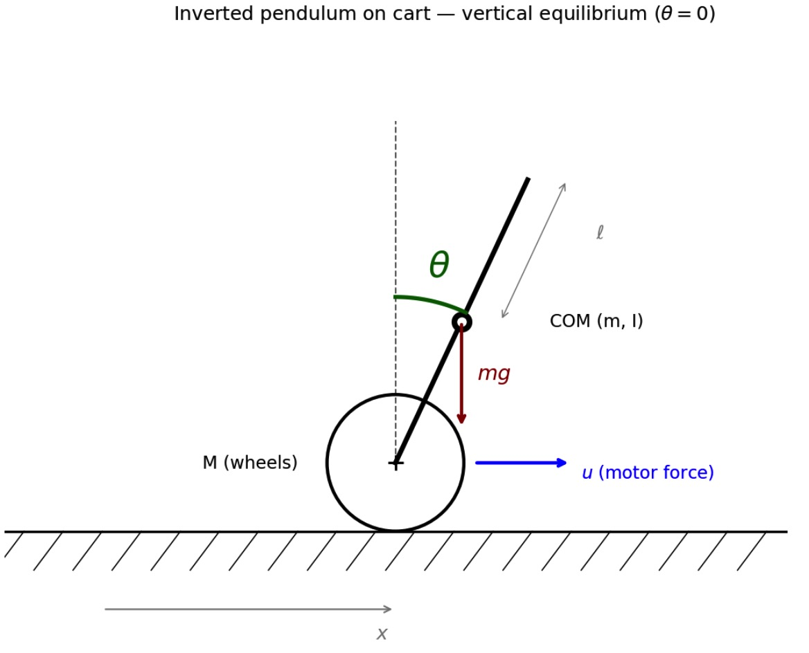
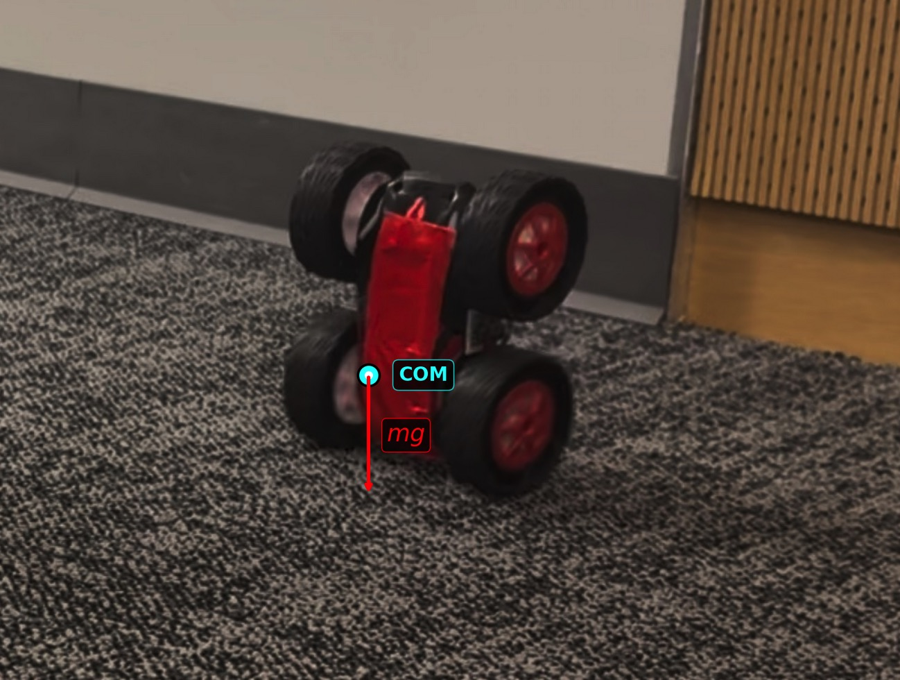

+++
title = "Lab 12: Inverted Pendulum"
date = 2026-05-13
weight = 1
[taxonomies]
tags = ["LQR Controller", "C++", "Sensors", "Embedded Software", "Nonlinear Dynamic", "Kalman Filter"]
+++

# Overview

I drew inspiration from two prior writeups —
[Aravind Ramaswami's wheelie report](https://anunth-r.github.io/Fast-Robots/lab_9000.html)
(Kalman + pole-placement) and
[Stephan Wagner's Lab 12 report](https://fast.synthghost.com/lab-12-inverted-pendulum-control/)
(hand-tuned PD, no observer). With Dyllan Hofflich and Tina Cheng, our final
solution lands closer to Stephan's.

The inverted pendulum is a very famous unstable nonlinear system — a small
disturbance from vertical grows exponentially unless the controller can
inject a corrective force faster than the car falls. On our hardware the
fall-time constant is about 70 ms, which sets a hard lower bound on the
control loop rate. The lab broke into three pieces: model the car as a
pendulum on a cart, build a real-time balance controller at $\theta = 0$,
and add a launch state machine to flip the car up from horizontal.

## System Modeling

### Pendulum-on-cart geometry

A wheel of mass $M$ translates along $x$, with a rigid rod of mass $m$ and
moment of inertia $I$ attached to its axle. The rod's COM is a distance
$\ell$ above the wheel center. State vector:

$$
\mathbf{x} = \begin{bmatrix} x \\ \dot x \\ \theta \\ \dot\theta \end{bmatrix}.
$$




### Lagrangian and equations of motion

With $T_w = \tfrac{1}{2}M\dot x^2$,
$T_p = \tfrac{1}{2}m\,[(\dot x + \ell\dot\theta\cos\theta)^2 + (\ell\dot\theta\sin\theta)^2] + \tfrac{1}{2}I\dot\theta^2$,
and $V = mg\ell\cos\theta$, the Lagrangian
$\mathcal{L} = T_w + T_p - V$ gives:

$$
(M + m)\,\ddot x + m\ell\,\ddot\theta\cos\theta - m\ell\,\dot\theta^2\sin\theta = u
$$
$$
(I + m\ell^2)\,\ddot\theta + m\ell\,\ddot x\cos\theta - mg\ell\sin\theta = 0
$$

### Linearization about vertical

Substituting $\sin\theta \approx \theta$, $\cos\theta \approx 1$,
$\dot\theta^2 \approx 0$ linearizes the coupled equations around the
upright equilibrium. Since the car has no wheel encoder and I can't ready the cart's absolute position, I drop the
$x$ row entirely — penalizing $x$ in $Q$ wouldn't actually make the
controller know where the cart is. The reduced 2-state model in
$[\theta,\ \dot\theta]$ becomes:

$$
\dot{\mathbf{x}} = A\mathbf{x} + B u, \quad
A = \begin{bmatrix} 0 & 1 \\ \alpha_1 & 0 \end{bmatrix}, \quad
B = \begin{bmatrix} 0 \\ \alpha_2 \end{bmatrix}
$$

with $\alpha_1, \alpha_2$ aggregating $g$, $\ell$, $m$, $M$, $I$. The
positive entry $\alpha_1$ on the off-diagonal is what makes the upright
equilibrium unstable — its square root is the divergent eigenvalue of
$A$, the reciprocal of the fall-time constant. I initialize
$\alpha_1 \approx 6.21$, $\alpha_2 \approx 60$ from Aravind's report as a starting point.  
I will retune the constants by hands later.

## Controller Design

### LQR for principled gain selection

LQR produces gains that optimally
trade off state error against control effort. The cost
$J = \int_0^\infty \mathbf{x}^\top Q\,\mathbf{x} + R u^2\, dt$
gives optimal feedback $K = R^{-1} B^\top P$, where $P$ solves the
continuous-time algebraic Riccati equation:

$$
A^\top P + P A - P B R^{-1} B^\top P + Q = 0.
$$

I weighted $Q$ heavily on $\theta$ (100) and lightly on $\dot\theta$ (1),
with $R = 1$ — penalize pose error, tolerate motion, don't over-penalize
the motor:

```python
import numpy as np
from scipy.linalg import solve_continuous_are

A = np.array([[0, 1], [6.21, 0]])
B = np.array([[0], [60.0]])
Q = np.diag([100.0, 1.0])
R = np.array([[1.0]])

P = solve_continuous_are(A, B, Q, R)
K = np.linalg.inv(R) @ B.T @ P
print("LQR gains [Kp, Kd]:", K.ravel())
```

Result: $K_p \approx 0.04$, $K_d \approx 0.005$

### Why PD with hand-tuned gains in the end

The LQR output assumes the control input is in Newtons, but my firmware
issues signed PWM (−255 to +255). Converting between them requires a
force-to-PWM constant $k_f$ that I never measured, which left my LQR
gains dimensionally inconsistent with the motor command. I converged on
PD gains by hand instead, using the LQR ratio of $K_p:K_d$ as a starting
point:

| Parameter | Value | Why |
|---|---|---|
| $K_p$ | 15.0 | 5° error → 75 PWM, above motor deadband |
| $K_d$ | 1.0  | Rate damping to avoid oscillation |
| $max pwm$ | 255 | Full authority for large disturbances |
| target pitch | +90° | Wheelie orientation in my IMU mounting |

The reference's $K_p = 4$, $K_d = 0.2$ were sub-deadband: 5° → 20 PWM
didn't move the wheels at all, then larger errors slammed past — a
limit-cycle recipe. Tripling $K_p$ moved every meaningful correction
above the motor's static-friction threshold.

### Control law in firmware

```cpp
if (stunt_state == IPEND_HOLD) {
    float pitch_rate_dps = +latest_gx;
    float deviation      = latest_pitch_comp - ipend_cfg.target_pitch_deg;
    float u              = ipend_cfg.Kp * deviation
                         + ipend_cfg.Kd * pitch_rate_dps;
    int   pwm            = (int)constrain(u, -ipend_cfg.max_pwm,
                                              +ipend_cfg.max_pwm);
    setLeftMotor(pwm);
    setRightMotor(pwm);
}
```

Both wheels get the same signed PWM — no differential needed.

## IMU State Estimation

I tried Aravind's Kalman observer first, but the estimate drifted
unpredictably during fast maneuvers — translational acceleration from
the cart kept contaminating the accelerometer pitch, the filter couldn't
distinguish it from a true tilt, and the controller would saturate on
phantom angles. After a couple of sessions tuning $\Sigma_u$ and
$\Sigma_z$ to no avail, I went back to the complementary filter I
already used in earlier labs:

```cpp
pitch_lpf_state = ALPHA_LPF * pitch_acc + (1 - ALPHA_LPF) * pitch_lpf_state;
pitch_comp_state = (1 - ALPHA_COMP) * (pitch_comp_state + pitch_rate * dt)
                 + ALPHA_COMP * pitch_lpf_state;
```

The intuition is that the gyro is accurate on short timescales but drifts
when integrated; the accelerometer is noisy on short timescales but
absolute on long ones. With `ALPHA_LPF = 0.10` and `ALPHA_COMP = 0.05`,
the filter trusts the gyro between frames and gently pulls toward the
accel pitch over hundreds of milliseconds. At 50 Hz this is essentially
as good as Kalman, with zero hyperparameters to retune per stunt.

### Axis-swap calibration

My IMU was mounted rotated 90° about the car z-axis, so car pitch
showed up on IMU-y instead of IMU-x. I verified this by walking the car
through five orientations and noting which accel channel saturated to ±1 g in each. Fixed by
swapping which axes feed pitch and roll:

```cpp
latest_pitch_acc = atan2(latest_ay, latest_az) * 180.0f / M_PI;
latest_roll_acc  = atan2(latest_ax, latest_az) * 180.0f / M_PI;
float pitch_rate = +latest_gx;
```

## Switching Strategies: From My Car to Dyllan's

After days of fighting motor deadband and surface friction on my own car,
I switch to path planning on the last day to have a complete
deliverable. Coming back to the pendulum with Dyllan and Tina, we ran my PD
code on Dyllan's car and it balanced for a couple of seconds, my controller was actually decent for Ananya's car. 
We then committed to Dyllan's full LQR formulation and tuned it together; the results below come from his
car.


### Why Dyllan's LQR was a better starting point

Three reasons, all in his
[Lab 12 report](https://spike-h.github.io/fastRobots/lab12.html). First,
cart velocity is a state: his 3-state model
$[\dot x,\ \theta,\ \dot\theta]$ keeps $\dot x$ in the loop, estimated
from a lowpass of commanded PWM as a "soft encoder." This preserves the
mass-matrix off-diagonal coupling — the momentum-conservation effect
where pushing the cart forward tilts the body back — that my 2-state
model throws away. Second, parallel-axis inertia handled rigorously:
he writes $\alpha = I_{b,\text{com}} + m_b L^2$ explicitly, which gives
a physical fall-time constant $\tau \approx 70$ ms and tells us the
control loop has to run at least 5× faster — a bandwidth target my
borrowed-$\alpha_1$ model could not produce. Third, calibration
divides into $K$: his notebook divides the LQR output by a measured
$k_f$ (force-to-PWM), producing unit-correct gains straight from
`solve_continuous_are` — the step that would have made my LQR
implementation actually deployable.

One physical insight came out of his flip-up attempt: mass at the top
makes balance easier, because higher $I_{b,\text{com}}$ lengthens the
fall-time constant. We taped weights to the top for the final tuning
runs and it visibly stabilized the pole — a fix that runs against the
naive "lower COM is better" intuition.

## Wheelie Launch State Machine

The launch sequence is the "rip the rug" pattern: drive forward to build
linear momentum, brake hard to plant the front wheels, then reverse the
motors. The wheels yank the contact point backward while the car's
inertia keeps it moving forward, and the mismatch generates a
forward-pitching torque about the front axle that lifts the rear into
a wheelie. Once $|\theta| > 30°$, the FSM hands off to the balance
controller. The FSM has one interesting state (`BALANCE`); everything
else is event-driven timing, with timeouts dropping back to `IDLE` if
the launch fails.


```cpp
struct WheelieConfig {
    int   forward_pwm        = 250;
    int   forward_ms         = 250;
    int   brake_ms           = 100;
    int   reverse_pwm        = 250;
    int   reverse_ms         = 270;
    int   wait_max_ms        = 600;
    float balance_trigger_deg = 30.0f;
    float target_pitch_deg    = +90.0f;
    float Kp = 15.0f;
    float Kd = 1.0f;
    int   max_balance_pwm = 255;
};
```

## Results

### First attempt

With the borrowed $K_p = 4$, $K_d = 0.2$ the car briefly lifted during
the launch, then stalled or over-rotated before reaching the trigger
threshold. Even when I cheated by placing it vertical by hand the motors
produced almost no audible response to small disturbances — every
correction landed below the deadband. The controller was technically
running but had no real authority.

<iframe width="560" height="315" src="https://youtube.com/embed/jXx1CmFetPo"
  title="First attempt — gains too low" frameborder="0" allowfullscreen></iframe>

### After tuning

$K_p = 15$, $K_d = 1.0$ produced the qualitative response I wanted: small
disturbances drew immediate motor action, larger ones got caught before
becoming falls, and the car held within roughly ±10° of vertical. The
motors stopped behaving like a sticky low-pass filter on the controller's
output and started actually tracking it.

<iframe width="560" height="315" src="https://www.youtube.com/embed/lLXaZBUH5W"
  title="Tuned gains" frameborder="0" allowfullscreen></iframe>

### Flow A — manual placement

My most consistent result: place the car vertical by hand, then engage
the controller. This decouples the balance problem from the launch problem
and was the configuration we used for most gain-tuning.

<iframe width="560" height="315" src="https://www.youtube.com/embed/Z2JP7KJSA-Y"
  title="Flow A — PID balance from manual placement" frameborder="0" allowfullscreen></iframe>


### Surface fix

The lab carpet absorbed the brake-to-reverse impulse — the wheels sank
into the pile and never bit, so the car never generated enough
reaction torque to lift. On a hard surface the launch reaches the trigger
threshold and the controller takes over the rest.

<iframe width="560" height="315" src="https://www.youtube.com/embed/__SURFACE_FIX_ID__"
  title="Wheelie launch on hard surface" frameborder="0" allowfullscreen></iframe>

## Path Planning Strategy

Brief overview of the separate path-execution deliverable. The task is to
navigate 9 waypoints across the mapped arena, from $(-4, -3)$ to $(0, 0)$
in grid cells. I went with turn-go-turn between adjacent waypoints
(no global planning — the waypoints are hand-designed and have no walls
between consecutive points) and a Bayes-filter update at every
waypoint, reusing the Lab 11 pattern: uniform-prior reset before each
360° scan, no prediction step (the provided $O(N^6)$ implementation is
too slow for online use). Onboard PID handles both the in-place turn and
the ToF-based straight leg; offboard Python plans the segments and
`await`s `DONE` notifications from the firmware so the Bayes-filter
compute doesn't compete with the 50 Hz control loop. A single waypoint 
takes 8–12 seconds end-to-end, dominated by the 18
turn-and-settle cycles of the localization scan. My best run hits the
first 4–5 waypoints before cumulative heading drift (±5° per turn) points
the car at a wall.

```python
async def step_once(self):
    # 1. Current pose = argmax of latest belief
    cell = np.unravel_index(np.argmax(self.loc.bel), self.loc.bel.shape)
    current_pose = self.loc.mapper.from_map(*cell)

    # 2. Turn-go-turn to next waypoint
    rot1, trans = self._plan_segment(current_pose, self.target_waypoint)
    await self.robot.turn_to_heading(current_pose[2] + rot1)
    await self.robot.drive_distance(trans)

    # 3. Re-localize: 360° scan + Bayes update
    await self.loc.get_observation_data()    # 18 readings, 20° apart
    self.loc.update_step()
```

<iframe width="560" height="315" src="https://www.youtube.com/embed/pZiou_tTjP8"
  title="Path execution — best run" frameborder="0" allowfullscreen></iframe>

## Collaboration

**Thanks to Dyllan Hofflich for letting me run my PD code on Ananya Jajodia's car and working together with Dyllan Hofflich and Tina Cheng on the LQR derivation and tuning sessions. Thanks to Claude for helping debugging my inverted pendulum code and tuning process. Thanks to Professor Helbling and the entire teaching team of Fast Robots for a great semester. This is one of the best classes I have taken in college.** 