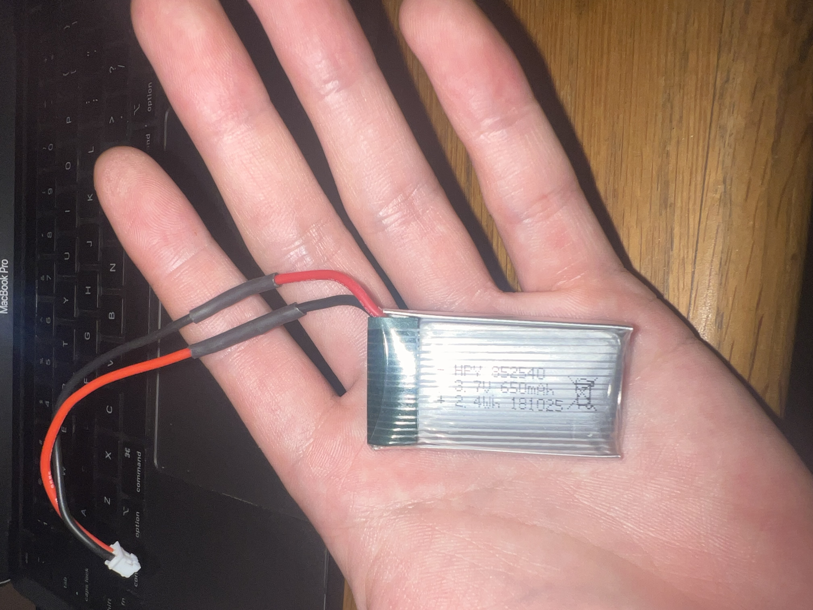
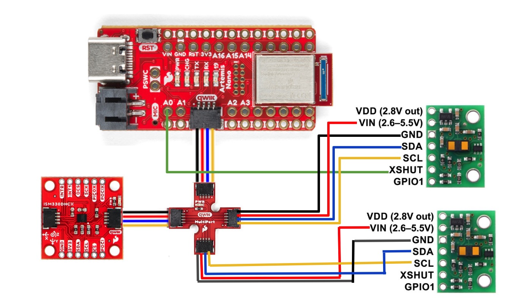
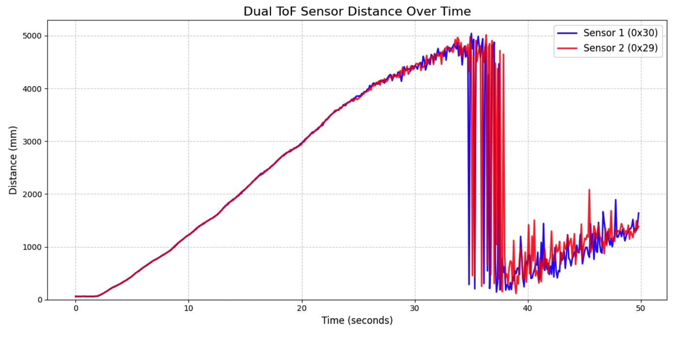

+++
title = "Lab 3: Time of Flight Sensors"
date = 2026-02-23
weight = 10
[taxonomies]
tags = ["Robotics", "C++", "Sensors", "Python", "Embedded Software", "Microcontroller" ]
+++

## Overview

In Lab 3, the objective was to test out the functionalities and capabilities of two VL53L1X Time-of-Flight (ToF) sensors while still have the IMU. The faster and more reliably the robot can sample these distances, the faster it can safely drive. This lab involved permanently wiring the sensors, powering the Artemis from a battery, bypassing I2C address conflicts, and streaming accurate and reliable ToF data over Bluetooth alongside the IMU.

### Sensor Placement Strategy

I plan to mount one ToF sensor on the front center of the car to detect obstacles directly in the driving path, and the other on the side of the car between the wheels. This configuration will allow the robot to avoid forward collisions while simultaneously maintaining a set distance from sides for tasks based on what I know from the future labs.

**Blind spots:** Because the sensors have a relatively narrow Field of View, the robot will likely miss obstacles that are lower than the sensor's mounting height, highly reflective/angled surfaces that bounce the IR light away, or thin obstacles that fall between the front and side sensor's cone of vision. These blind spots will need to be taking in great consideration in the future when I am doing localization. 

### I2C Address Conflict

Using the `Example05_Wire_I2C.ino` sketch, I scanned the bus and successfully found the default ToF at address `0x29`, and IMU at address `0x69` on port `0x10000E9C`. I determine those number specifically by doing isolation test of the sensors. 

<figure>

<figcaption>I2C Device Scanning with only the Time of Flight plugged in</figcaption>
</figure>

<figure>

<figcaption>I2C Device Scanning with both the Time of Flight and IMU plugged in</figcaption>
</figure>

Both VL53L1X sensors share the same hardwired default I2C address (`0x29`). This was a bit unexpected, because its datasheet said that the default address is `0x52`. After further investigation, I realized that the address is left-shifted by 1 bit, since the LSB is used for read/write. Since I2C requires unique addresses for each device on the bus, I cannot simply plug both into the Qwiic connect and work with both of them simulataniously.

To solve this, I used the `XSHUT` (shutdown) pin. By wiring the `XSHUT` pin of ToF sensor 2 to an output pin on the Artemis (Pin A0), I can hold Sensor 2 in hardware shutdown during boot. I then initialize Sensor 1, use software to change its address to `0x30`, and finally pull `XSHUT` high to wake up Sensor 2 at the default `0x29` address. Following is the code that implements what I described above.

```c++
    WIRE_PORT.begin();
    WIRE_PORT.setClock(400000);

    Serial.println("Booting ToF Sensors...");
    pinMode(SHUTDOWN_PIN, OUTPUT);
    digitalWrite(SHUTDOWN_PIN, LOW); 
    delay(50); 

    sensor1.begin(); 
    sensor1.setI2CAddress(0x30); 
    
    digitalWrite(SHUTDOWN_PIN, HIGH);
    delay(50); 

    sensor2.begin();

    sensor1.setDistanceModeShort();
    sensor2.setDistanceModeShort();
```

## Hardware Setup

I prepared the Artemis for by soldering the provided 650mAh RC car battery to a JST jumper cable. I was careful to cut and strip the wires one at a time to avoid shorting the battery. After soldering, I used heat shrink tubing to insulate the exposed wire. I verified the polarity (positive to positive) before plugging it into the Artemis.

<figure style="margin:0;">

<figcaption>Soldered Battery</figcaption>
</figure>

I then successfully tested this by running my BLE Python script and sending some test messaging back and forth without the USB-C cable connected. 

<div style="display:flex; gap:15px; justify-content:center; flex-wrap:wrap;">
<figure style="margin:0;">

<figcaption>Python server on messaging tests on battery</figcaption>
</figure>
<figure style="margin:0;">

<figcaption>Artemis on messaging tests on battery</figcaption>
</figure>
</div>

Finally, I cut one end of 2 Qwiic cables and soldered one to each of the ToF sensor, noting the color coding (Blue = SDA, Yellow = SCL, Red = 3.3V, Black = GND). And connected them to the qwiic connector hub, shown below in the circuit diagram

<figure style="margin:0;">

<figcaption>Circuit Diagram</figcaption>
</figure>

## Sensor Modes, Dual Sensor Integration & Testing

The VL53L1X technically supports three distance modes:

* **Short:** Max distance ~1.3m. Better ambient light immunity.
* **Medium:** Max distance ~3m.
* **Long:** Max distance ~4m. Default mode, but highly sensitive to ambient light and lower accuracy at close range.

**The Medium Mode:** I decided to ignore the medium mode since for this lab, since it is support only through Polulu VL53L1X Library, which would require me to change a lot of the code for the ToF. If I find that I may need something in between short and long mode in the future, I will consider look at this more carefully.

Below is the initial test I did, after hooking up both of the ToF, and having them both function  simultaneously. Note this satify Task 8, so I jumped ahead. Refer to code snippet in I2C Address for how I got both of them to work.

<iframe width="450" height="315" src="https://youtube.com/embed/NNu_KvDo6iw" allowfullscreen></iframe> <figcaption>Two ToF test</figcaption>

<iframe width="450" height="315" src="https://youtube.com/embed/TP_kfJYFPFA" allowfullscreen></iframe> <figcaption>Serial Monitor - Two ToF test</figcaption>


## ToF Sensor Speed and Non-Blocking Code

In future labs, the robot cannot hang while waiting for a laser to bounce back. To ensure the code executes as fast as possible, I wrote a non-blocking loop that continuously printed the Artemis `millis()` clock, and only printed ToF data when `checkForDataReady()` was true.
- Loop Execution Speed: The millis() timestamps incremented every 3 to 4 ms, indicating that the main loop executes at roughly 250 to 330 Hz.
- Sampling Rate: Sensor 1 (~46.5 Hz): Looking at some sample data. Averaging those gives roughly 21.5 ms per sample. which means sensor 1 is operating at an average rate of 46.5 Hz. Sensor 2 (~11Hz): Sensor 2 only gets data once while Sensor 1 gets data 4 times, it is visually obvious it is running much slower.

<div style="display:flex; gap:15px; justify-content:center; flex-wrap:wrap;">
<figure style="margin:0;">

<figcaption>Speed test 1</figcaption>
</figure>
<figure style="margin:0;">

<figcaption>Speed test 2</figcaption>
</figure>
</div>

- Sensor Discrepancies: During testing, Sensor 1 sampled significantly faster than Sensor 2. From some research, I believe this is due to a hardware reset discrepancy. Because the XSHUT pin is only wired to Sensor 2, a soft-reset of the Artemis completely wipes Sensor 2's registers, forcing it to boot into the default 50ms budget. Sensor 1, however, maintains continuous 3.3V power during a soft-reset, meaning it retained the faster 20ms timing budget from previous code uploads.

## Data Collection over Bluetooth

I made a setup with a measuring tape, using the provided white board as an object to detect and my box to hold the sensor in one position, imaged below:

<figure style="margin:0;">

<figcaption>Setup</figcaption>
</figure>


<figure style="margin:0;">

<figcaption>TOF short mode test 1</figcaption>
</figure>

<figure style="margin:0;">

<figcaption>TOF short mode test 2 </figcaption>
</figure>

<figure style="margin:0;">

<figcaption>TOF long mode test 1</figcaption>
</figure>

<figure style="margin:0;">

<figcaption>TOF long mode test 2</figcaption>
</figure>

I created a new Bluetooth command (`START_BOTH`) that simultaneously collects data from the ToF sensors and the IMU (using the Complementary Filter developed in Lab 2).

Because the IMU calculates data much faster than the ToF sensors, the IMU updates its angles in the background continuously. Whenever the ToF sensors finish a distance reading, the Artemis grabs the *most recent* IMU pitch and roll and saves all five variables into parallel arrays.

<figure>

<figcaption>Distance and IMU Complementary Pitch and Roll vs. Time for over 10 seconds</figcaption>
</figure>

### Collaboration

I collaborated extensively on this project with [Jack Long](https://jack-d-long.github.io/) and [Trevor Dales](https://trevordales.github.io/). I referenced [Wenyi's site](https://mavisfu.github.io/lab3.html) for my wiring setup and initial ToF sketch. ChatGPT was used for complex hardware debugging (specifically resolving the I2C optical cross-talk and macOS Bluetooth UUID handling), plotting CSV data, and formatting.
