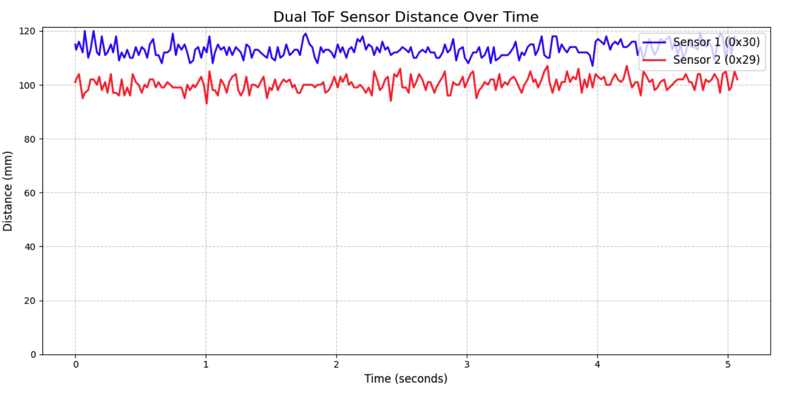
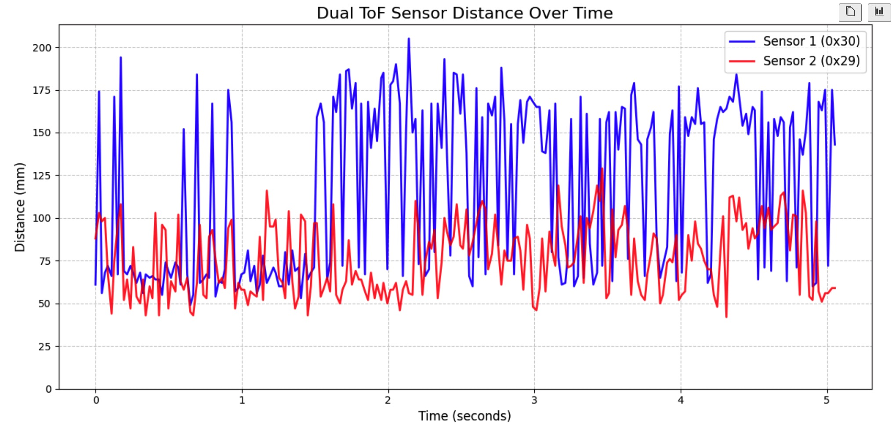
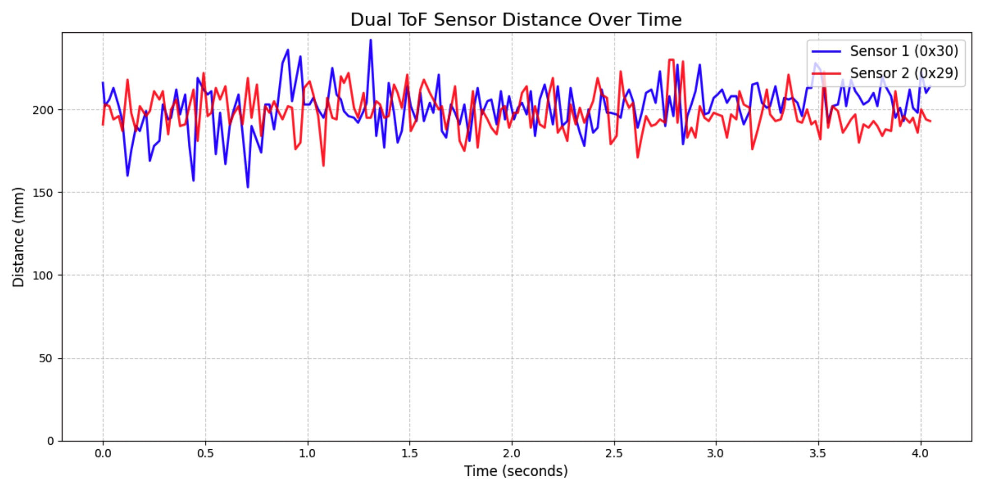
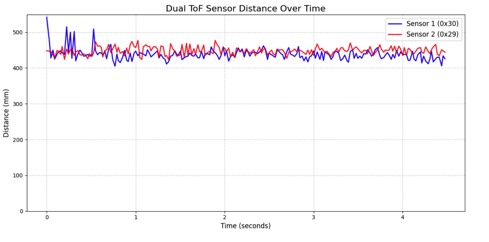
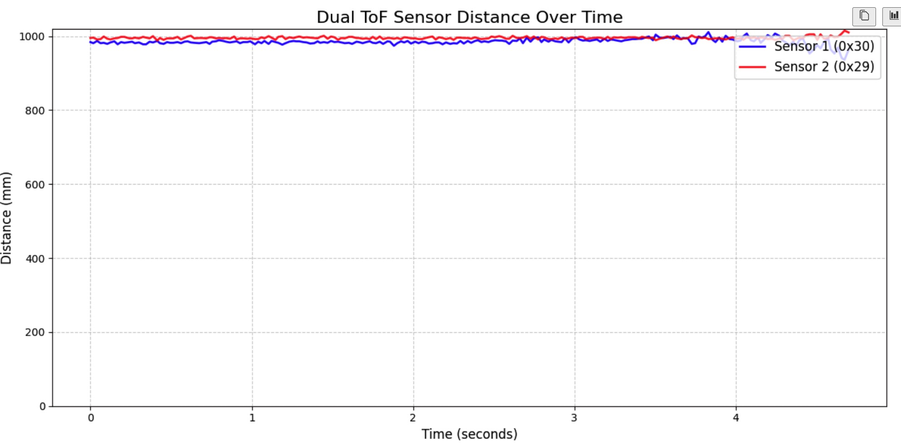
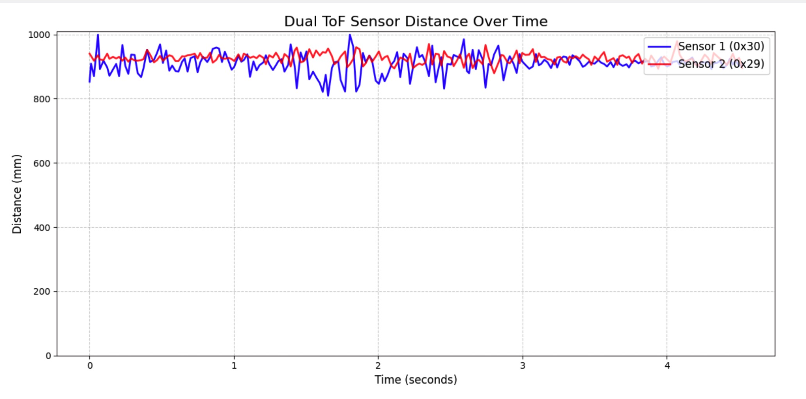

+++
title = "Lab 3: Time of Flight Sensors"
date = 2026-02-23
weight = 10
[taxonomies]
tags = ["Robotics", "C++", "Sensors", "Python", "Embedded Software", "Microcontroller" ]
+++

## Overview

In Lab 3, the objective was to test out the functionalities and capabilities of two VL53L1X Time-of-Flight (ToF) sensors while still having the IMU. The faster and more reliably the robot can sample these distances, the faster it can safely drive. This lab involved permanently wiring the sensors, powering the Artemis from a battery, bypassing I2C address conflicts, and streaming accurate and reliable ToF data over Bluetooth alongside the IMU.

### Sensor Placement Strategy

I plan to mount one ToF sensor on the front center of the car to detect obstacles directly in the driving path, and the other on the side of the car between the wheels. This configuration will allow the robot to avoid forward collisions while simultaneously maintaining a set distance from the sides for tasks, based on what I know from future labs.

**Blind spots:** Because the sensors have a relatively narrow Field of View, the robot will likely miss obstacles that are lower than the sensor's mounting height, highly reflective/angled surfaces that bounce the IR light away, or thin obstacles that fall between the front and side sensor's cone of vision.  These blind spots will need to be taken into great consideration in the future when I am doing localization.

### I2C Address Conflict

Using the `Example05_Wire_I2C.ino` sketch, I scanned the bus and successfully found the default ToF at address `0x29`, and the IMU at address `0x69` on port `0x10000E9C`. I determined those numbers specifically by doing isolation tests on the sensors.

<figure>

<figcaption>I2C Device Scanning with only the Time of Flight plugged in</figcaption>
</figure>

<figure>

<figcaption>I2C Device Scanning with both the Time of Flight and IMU plugged in</figcaption>
</figure>

Both VL53L1X sensors share the same hardwired default I2C address (`0x29`). This was a bit unexpected, because its datasheet said that the default address is `0x52`. After further investigation, I realized that the address is left-shifted by 1 bit, since the LSB is used for read/write. Since I2C requires unique addresses for each device on the bus, I cannot simply plug both into the Qwiic connector and work with both of them simultaneously.

To solve this, I used the `XSHUT` (shutdown) pin. By wiring the `XSHUT` pin of ToF sensor 2 to an output pin on the Artemis (Pin A0), I can hold Sensor 2 in hardware shutdown during boot. I then initialize Sensor 1, use software to change its address to `0x30`, and finally pull `XSHUT` high to wake up Sensor 2 at the default `0x29` address. The following is the code that implements what I described above.

```c++
    WIRE_PORT.begin();
    WIRE_PORT.setClock(400000);

    Serial.println("Booting ToF Sensors...");
    pinMode(SHUTDOWN_PIN, OUTPUT);
    digitalWrite(SHUTDOWN_PIN, LOW); 
    delay(50); 

    sensor1.begin(); 
    sensor1.setI2CAddress(0x30); 
    
    digitalWrite(SHUTDOWN_PIN, HIGH);
    delay(50); 

    sensor2.begin();

    sensor1.setDistanceModeShort();
    sensor2.setDistanceModeLong();

```

## Hardware Setup

I prepared the Artemis by soldering the provided 650mAh RC car battery to a JST jumper cable. I was careful to cut and strip the wires one at a time to avoid shorting the battery. After soldering, I used heat shrink tubing to insulate the exposed wire. I verified the polarity (positive to positive) before plugging it into the Artemis.

<figure style="margin:0;">

<figcaption>Soldered Battery</figcaption>
</figure>

I then successfully tested this by running my BLE Python script and sending some test messages back and forth without the USB-C cable connected.

<div style="display:flex; gap:15px; justify-content:center; flex-wrap:wrap;">
<figure style="margin:0;">

<figcaption>Python server on messaging tests on battery</figcaption>
</figure>
<figure style="margin:0;">

<figcaption>Artemis on messaging tests on battery</figcaption>
</figure>
</div>

Finally, I cut one end off of 2 Qwiic cables and soldered one to each of the ToF sensors, noting the color coding (Blue = SDA, Yellow = SCL, Red = 3.3V, Black = GND). And I connected them to the Qwiic connector hub, as shown below in the circuit diagram.

<figure style="margin:0;">

<figcaption>Circuit Diagram</figcaption>
</figure>

## Sensor Modes, Dual Sensor Integration & Testing

The VL53L1X technically supports three distance modes:

* **Short:** Max distance ~1.3m. Better ambient light immunity.
* **Medium:** Max distance ~3m.
* **Long:** Max distance ~4m. Default mode, but highly sensitive to ambient light and lower accuracy at close range.

**The Medium Mode:** I decided to ignore the medium mode for this lab, since it is supported only through the Pololu VL53L1X Library, which would require me to change a lot of the code for the ToF. If I find that I may need something in between short and long mode in the future, I will consider looking at this more carefully.

Below is the initial test I did after hooking up both of the ToF sensors and having them both function simultaneously. Note this satisfies Task 8, so I jumped ahead. Refer to the code snippet in the I2C Address section for how I got both of them to work.

<iframe width="450" height="315" src="https://youtube.com/embed/NNu_KvDo6iw" allowfullscreen></iframe> <figcaption>Two ToF test</figcaption>

<iframe width="450" height="315" src="https://youtube.com/embed/TP_kfJYFPFA" allowfullscreen></iframe> <figcaption>Serial Monitor - Two ToF test</figcaption>

## ToF Sensor Speed and Non-Blocking Code

In future labs, the robot cannot hang while waiting for a laser to bounce back. To ensure the code executes as fast as possible, I wrote a non-blocking loop that continuously printed the Artemis `millis()` clock, and only printed ToF data when `checkForDataReady()` was true.

* Loop Execution Speed: The `millis()` timestamps incremented every 3 to 4 ms, indicating that the main loop executes at roughly 250 to 330 Hz.
* Sampling Rate: Sensor 1 (~46.5 Hz): Looking at some sample data, averaging those gives roughly 21.5 ms per sample, which means Sensor 1 is operating at an average rate of 46.5 Hz. Sensor 2 (~11 Hz): Sensor 2 only gets data once while Sensor 1 gets data 4 times; it is visually obvious it is running much slower.

<div style="display:flex; gap:15px; justify-content:center; flex-wrap:wrap;">
<figure style="margin:0;">

<figcaption>Speed test 1</figcaption>
</figure>
<figure style="margin:0;">

<figcaption>Speed test 2</figcaption>
</figure>
</div>

* Sensor Discrepancies: During testing, Sensor 1 sampled significantly faster than Sensor 2. This is because I set Sensor 1 to short mode and Sensor 2 to long mode. Because long mode can reach further, its waves also take longer to travel back.

```c++
// print code
void loop() {
  Serial.print("Time (ms): ");
  Serial.println(millis());

  if (sensor1.checkForDataReady()) {
    int dist1 = sensor1.getDistance();
    sensor1.clearInterrupt();
    Serial.print(">>>> SENSOR 1 READY: "); 
    Serial.print(dist1);
    Serial.println(" mm");
  }
  
  if (sensor2.checkForDataReady()) {
    int dist2 = sensor2.getDistance();
    sensor2.clearInterrupt();
    Serial.print(">>>> SENSOR 2 READY: "); 
    Serial.print(dist2);
    Serial.println(" mm");
  }
}

```

## Data Collection over Bluetooth

First, I wanted to compare the performance difference between the long mode and short mode for the ToF by starting from a white wall, and then slowly dragging my ToF sensors back from the wall for 30+ seconds.

Here are the results I got: (Note: I collected 2 trials of each for consistency comparison).

<figure style="margin:0;">

<figcaption>TOF short mode test 1</figcaption>
</figure>

<figure style="margin:0;">

<figcaption>TOF short mode test 2 </figcaption>
</figure>

<figure style="margin:0;">

<figcaption>TOF long mode test 1</figcaption>
</figure>

<figure style="margin:0;">

<figcaption>TOF long mode test 2</figcaption>
</figure>

### Metric Evaluation:

Range:

* Short Mode: The graphs show a perfectly linear tracking line that abruptly drops to 0 mm just past 2100 mm (~2.1 meters). This defines the absolute maximum physical range in short mode before the sensor's confidence threshold fails. This is higher than expected from the short mode.
* Long Mode: The sensors track linearly up to approximately 4800 mm (~4.8 meters). Beyond this point, the signal breaks down into massive noise spikes (erratically jumping between 0 and 5000 mm). And the noise becomes really bad starting at ~4.2 meters. But this is again higher than expected for long mode.

Accuracy: Across all four graphs, Sensor 1 (blue) and Sensor 2 (red) overlap almost perfectly during the valid range window. The steady, linear slope as the distance increases demonstrates that the sensors scale proportionally and accurately with real-world distance, with minimal deviation between the two physical units.

Repeatability: The sensor performance is incredibly consistent. Comparing Short 1 to Short 2, both trials hit their failure point at the exact same ~2100 mm mark. Similarly, Long 1 and Long 2 both experience total signal breakdown at the identical ~4800 mm threshold. The noise profiles and slopes are virtually indistinguishable between trials.

Ranging Time: There is a direct trade-off between range and speed. Short mode allows for a much tighter timing budget (20ms), yielding a fast ranging time of approximately ~45 Hz. To achieve the 4+ meter range in Long mode, the sensors require a larger timing budget (50ms) to leave the optical shutter open longer, reducing the ranging speed to roughly ~20 Hz.

From this experiment, I decided to test the accuracy further by measuring a set distance. I made a setup with a measuring tape, using the provided white board as an object to detect and my box to hold the sensor in one position, with the tape measure recording the right distance, imaged below:

<figure style="margin:0;">

<figcaption>Setup</figcaption>
</figure>

### ToF Accuracy Analysis (Static Distance Tests)

I collected static data at four precise distances: 100mm, 200mm, 500mm, and 1000mm. I used a reflective whiteboard as the target. I performed these tests in both Long Mode and Short Mode to compare their performance.

100mm and 200mm Testing

<div style="display:flex; gap:15px; justify-content:center; flex-wrap:wrap;">
<figure style="margin:0;">

<figcaption>100 mm - Short Mode</figcaption>
</figure>
<figure style="margin:0;">

<figcaption>100 mm - Long Mode</figcaption>
</figure>
<figure style="margin:0;">

<figcaption>200 mm - Short Mode</figcaption>
</figure>
<figure style="margin:0;">

<figcaption>200 mm - Long Mode</figcaption>
</figure>
</div>

500mm and 1000mm Testing

<div style="display:flex; gap:15px; justify-content:center; flex-wrap:wrap;">
<figure style="margin:0;">

<figcaption>500 mm - Short Mode</figcaption>
</figure>
<figure style="margin:0;">

<figcaption>500 mm - Long Mode</figcaption>
</figure>
<figure style="margin:0;">

<figcaption>1000 mm - Short Mode</figcaption>
</figure>
<figure style="margin:0;">

<figcaption>1000 mm - Long Mode</figcaption>
</figure>
</div>

Discussion on Accuracy and The "Whiteboard Effect"

Analyzing these graphs reveals a disparity between Short and Long mode, which is heavily exacerbated by the reflective whiteboard target:

Short Mode is Highly Accurate: Across all four distances (100mm, 200mm, 500mm, and 1000mm), Short mode performed really well. The data lines are flat, stable, and cluster very tightly around the true distance. For instance, at 1000mm, both sensors tracked cleanly between 980mm and 1000mm. At 500mm, they were nearly perfectly aligned with the 500mm mark.

Long Mode Saturation (The Whiteboard Effect): In stark contrast, Long mode failed at close ranges. At 100mm, the Long mode data is pretty noisy, oscillating randomly between 50mm and 200mm. Even at 1000mm, Long mode under-reads the actual distance by nearly 100mm and exhibits high-frequency jitter.

Now, this is a bit unfair for long mode because it is designed to look for faint signals from up to 4 meters away, so it increases its sensitivity and leaves its optical "shutter" open longer. Pointing this highly sensitive mode at a glossy, highly reflective whiteboard at a close distance of 100mm effectively "blinds" the sensor.

Sensor Offset: I also observed a slight, consistent offset between Sensor 1 and Sensor 2. Because the physical test setup was identical, this minor variance is likely due to the placement of my ToFs at slightly different angles, causing them to hit the whiteboard at very slightly different angles.

Conclusion: These tests definitively prove that for a small room with a lot of reflection, Short Mode wins because of its accuracy and speed. Long mode's sensitivity to reflection makes it untrustworthy at sub-1-meter distances in this specific environment. However, if future labs require greater than 2 meter distance detection, I would need to use Long mode or implement Medium mode.

### IMU and ToF

I created a new Bluetooth command (`START_BOTH`) that simultaneously collects data from the ToF sensors and the IMU (using the Complementary Filter developed in Lab 2).

```c++
        case START_BOTH: {
            recordBoth = true;
            tof_sample_idx = 0;
            s1_read_done = false;
            s2_read_done = false;
            temp_dist1 = 0;
            temp_dist2 = 0;

            // Reset IMU timing so filters start fresh
            imu_samples = 0;
            t_start_us = micros();
            t_last_us  = t_start_us;
            imu_state_initialized = false; 

            tx_estring_value.clear();
            tx_estring_value.append("BOTH_RECORDING_STARTED");
            tx_characteristic_string.writeValue(tx_estring_value.c_str());
            break;
        }

```

```
void loop()
{
    BLEDevice central = BLE.central();

    if (central) {
        while (central.connected()) {
            loop_count++;   

            // Non-blocking IMU calculation runs if requested
            if ((recordIMU || recordBoth)) {
                if (myICM.dataReady()) {
                    collectIMU();          
                }
            }

            // Non-blocking ToF sampling 
            if ((recordToF || recordBoth) && tof_sample_idx < MAX_SAMPLES) {
                
                // Throttle I2C polling to every 5ms
                static uint32_t last_tof_check = 0;
                if (micros() - last_tof_check > 5000) {
                    last_tof_check = micros();

                    if (!s1_read_done && sensor1.checkForDataReady()) {
                        temp_dist1 = sensor1.getDistance();
                        sensor1.clearInterrupt(); 
                        s1_read_done = true;
                    }
                    
                    if (!s2_read_done && sensor2.checkForDataReady()) {
                        temp_dist2 = sensor2.getDistance();
                        sensor2.clearInterrupt();
                        s2_read_done = true;
                    }

                    // Once BOTH sensors are ready, record everything!
                    if (s1_read_done && s2_read_done) {
                        tof_time_buffer[tof_sample_idx] = micros();
                        tof1_buffer[tof_sample_idx] = temp_dist1;
                        tof2_buffer[tof_sample_idx] = temp_dist2;
                        
                        // If doing combined recording, grab the most recent IMU state
                        if (recordBoth) {
                            pitchcomp_buffer[tof_sample_idx] = pitch_comp_state;
                            rollcomp_buffer[tof_sample_idx]  = roll_comp_state;
                        }
                        
                        tof_sample_idx++;
                        
                        s1_read_done = false;
                        s2_read_done = false;
                    }
                }
            }

            write_data();
            read_data();
        }
    }
}

```

Because the IMU calculates data much faster than the ToF sensors, the IMU updates its angles in the background continuously. Whenever the ToF sensors finish a distance reading, the Artemis grabs the *most recent* IMU pitch and roll and saves all five variables into parallel arrays.

<figure>

<figcaption>Distance and IMU Complementary Pitch and Roll vs. Time for over 10 seconds</figcaption>
</figure>

As seen in the graph above, all three sensors (2 ToFs and 1 IMU) are successfully running in parallel without blocking each other.

## Collaboration

I collaborated extensively on this project with Ananya Jajodia.

I referenced Lucca Correia's site for the I2C address and ToF speed test, and Aidan Derocher's site for the wiring diagram and ToF testing.

ChatGPT was used for plotting CSV data and sending ToF data over Bluetooth.
