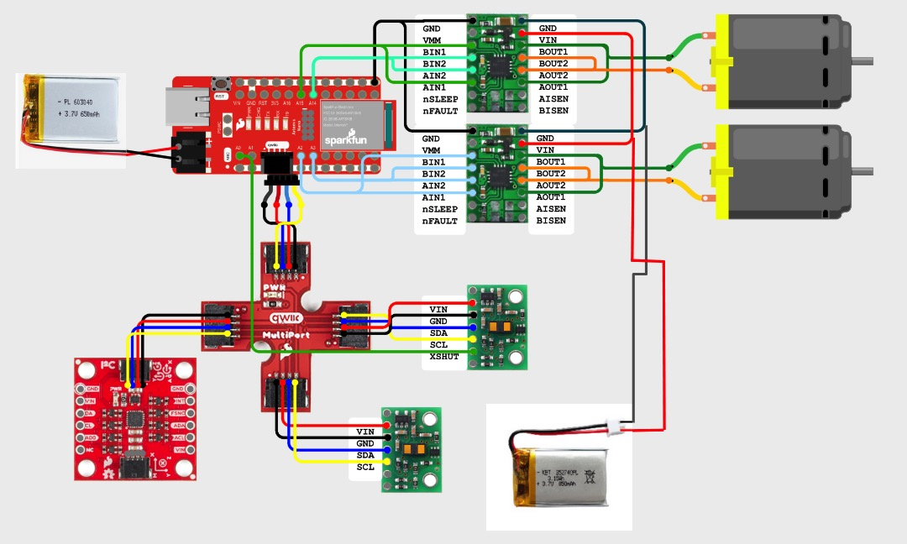
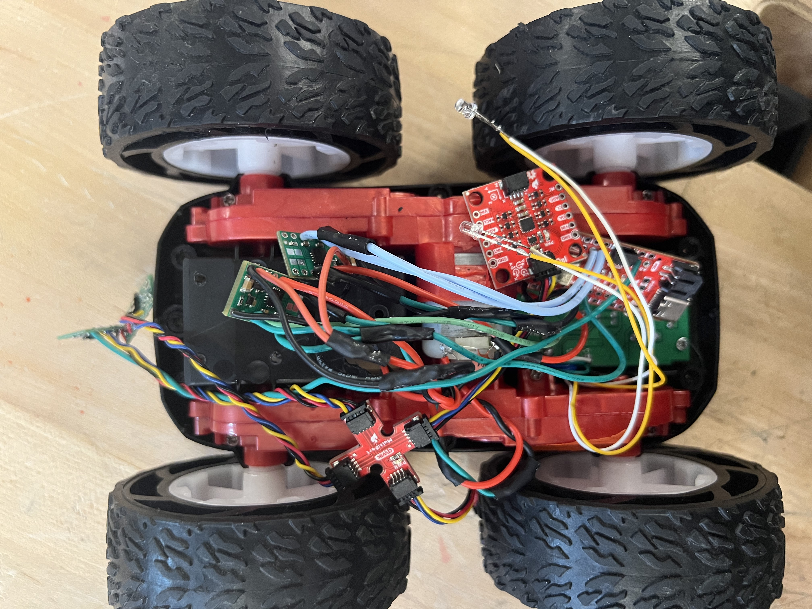
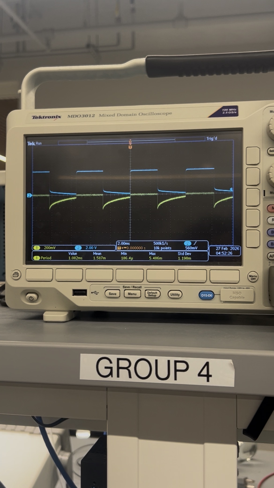
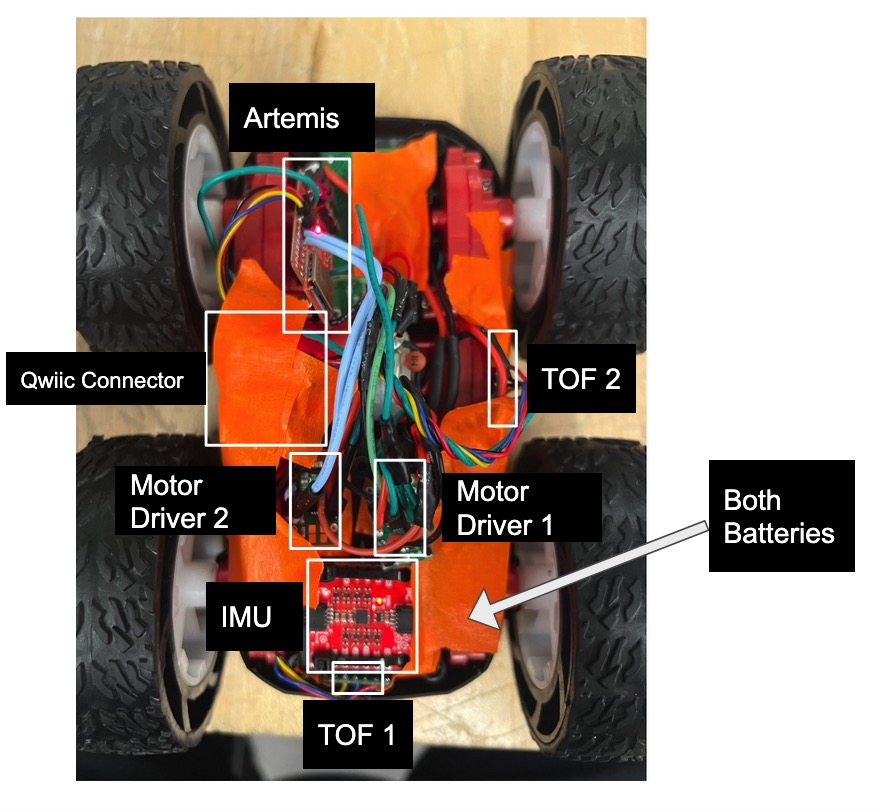
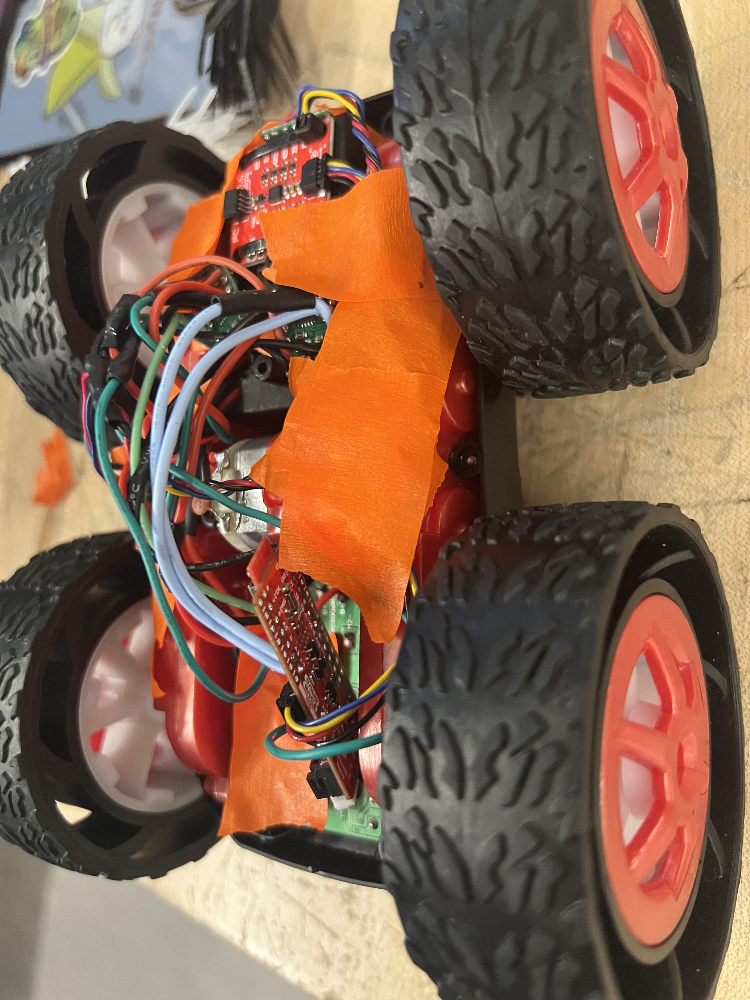
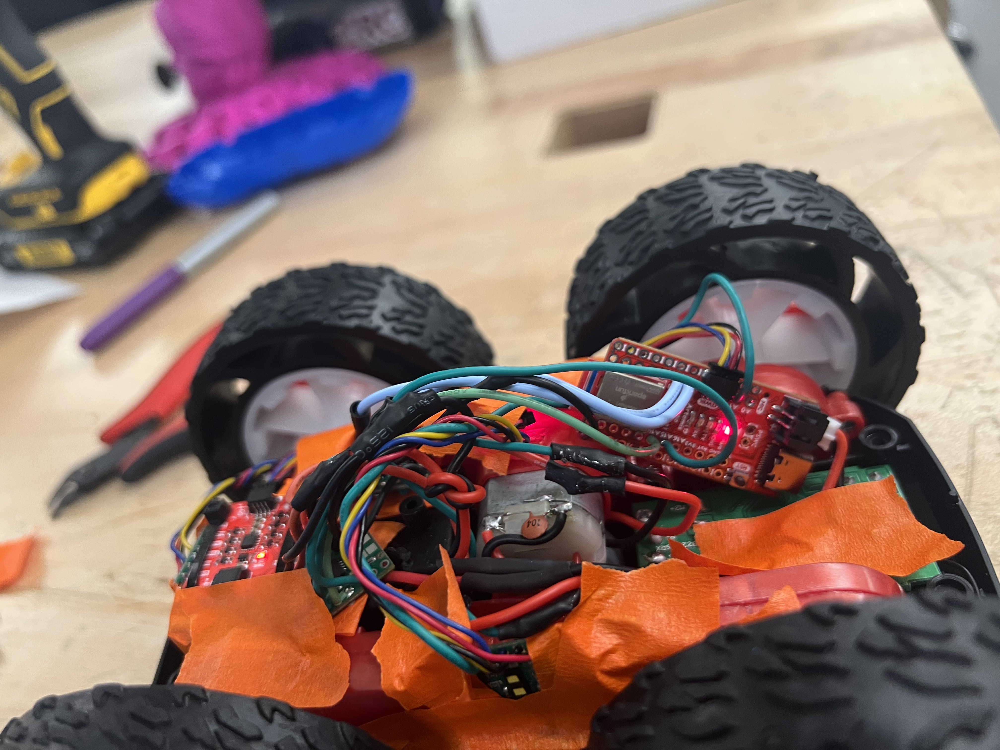
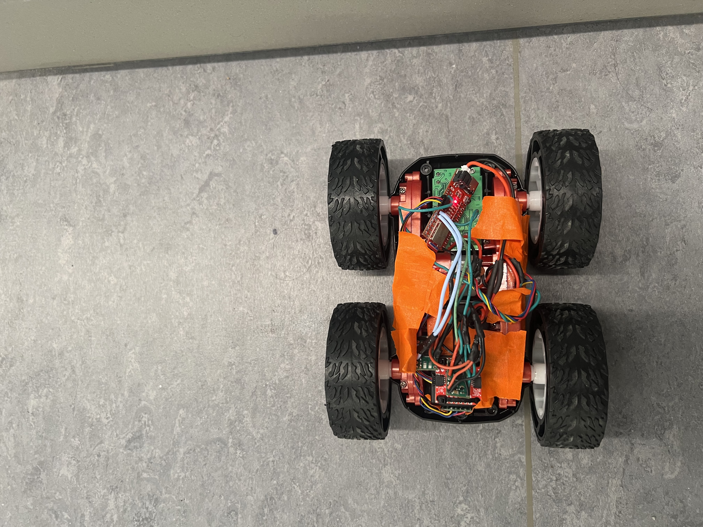

+++
title = "Lab 4: Motor Drivers and Open Loop Control"
date = 2026-03-02
weight = 9
[taxonomies]
tags = ["Robotics", "C++", "Sensors", "Python", "Embedded Software", "Microcontroller" ]
+++

## Prelab
### Wire Schematic

To control the motors, I utilized the PWM-capable pins on the Artemis Nano. I refer to Lucca Correial's website for identify which pins can do PWM. I assigned pins 15 and 14 for the Left Motor (forward and backward, respectively) and 2 and 3 for the Right Motor. These pins were chosen to keep the wiring organized and relatively localized on the board.

From lecture and further research, parallel-couple the inputs and outputs of each dual motor driver ensure the motors receive enough current without overheating the motor drivers. This effectively combines the two channels of a single IC, doubling the average current capacity sent to each DC motor.

Here is my full circuit schematic include work from lab 1-4. 
<figure>

<figcaption>System Circuit Schematic</figcaption>
</figure>

### Battery Discussion
We use two separate batteries—one for the Artemis and one for the motor drivers—to isolate our logic circuitry from electrical noise and voltage drops. DC motors are significant inductive loads; when they rapidly change speed or reverse direction, they can pull large spikes of current and generate back-EMF. If the Artemis were powered by the same supply, these fluctuations could cause the microcontroller to brown-out, reset, or register false readings on the sensors.

## Lab Tasks
### Soldering the Circuit
Below is an image of the finished, soldered physical circuit. (Note: The circuit had not been mounted into the chassis before my initial PWM tests; I just forgot to photograph it prior to this step!)

<figure>

<figcaption>Finished System Circuit</figcaption>
</figure>

### Power Supply and Oscilloscope Hookup

Before integrating the drivers into the car, I tested the PWM outputs using an oscilloscope and an external power supply. The power supply was set to 3.7V with a conservative current limit to simulate the 850mAh Li-Ion battery, which prevents any real damage in the event of a short circuit or a bad soldering job. 

Here is the image of the setup:
<figure>

<figcaption>Oscilloscope Hookup</figcaption>
</figure>

<figure>

<figcaption>Power Supply Hookup</figcaption>
</figure>

To verify the PWM generation, I used the following basic code to send a duty cycle of approximately 23% (60/255) to pin 15, representing the forward direction:

```cpp
#define MOTOR_INL1 15
#define MOTOR_INL2 14

void setup() {
  pinMode(MOTOR_INL1, OUTPUT);
  pinMode(MOTOR_INL2, OUTPUT);
  
  analogWrite(MOTOR_INL1, 0); 
  analogWrite(MOTOR_INL2, 0);   
}

void loop() {
  analogWrite(MOTOR_INL1, 60); 
  analogWrite(MOTOR_INL2, 0); 
}

```
Here is video showing my probe setup, as well as the results:
<iframe width="450" height="315" src="https://youtube.com/embed/MVw43_S0BW8" allowfullscreen></iframe>
<figcaption>Left Motor Driver PWM Test</figcaption>

The analogWrite(MOTOR_INL1,60) line indicated a 23.5% (60/255) duty cycle to pin 15. Oscilloscope graph:
<figure>

<figcaption>Oscilloscope capturing the PWM signal</figcaption>
</figure>

Now I used a for loop to incrementally increase the PWM from 0 to 255 on the left motor, and this is a video showing this:
<iframe width="450" height="315" src="https://youtube.com/embed/DooZhPy4oLc" allowfullscreen></iframe>
<figcaption>Regulated Left Motor Driver PWM Test</figcaption>

Here is the example graph for the PWM being regulated:
<figure>

<figcaption>Oscilloscope capturing the PWM signal</figcaption>
</figure>

Switch to the right motor, and do the same regulating test:
<iframe width="450" height="315" src="https://youtube.com/embed/LsvBeuKERr4" allowfullscreen></iframe>
<figcaption>Regulated Right Motor Driver PWM Test</figcaption>

### Motor Testing

After validating the signal, I dismantled the RC car. I decided not to remove the stock PCB, thinking the flat surface would be useful for mounting my components (although I ultimately didn't take much advantage of it for this lab). I then cut the motor leads and wired up the left motor driver first, keeping the chassis elevated so the wheels could spin freely.

During this phase, I ran into a frustrating bug while testing the second motor driver. I wrote the exact same PWM code to verify the motor functioned correctly, I can also the motor try to spin from the hum sound, but it refused to spin. After extensive troubleshooting, I finally connected the `VIN` and `GND` leads of both motor drivers together into the power supply, and it worked perfectly—even though I was only actively controlling one driver.

Here is some of the results of the PWM test on actual motors:
<iframe width="450" height="315" src="https://youtube.com/embed/XDPilbXST54" allowfullscreen></iframe>
<figcaption>Right Motor Driver Test (Elevated)</figcaption>

<iframe width="450" height="315" src="https://youtube.com/embed/5jg_x6OLH68" allowfullscreen></iframe>
<figcaption>Right Motor Driver Test (Elevated)</figcaption>

<iframe width="450" height="315" src="https://youtube.com/embed/hbjFIpIejHI" allowfullscreen></iframe>
<figcaption>Both Motors Running on Power Supply</figcaption>

Once both sides were verified, I transitioned power from the bench supply to the 3.7V 850mAh battery to ensure the system could run untethered.

<iframe width="450" height="315" src="https://youtube.com/embed/towbY2_A_A4" allowfullscreen></iframe>
<figcaption>Both Motors Running on Battery Power</figcaption>

### Complete Hardware Integration on Car

All components were packed securely into the chassis. The IMU were zip-tied in the front of the bot on the flat surface of the battery case. The motor drivers sits a bit back from there. I put both batteries in the battery case. The Artemis is mounted in the back of the car, and the two ToF sensors were placed in the front and the left side to ensure clear lines of sight. In this way, I try to keep all the high voltage component away from the sensors, try to keep the EMI as low as possible. I made sure no components stuck out past the wheels so the car could safely roll or flip without damaging the electronics. (Failed driving tests, ie. running into the wall, have shown, this is indeed reliable.)

<figure>

<figcaption>Top-down view of the fully integrated chassis</figcaption>
</figure>

<div style="display: flex; justify-content: space-around; align-items: center; gap: 10px;">
<div style="text-align: center;">

<p>Right View</p>
</div>
<div style="text-align: center;">

<p>Left View</p>
</div>
</div>
<figcaption>Side profiles of the fully integrated chassis</figcaption>

### Motor Functions

To make testing easier for the remainder of this lab and future assignments, I integrated helper functions for motor control (`moveForward`, `moveBackward`, `turnLeft`, `turnRight`, `stopMotors`, and speed adjustments) into my main Artemis code. I also mapped these functions to commands sent over Bluetooth. For the sake of brevity, I haven't included the Bluetooth parsing code here, as it was documented in the previous three labs.

```cpp
void moveForward() {
  analogWrite(MOTOR_INL1, motorSpeed); 
  analogWrite(MOTOR_INL2, 0);   
  analogWrite(MOTOR_INR1, motorSpeed);  
  analogWrite(MOTOR_INR2, 0);
}

void moveBackward() {
  analogWrite(MOTOR_INL1, 0); 
  analogWrite(MOTOR_INL2, motorSpeed);   
  analogWrite(MOTOR_INR1, 0);  
  analogWrite(MOTOR_INR2, motorSpeed);
}

void turnLeft() {
  analogWrite(MOTOR_INL1, 0); 
  analogWrite(MOTOR_INL2, motorSpeed);   
  analogWrite(MOTOR_INR1, motorSpeed);  
  analogWrite(MOTOR_INR2, 0);
}

void turnRight() {
  analogWrite(MOTOR_INL1, motorSpeed); 
  analogWrite(MOTOR_INL2, 0);   
  analogWrite(MOTOR_INR1, 0);  
  analogWrite(MOTOR_INR2, motorSpeed);
}

void stopMotors() {
  analogWrite(MOTOR_INL1, 0); 
  analogWrite(MOTOR_INL2, 0);   
  analogWrite(MOTOR_INR1, 0);  
  analogWrite(MOTOR_INR2, 0);
}

```

### Lower PWM Limit

To find the minimum PWM value required to overcome the gearbox's static friction (the "deadband"), I placed the car on the floor and slowly ramped up the `motorSpeed` variable.

On a full charge, the minimum PWM to move both forward and backward was about 40-41. In an earlier test (shown in the first video below), I decremented the PWM from high to low and found a slightly higher minimum limit of 44. This discrepancy is likely due to a lower battery charge at the time. Because PWM is a percentage of the total voltage, a dying battery provides a lower average voltage to the motors, meaning a higher PWM value is required to achieve the same physical torque.

Executing an on-axis turn required a significantly higher minimum PWM of 135. This is due to the physics of skid steering: to turn in place, the wheels are forced to drag laterally across the ground, generating vastly more static friction than moving in a straight line. It is worth noting that I conducted this turning test on a different surface with a higher coefficient of friction, so the minimum PWM for turning on the standard lab floor may be lower.

```python
for i in range(15):
    ble.send_command(CMD.SET_SPEED, str(25+i))
    ble.send_command(CMD.FORWARD, "")
    time.sleep(1)
    # ble.send_command(CMD.BACKWARD, "")
    # time.sleep(1)
    # ble.send_command(CMD.LEFT, "")
    # time.sleep(2)
    # ble.send_command(CMD.RIGHT, "")
    # time.sleep(2)
    print(f"Speed set to: {25+i}")
ble.send_command(CMD.STOP, "")

```

Here are the videos documenting the lower limit tests:

<div style="display: grid; grid-template-columns: repeat(2, 1fr); gap: 20px; text-align: center;">

<div>
<iframe width="100%" height="250" src="https://youtube.com/embed/aNkpLh34K3s" allowfullscreen></iframe>
<figcaption>Decremental Limit Test with Forward and Backward</figcaption>
</div>

<div>
<video width="100%" height="250" controls>
<source src="turn_limit2.mp4" type="video/mp4">
Your browser does not support the video tag.
</video>
</div>

<div>
<video width="100%" height="250" controls>
<source src="forward_limit.mp4" type="video/mp4">
Your browser does not support the video tag.
</video>
</div>

<div>
<video width="100%" height="250" controls>
<source src="backward_limit.mp4" type="video/mp4">
Your browser does not support the video tag.
</video>
</div>

</div>

### Calibration

Due to mechanical variances, providing the exact same PWM value to both motors caused the car to drift noticeably. To achieve a straight 2-meter run, I implemented a multiplicative calibration factor.

I started both `leftCalibration` and `rightCalibration` at `1.0`. After observing the car veering left (which indicates the right wheels were spinning faster and driving the chassis to the left), I iteratively increased the left calibration float down to `1.2`.

Because calibration multipliers can sometimes push a base speed over the maximum 8-bit PWM limit, I also implemented the `constrain()` function as a safety measure to prevent integer overflow.

```cpp
int motorSpeed = 100; 
float leftCalibration = 1.2;  
float rightCalibration = 1.0; 

void moveForward() {
  int actualLeftSpeed = motorSpeed * leftCalibration;
  int actualRightSpeed = motorSpeed * rightCalibration;

  actualLeftSpeed = constrain(actualLeftSpeed, 0, 255);
  actualRightSpeed = constrain(actualRightSpeed, 0, 255);

  analogWrite(MOTOR_INL1, actualLeftSpeed); 
  analogWrite(MOTOR_INL2, 0);   
  analogWrite(MOTOR_INR1, actualRightSpeed);  
  analogWrite(MOTOR_INR2, 0);
}

void turnLeft() {
  int actualLeftSpeed = motorSpeed * leftCalibration;
  int actualRightSpeed = motorSpeed * rightCalibration;

  actualLeftSpeed = constrain(actualLeftSpeed, 0, 255);
  actualRightSpeed = constrain(actualRightSpeed, 0, 255);

  analogWrite(MOTOR_INL1, 0); 
  analogWrite(MOTOR_INL2, actualLeftSpeed);   
  analogWrite(MOTOR_INR1, actualRightSpeed);  
  analogWrite(MOTOR_INR2, 0);
}

```

With the calibration applied, the car successfully followed a straight line found on the floor in Upson Hall using forward commands sent from the Python backend. You can see a massive difference in stability before and after calibration.

<figure>

<figcaption>Example of the Starting Point</figcaption>
</figure>

<video width="640" height="360" controls>
<source src="cal1.mp4" type="video/mp4">
Your browser does not support the video tag.
</video>

<video width="640" height="360" controls>
<source src="cal2.mp4" type="video/mp4">
Your browser does not support the video tag.
</video>

## Open Loop Testing
Finally, I try to move the car in a race track manner, by have it move forward, turn left, move around the curve, turn left, move forward again, then turn. In general this drive is not great, but it achieve its goal.
<video width="640" height="360" controls>
<source src="open_loop.mp4" type="video/mp4">
Your browser does not support the video tag.
</video>

## Discussion

Although this lab report is shorter compared to previous ones, the lab itself has definitely taken the most amount of time. From soldering the full circuit (which took way longer than anticipated), to testing the PWM signals and overcoming the grounding roadblocks, to iteratively calibrating the robot to drive in a straight line, it was a heavy workload.

Despite the calibration, the open-loop drive is still not perfect. It is prone to slipping and drifting over long distances, which really highlights the limitations of relying purely on dead reckoning. I am looking forward to implementing PID control using sensor feedback for much better reliability in the future.

## Collaboration

I collaborated extensively on this project with Ananya Jajodia and Dyllan Hofflich.

I referenced Aiden Derocher's site for wiring help and PWM testing.

ChatGPT was used for some website formatting.
