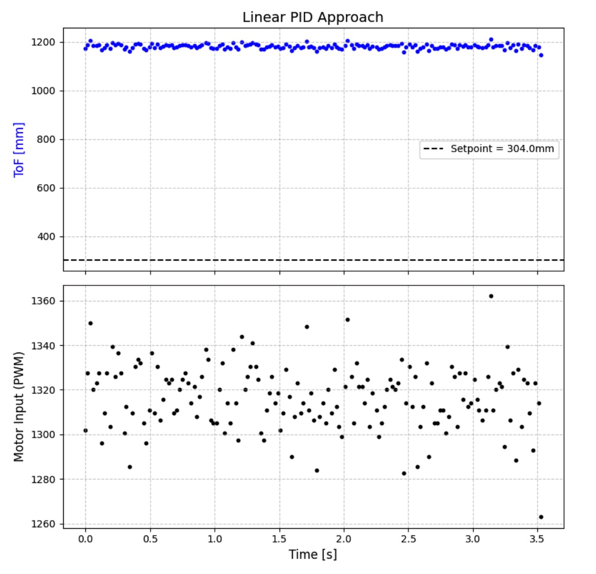
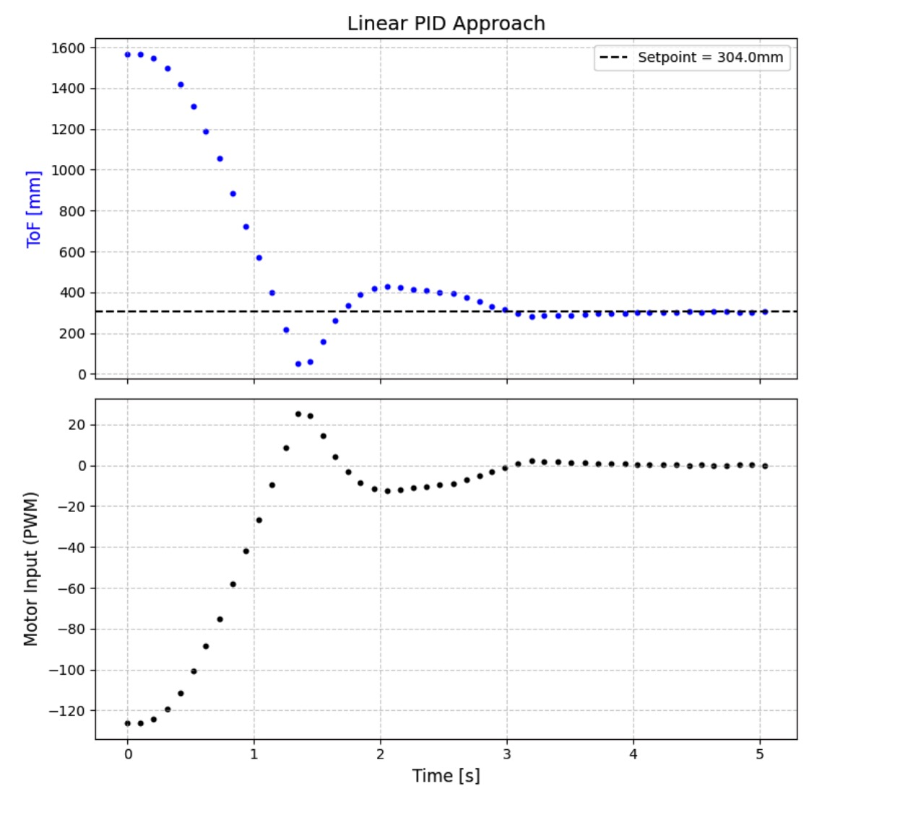
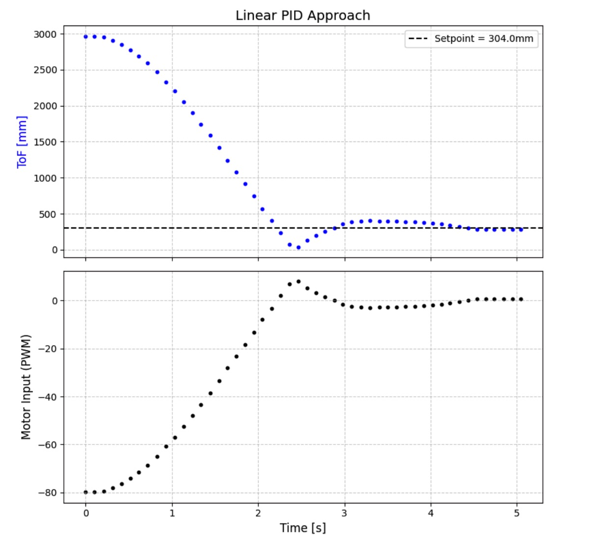
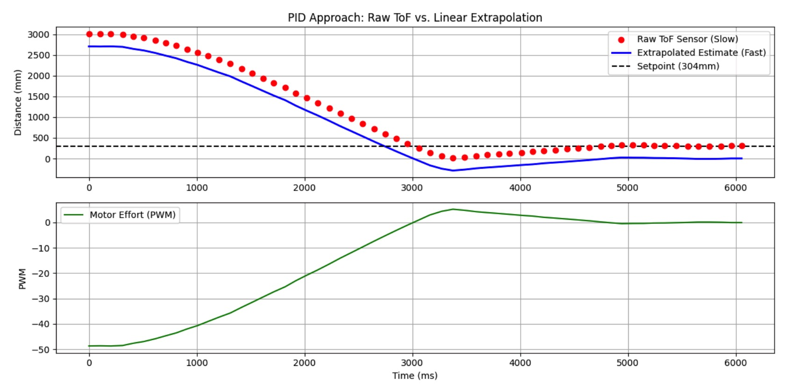
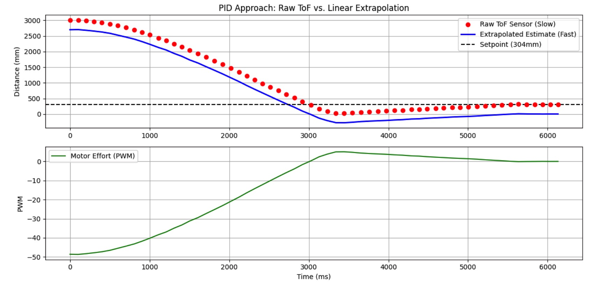
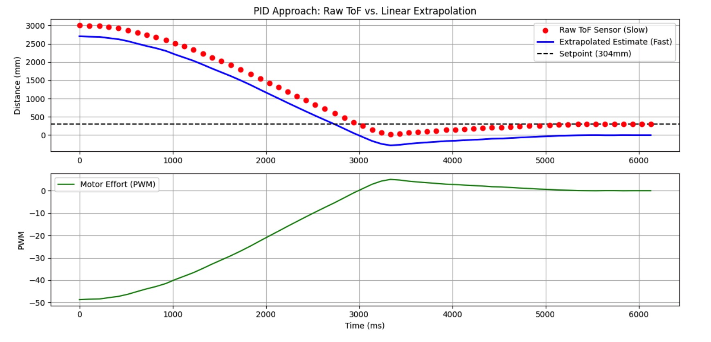

+++
title = "Lab 5: Linear PID Control and Linear Interpolation"
date = 2026-03-15
weight = 8
[taxonomies]
tags = ["Robotics", "C++", "Sensors", "Python", "Embedded Software", "Microcontroller" ]
+++

## Objective

The purpose of this lab is to implement a robust linear PID controller to drive the robot as fast as possible toward a wall, stopping exactly 304mm (1 foot) away. To account for slow sensor sampling rates, linear extrapolation is introduced to decouple the PID control loop frequency from the Time-of-Flight (ToF) sensor's data generation rate.

-----

## Prelab: Bluetooth Architecture and Debugging

To prevent blocking delays from `Serial.print` or Bluetooth transmissions from slowing down the high-speed PID control loop, all debugging data is stored locally in arrays (`tof_time_buffer`, `tof1_buffer`, `pid_error_buffer`, `pid_pwm_buffer`) during the run.

The test sequence is entirely controlled via Python over BLE. The command `START_LINEAR_PID_DATA` triggers the control loop, passing the 304mm setpoint. A separate `SET_PID` command allows for real-time tuning of the **Kp**, **Ki**, and **Kd** gains without needing to recompile and flash the Artemis board. Once the test concludes, `STOP_LINEAR_PID_DATA` triggers a hard stop to the motors and transmits the data arrays back to the Jupyter Notebook for visualization.

\<figure\>
\
\<figcaption\>Here is an example of ToF data being sent over the network for debugging.\</figcaption\>
\</figure\>

-----

## Position Control Implementation

### ToF Sensor Configuration and Testing Challenges

Initial testing was incredibly frustrating because I wanted to use the Long `distanceMode` for linear PID so I could potentially start up to 4 meters away. However, the ToF sensor continuously failed to read the correct distance when placed on the ground past 1.8 meters, which was insufficient for the linear PID tests. After many hours of debugging different components, rewriting the code three times, and swapping back and forth between two cars, I realized the issue. Both cars' ToF sensors were pointing slightly downward. Additionally, the carpet and floor surface I was testing on absorbed or scattered the IR waves strongly, making the readings highly inaccurate. I resolved this simply by moving my testing to the hallway, which instantly fixed the sensor reliability issues.

While this setup provided clean data from 3 meters down to the target, it reduced the sensor sampling rate to roughly 20Hz.

### Motor Deadband and Scaling Calibration

Because the robot needs to make micro-adjustments as it approaches the target, a `driveCalibrated()` function was written to handle motor deadband.

```cpp
void driveCalibrated(float left_speed, float right_speed) {
    if(!motors_enabled) return;

    // Constrain before scaling to prevent full-throttle drift
    left_speed = constrain(left_speed, -255.0, 255.0);
    right_speed = constrain(right_speed, -255.0, 255.0);

    left_speed *= left_motor_scaling;
    right_speed *= right_motor_scaling;

    if (fabs(left_speed) > 0.1) {
        int pwm_l = map(fabs(left_speed), 0, 255, min_pwm_left, 255);
        pwm_l = constrain(pwm_l, min_pwm_left, 255); 
        // ... (Directional logic and right motor logic follows)
```

The PID output is mapped so that a requested effort of "1" physically translates to the minimum PWM required to overcome static friction (roughly 40 PWM for this chassis). The raw input is constrained *before* the motor scaling factor is applied to ensure the robot drives perfectly straight even when the PID controller demands maximum output.

### Proportional (P) Control Tuning

With a starting distance of 3000mm and a setpoint of 304mm, the initial error is extremely large (\~2696mm). If a standard **Kp** value (like 1.0) was used, the control effort would massively saturate the motors, causing the robot to violently charge the wall.

A viable proportional gain range was calculated to keep the initial motor commands within the 0-255 bounds.

  * **Conservative (Slow):** **Kp = 0.005**
  * **Aggressive (Fast):** **Kp = 0.009**

This first section showcases my initial tests from 1800mm away, a constraint caused by the early sensor issues.

\<iframe width="450" height="315" src="[https://youtube.com/embed/vyQKNND2o0w](https://youtube.com/embed/vyQKNND2o0w)" allowfullscreen\>\</iframe\>
\<figcaption\>1800mm P Test\</figcaption\>

\<figure\>
\
\<figcaption\>P-only PID control, ToF Distance vs. Time \</figcaption\>
\</figure\>

While purely Proportional control proved fairly accurate, higher speeds resulted in overshoot, requiring a Derivative (**Kd**) term to act as a brake as the error rapidly decreased. By adding this, I was able to increase the P term even higher.

\<iframe width="450" height="315" src="[https://youtube.com/embed/g93l-az-CnU](https://youtube.com/embed/g93l-az-CnU)" allowfullscreen\>\</iframe\>
\<figcaption\>1800mm PD Test\</figcaption\>

\<figure\>
\
\<figcaption\>PD control, ToF Distance vs. Time \</figcaption\>
\</figure\>

My final tuned gains were **Kp = 0.0025**, **Kd = 20000.0**, and **Ki = 0**. I did not end up using the I-term because there was no observable steady-state error.

-----

## Linear Extrapolation

### The Sampling Rate Problem

The ToF sensor returns new data every 55ms (18-20Hz). However, the main `loop()` and the PID calculation can execute hundreds of times per second. Without extrapolation, the PID controller uses "stale" distance data for 50ms at a time, resulting in jerky motor commands and discrete steps in the derivative calculation.

### Implementation

To decouple the rates, the `readToF()` function was modified to calculate the PID effort every single loop cycle, regardless of whether a new ToF reading was ready.

If no new data is available, the system calculates the robot's velocity based on the last two known ToF readings and their timestamps, and projects the current distance:

$$d_{est} = d_{last} + (v \cdot \Delta t)$$

```cpp
    float estimated_distance = last_known_dist; 

    if (!new_data_available && prev_known_time > 0) {
        float dt_history = (last_known_time - prev_known_time) / 1000000.0f;
        if (dt_history > 0.0f) {
            float velocity = (last_known_dist - prev_known_dist) / dt_history; 
            float time_since_last = (current_time - last_known_time) / 1000000.0f;
            estimated_distance = last_known_dist + (velocity * time_since_last);
        }
    }
    
    // Execute PID immediately using the estimated distance
    if (run_linear_pid) {
        float control_effort = computePID(linear_pid_setpoint, estimated_distance);
        driveCalibrated(control_effort, control_effort);
    }
```

### Extrapolated Results

With extrapolation active, the PID loop runs continuously at over 150Hz. The robot smoothly ramps down its motor speed between sensor flashes, allowing for significantly higher top speeds without risking a crash. The plotted data clearly shows the true sensor readings arriving at \~20Hz, while the motor commands adjust smoothly at high frequency. I implemented extrapolation on my best linear PID controller and recorded three repeated trials.

\<div style="display: flex; flex-wrap: wrap; align-items: center; justify-content: space-between; margin-bottom: 40px;"\>
\<div style="flex: 0 0 48%; min-width: 300px;"\>
\<iframe width="100%" height="315" src="[https://youtube.com/embed/dOP3MGeF\_IE](https://youtube.com/embed/dOP3MGeF_IE)" allowfullscreen\>\</iframe\>
\<figcaption style="text-align: center; font-style: italic;"\>Trial 1 Video\</figcaption\>
\</div\>
\<div style="flex: 0 0 48%; min-width: 300px;"\>
\<figure style="margin: 0;"\>
\
\<figcaption style="text-align: center; font-style: italic;"\>Trial 1: ToF Distance vs. Time\</figcaption\>
\</figure\>
\</div\>
\</div\>

\<div style="display: flex; flex-wrap: wrap; align-items: center; justify-content: space-between; margin-bottom: 40px;"\>
\<div style="flex: 0 0 48%; min-width: 300px;"\>
\<iframe width="100%" height="315" src="[https://youtube.com/embed/33lLNpuxZKE](https://youtube.com/embed/33lLNpuxZKE)" allowfullscreen\>\</iframe\>
\<figcaption style="text-align: center; font-style: italic;"\>Trial 2 Video\</figcaption\>
\</div\>
\<div style="flex: 0 0 48%; min-width: 300px;"\>
\<figure style="margin: 0;"\>
\
\<figcaption style="text-align: center; font-style: italic;"\>Trial 2: ToF Distance vs. Time\</figcaption\>
\</figure\>
\</div\>
\</div\>

\<div style="display: flex; flex-wrap: wrap; align-items: center; justify-content: space-between; margin-bottom: 40px;"\>
\<div style="flex: 0 0 48%; min-width: 300px;"\>
\<iframe width="100%" height="315" src="[https://youtube.com/embed/v3NTideadpo](https://youtube.com/embed/v3NTideadpo)" allowfullscreen\>\</iframe\>
\<figcaption style="text-align: center; font-style: italic;"\>Trial 3 Video\</figcaption\>
\</div\>
\<div style="flex: 0 0 48%; min-width: 300px;"\>
\<figure style="margin: 0;"\>
\
\<figcaption style="text-align: center; font-style: italic;"\>Trial 3: ToF Distance vs. Time\</figcaption\>
\</figure\>
\</div\>
\</div\>

Finally, I pushed the car around while the linear PID was active to test how well it adapted to changing states and external disturbances.

\<iframe width="100%" height="315" src="[https://youtube.com/embed/sTJlFlL0Tps](https://youtube.com/embed/sTJlFlL0Tps)" allowfullscreen\>\</iframe\>
\<figcaption style="text-align: center; font-style: italic;"\>Disturbance Test Video\</figcaption\>

-----

## Discussion and Additional Implementations

Beyond the core PID and extrapolation math, making this system robust required several lower-level software considerations. To ensure the robot drove straight even when the PID demanded maximum effort, I implemented **pre-constraining** on the PID output before applying the differential **motor scaling factors**. I also optimized the **Bluetooth telemetry**, ensuring the `read_data()` and `write_data()` handlers were entirely **non-blocking** so the main control loop could maintain its high-frequency execution. 

-----

## Collaboration

I collaborated on this project with Ananya Jajodia on Troubleshooting my car

I referenced Aiden Derocher's site for debug and testing help.

ChatGPT was used for some website formatting.

