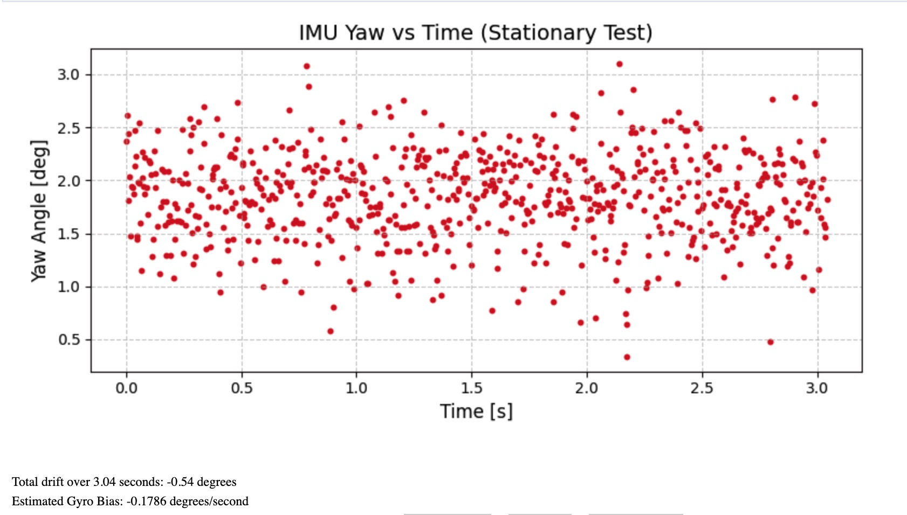
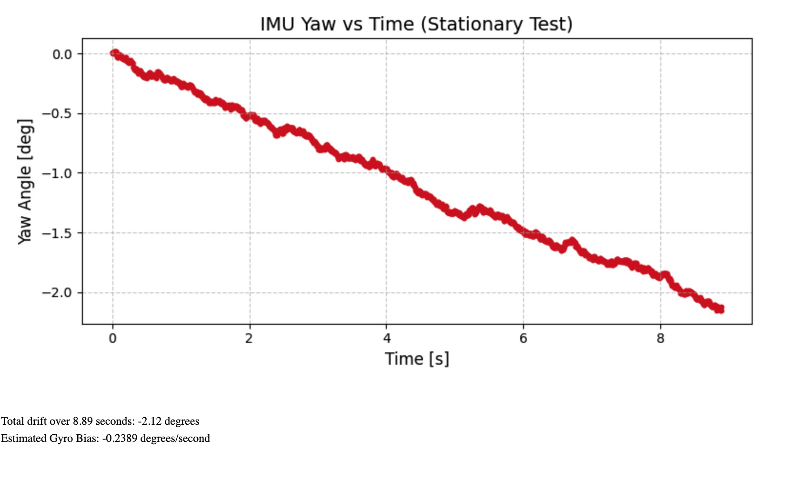
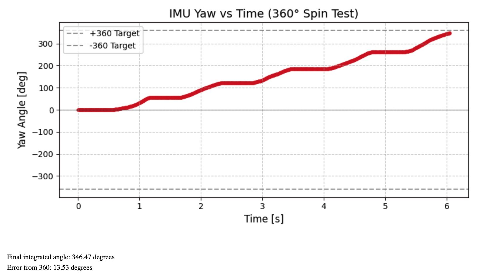
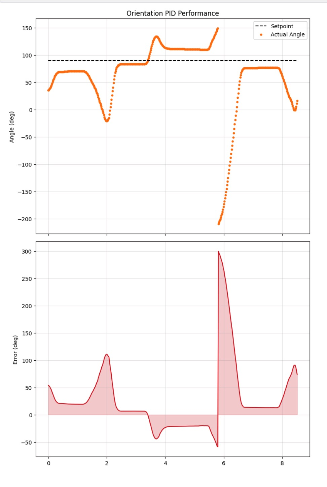
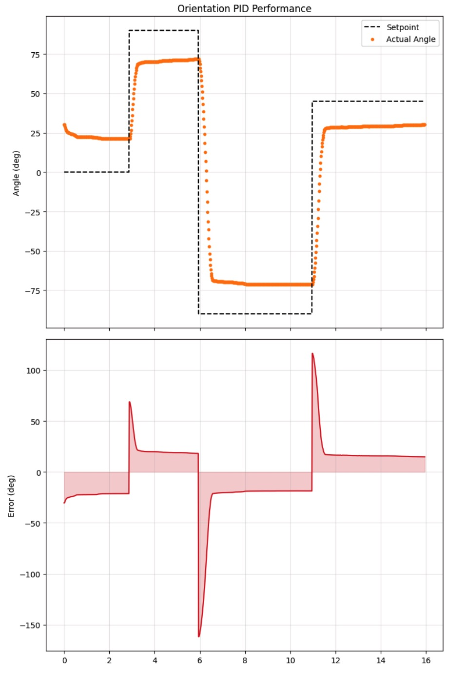
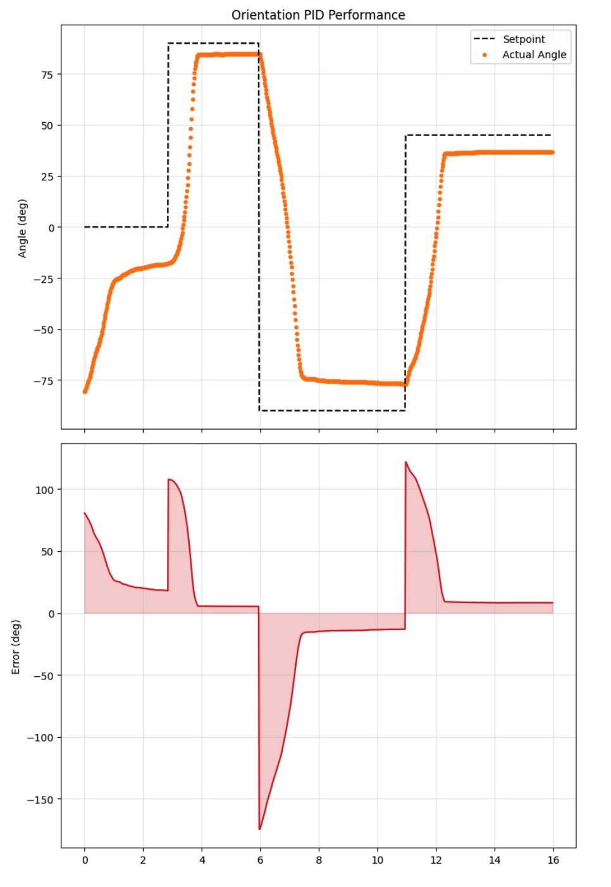

+++
title = "Lab 6: Orientation Control"
date = 2026-03-17
weight = 7
[taxonomies]
tags = ["Robotics", "C++", "Sensors", "Python", "Embedded Software", "Microcontroller" ]
+++

## Objective

The purpose of this lab is to implement a robust PID controller to manage the orientation (yaw) of the robot. This involves utilizing the IMU to perform in-place rotation using differential drive, while mitigating real-world sensor issues like gyroscope drift and derivative kick.

-----

## Prelab: Bluetooth Architecture and Dynamic Setpoints

To allow rapid tuning and mid-run setpoint changes, the Bluetooth handling was designed to be completely non-blocking. This is exactly how I transferred data in Lab 5 using commands. Instead of trapping the robot in a `while` loop during a turn, the main `loop()` continuously cycles through telemetry, sensor reading, and motor updating.

This architecture allowed me to implement a dedicated `UPDATE_YAW_SETPOINT` BLE command.

```cpp
case UPDATE_YAW_SETPOINT: {
    float new_yaw;
    success = robot_cmd.get_next_value(new_yaw);
    if (!success) return;
    
    rotational_setpoint = new_yaw;
    // ... [telemetry logging]
    break;
}
````

This satisfies the requirement to change the setpoint dynamically without halting the system. By passing new floats over Bluetooth, I can command the robot to snap to 90 degrees, and before it even finishes the turn, update the setpoint to -45 degrees seamlessly.

-----

## PID Input Signal and Gyroscope Bias

Initially, standard digital integration of the raw gyroscope data (`gyrZ()`) was tested to estimate orientation. However, a stationary test revealed significant hardware bias and a ton of sensor noise (setting up for the Kalman filter), drifting at approximately -0.24 degrees per second.

<figure>

<figcaption>Yaw value of a stationary IMU sitting flat on the table</figcaption>
</figure>

<figure>

<figcaption>Drift in yaw value of a stationary IMU over time</figcaption>
</figure>

<figure>

<figcaption>Yaw value of the IMU performing a 360-degree turn</figcaption>
</figure>

As you can see from the figures above, the IMU works fairly well measuring yaw when rotating slowly, but this is not the case if the car is spinning at full speed, which incurs a lot of drift. This called the DMP to the rescue.

### The Digital Motion Processor (DMP) Solution

To eliminate this bias, I bypassed manual integration and enabled the ICM-20948's onboard Digital Motion Processor (DMP). By configuring the DMP to output the 6-axis Game Rotation Vector (Quat6) at maximum speed (55Hz), the hardware's sensor fusion algorithm automatically corrects for drift in the background.

```cpp
    // Keep reading until the FIFO queue is completely empty
    while (myICM.status == ICM_20948_Stat_FIFOMoreDataAvail) {
        myICM.readDMPdataFromFIFO(&data);
    }
    // ... [Quaternion to Euler conversion] ...
    yaw_g_state = raw_yaw - yaw_offset; // Zero out relative to start heading
```

To prevent the DMP's internal FIFO queue from overflowing and crashing the sensor, a `while` loop was used to completely drain the queue, ensuring the PID loop always acts on the freshest, completely drift-free quaternion data.

## Proportional Only Tune

Initially, I started Kp at 0.9. Because the orientation ranges from -180 to 180 degrees, I mapped this against the PWM range using the deadband limit of 90 to 255 (a range of 165) that I learned from Lab 4. I then tuned the P value by increasing it slowly. Here is the result of this P-only controller targeting 90 degrees.

<iframe width="450" height="315" src="https://youtube.com/embed/MvP56cXlcOk" allowfullscreen></iframe>
<figcaption>Initial P controller</figcaption>

## The Derivative Term and Anti-Kick

It does not make sense to take the derivative of a signal that is the integral of another signal. Taking the mathematical derivative of the error `(error - prev_error) / dt` just undoes the integration while amplifying digital noise. Furthermore, if the setpoint is suddenly changed (e.g., commanding a turn from 0° to 90° mid-run), the error instantly spikes. Taking the derivative of this sudden step-change results in a near-infinite spike in the D-term, causing the motors to jolt violently.

Because the derivative of a constant setpoint is zero, the derivative of the error is mathematically equal to the negative of the actual rate of change. I bypassed the standard math and fed the raw gyroscope rate (`-myICM.gyrZ()`) directly into the D-term.

```cpp
    // ANTI-DERIVATIVE KICK: Use raw gyro rate instead of (error - prev_error)/dt
    float derivative = -gyro_rate; 
    float D = Kd * derivative;
```

<iframe width="450" height="315" src="https://youtube.com/embed/NCYYelEjF5c" allowfullscreen></iframe>
<figcaption>With a setpoint of 90 degrees, the car reacts to constant external turning</figcaption>

<figure>

<figcaption>Yaw vs. time at 90 degrees with external disturbance</figcaption>
</figure>

## Orientation Control and Tuning

Control relies on differential drive, passing `control_effort` to the left motor and `-control_effort` to the right motor using the calibrated motor functions from Lab 5. During initial testing, I accidentally created a positive feedback loop because turning the robot physically right yielded a negative IMU angle, causing the error to grow rather than shrink. Flipping the motor command signs instantly fixed this.

Here is an example of the error, where before the derivative term could brake the bot, its momentum carried it past the setpoint, resulting in constant spinning.

<iframe width="450" height="315" src="https://youtube.com/embed/aPiQhUuWHdg" allowfullscreen></iframe>
<figcaption> Positive feedback resulting in endless spinning </figcaption>

During tuning, the integral term (**Ki**) was kept at 0 to avoid integrator wind-up at first, as steady-state error is minimal for free-spinning wheels on a smooth floor. I did implement wind-up protection (`constrain(integral_sum, -50.0, 50.0);`), and later, when I noticed persistent small errors between my PD controller and the setpoints, I added the integral term.

I increased the proportional gain (**Kp**) until the robot snapped to the target quickly, then applied the derivative gain (**Kd**) to dampen the resulting oscillations.

  * **Final Kp:** `10.0`
  * **Final Kd:** `0.5`
  * **Final Ki:** `0.5`

### System Response and Results

Below are the results of the tuned PID controller handling consecutive setpoints (0 -\> 90 -\> -90 -\> 45 degrees) where I updated the yaw setpoint every 5 seconds. I tested this on two different surfaces: hard floor vs. carpet.

<iframe width="450" height="315" src="https://youtube.com/embed/xDcn3u4P5s4" allowfullscreen></iframe>
<figcaption>Floor setting</figcaption>
<figure>

<figcaption>Yaw vs. time with setpoint updates on floor</figcaption>
</figure>

<iframe width="450" height="315" src="https://youtube.com/embed/wg8QhRoUuI0" allowfullscreen></iframe>
<figcaption>Carpet setting</figcaption>
<figure>

<figcaption>Yaw vs. time with setpoint updates on carpet</figcaption>
</figure>

## Discussion

When I was tuning the integral terms of the PID controller on the carpet, I observed the situation below:

<iframe width="450" height="315" src="https://youtube.com/embed/zwCbHPWFi0w" allowfullscreen></iframe>
<figcaption>High Pitch Sound on Carpet with No Motion</figcaption>

After some investigation and further testing, I realized this meant the battery was dying and just needed to be charged.

## Collaboration

I referenced Lucca Correia's site for debugging and testing help. ChatGPT was used to help with some website formatting.
