+++
title = "Lab 7: Kalman Filter"
date = 2026-03-23
weight = 6
[taxonomies]
tags = ["Robotics", "C++", "Sensors", "Python", "Embedded Software", "Microcontroller" ]
+++

## Drag and Mass Estimations

To implement a Kalman Filter, we first approximate the open-loop robot system as a first-order system using Newton's second law, factoring in linear drag $d$ and motor input $u$:

$$F = m\ddot{x} = -d\dot{x} + u$$

The dynamics in continuous state-space form ($\dot{x} = Ax + Bu$) with state vector $x = \begin{bmatrix} x \\ \dot{x} \end{bmatrix}$ are:

$$\begin{bmatrix} \dot{x} \\ \ddot{x} \end{bmatrix} = \begin{bmatrix} 0 & 1 \\ 0 & -d/m \end{bmatrix} \begin{bmatrix} x \\ \dot{x} \end{bmatrix} + \begin{bmatrix} 0 \\ 1/m \end{bmatrix} u$$

To extract the lumped parameters $d$ and $m$, I recorded three open-loop step responses at 150 PWM. Single trajectories exhibit non-Gaussian Time-of-Flight (ToF) noise, so I averaged the datasets to create a clean consensus trajectory. Fitting an exponential decay to this average yielded a 70% rise time ($t_{0.7} = 1.05$ s) and steady-state velocity ($V_{ss} = 2.45$ m/s).

Assuming a normalized unit step input ($u = 1$), the parameters are calculated as:

$$d = \frac{u_{ss}}{\dot{x}_{ss}} = \frac{1}{2.45} = 0.408$$

$$m = \frac{-d \cdot t_{0.7}}{\ln(0.3)} = \frac{-0.408 \cdot 1.05}{-1.204} = 0.356$$

Plugging these into our continuous $A$ and $B$ matrices yields:

$$A = \begin{bmatrix} 0 & 1 \\ 0 & -1.146 \end{bmatrix}, \quad B = \begin{bmatrix} 0 \\ 2.809 \end{bmatrix}$$

Because we only measure distance (ToF data) and not velocity, our observation matrix $C$ isolates the first state:

$$C = \begin{bmatrix} 1 & 0 \end{bmatrix}$$

<figure style="display: flex; justify-content: space-around; align-items: flex-start; gap: 10px; width: 100%;">
<div style="flex: 1; text-align: center;">
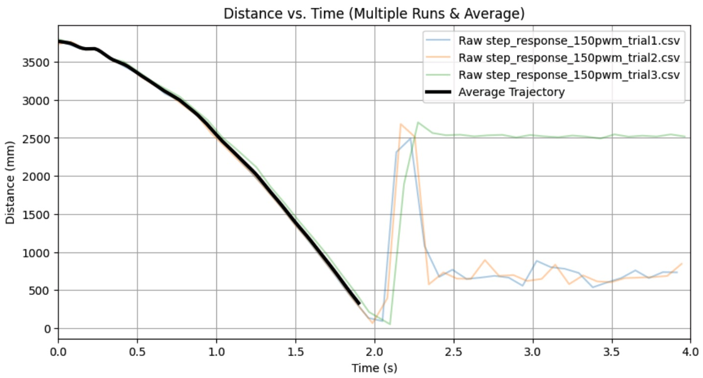
<figcaption style="margin-top: 5px;">Average distance vs time for open loop step response</figcaption>
</div>
<div style="flex: 1; text-align: center;">
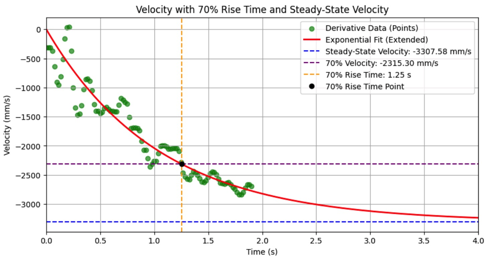
<figcaption style="margin-top: 5px;">Velocity and 70% rise time fit for open loop step response</figcaption>
</div>
<div style="flex: 1; text-align: center;">
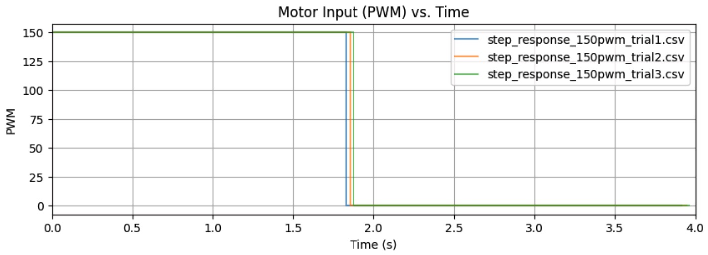
<figcaption style="margin-top: 5px;">PWM graphs for open loop step response</figcaption>
</div>
</figure>

Here is a video of one of the trajectories while I was collecting data for a step response:

<iframe width="450" height="315" src="[https://youtube.com/embed/74Vm-SvuMSU](https://youtube.com/embed/74Vm-SvuMSU)" allowfullscreen></iframe>
<figcaption>Data Collection Video</figcaption>

<figure>
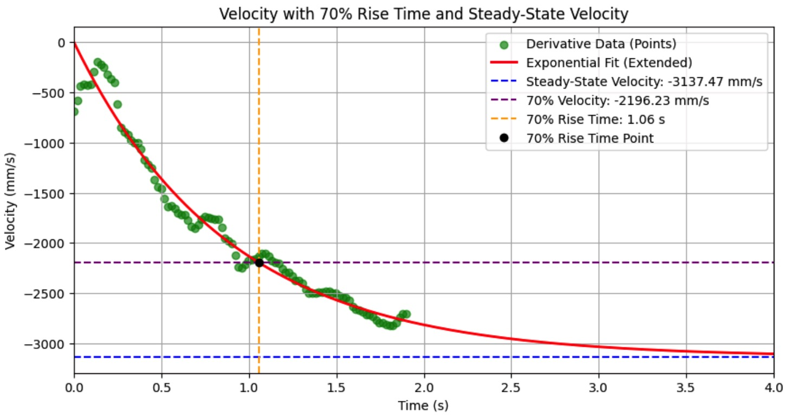
<figcaption>Velocity and 70% rise time fit for a better open loop step response</figcaption>
</figure>

*Note: Subsequent trials with a closer braking distance yielded a slightly higher steady-state velocity, but my filter performed well with the initial dataset, so I proceeded with the originally calculated A and B matrices.*

## Kalman Python Simulation

### System Timing and Discretization

The onboard prediction loop runs at 50 Hz ($\Delta t = 0.0209$ s), while the ToF sensor updates at \~10 Hz ($\Delta t = 0.0985$ s). The continuous model must be discretized using the fast loop interval to prevent the filter from artificially accelerating the physics.

Discretizing with the fast loop $\Delta t = 0.0209$ s via the first-order Taylor expansion ($A_d = I + A\Delta t$ and $B_d = B\Delta t$):

$$A_d = \begin{bmatrix} 1 & 0 \\ 0 & 1 \end{bmatrix} + \begin{bmatrix} 0 & 1 \\ 0 & -1.146 \end{bmatrix}(0.0209) = \begin{bmatrix} 1 & 0.0209 \\ 0 & 0.976 \end{bmatrix}$$

$$B_d = \begin{bmatrix} 0 \\ 2.809 \end{bmatrix}(0.0209) = \begin{bmatrix} 0 \\ 0.0587 \end{bmatrix}$$

If I had incorrectly used the slower Data $\Delta t$ (0.0985 s), the model would simulate nearly 100 milliseconds of acceleration during a 20-millisecond cycle, causing severe velocity overestimation.

```python
import numpy as np

# Discretized Matrices
Ad = np.array([[1.0, 0.0209], [0.0, 0.976]])
Bd = np.array([[0.0], [0.0587]])
C = np.array([[1, 0]])

# Noise Covariances
sig_u = np.array([[10.0**2, 0], [0, 10.0**2]]) 
sig_z = np.array([[20.0**2]])

# Kalman Filter Simulation Function
def kalman_filter(mu, sigma, u, y_meas, has_new_data):
    # Predict Step
    mu_p = Ad.dot(mu) + Bd.dot(u)
    sigma_p = Ad.dot(sigma).dot(Ad.T) + sig_u

    if has_new_data:
        # Update Step
        y_m = y_meas - C.dot(mu_p)
        S = C.dot(sigma_p).dot(C.T) + sig_z
        K = sigma_p.dot(C.T).dot(np.linalg.inv(S))

        mu = mu_p + K.dot(y_m)
        sigma = (np.eye(2) - K.dot(C)).dot(sigma_p)
    else:
        mu = mu_p
        sigma = sigma_p

    return mu, sigma
```

### Simulation Debugging

<figure>

<figcaption>Simulation Attempt 1: Unit Mismatch resulting in apparent zero velocity.</figcaption>
</figure>

**1. Unit Mismatch:** Initially, the $A$ and $B$ matrices predicted velocity in standard SI units (m/s), but the raw data was plotted in mm/s. The accurate prediction of -3.1 m/s appeared as a flat line on a scale of -3000 mm/s. This was resolved by calculating the matrices using millimeters.

<figure>
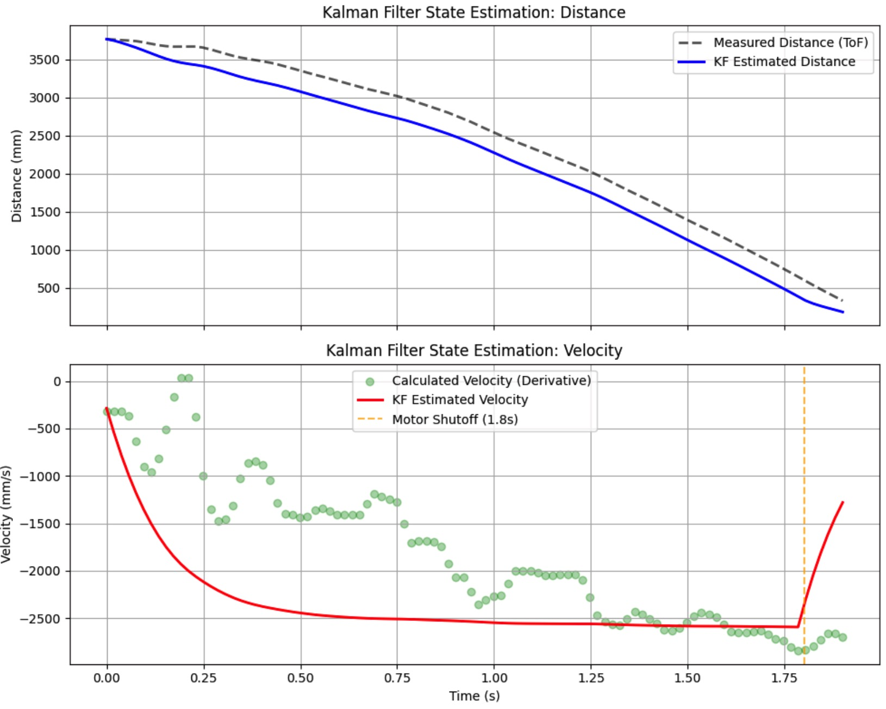
<figcaption>Simulation Attempt 2: Discretization timing mismatch causing extreme acceleration.</figcaption>
</figure>

**2. Discretization Mismatch:** After fixing units, the simulated velocity reached steady-state in 0.25 s instead of the actual 1.06 s. This occurred because $A_d$ and $B_d$ were mistakenly discretized using the 0.1 s ToF rate, but evaluated on a 0.018 s interpolation grid, resulting in a 5x artificial acceleration. Recalculating with the correct $\Delta t = 0.0209$ s resolved this.

### Sensor Noise Characterization and Final Tuning

Stationary tests revealed distance-dependent noise: $\sigma_{start} \approx 19.2$ mm (at 3800 mm) and $\sigma_{target} \approx 1.2$ mm (at 430 mm).

<figure style="display: flex; justify-content: space-around; align-items: flex-start; gap: 10px; width: 100%;">
<div style="flex: 1; text-align: center;">
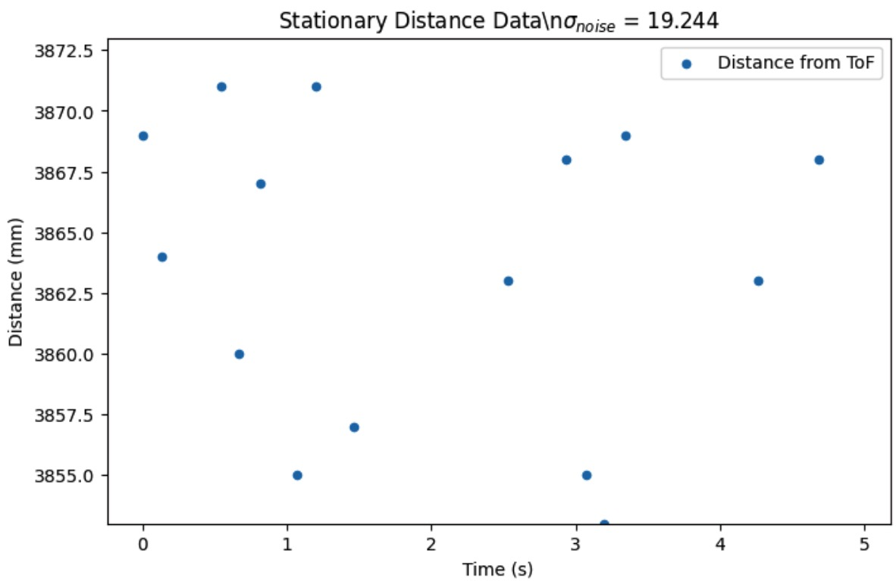
<figcaption style="margin-top: 5px;">Stationary Noise at Start (~3860mm): $sigma = 19.244$ mm</figcaption>
</div>
<div style="flex: 1; text-align: center;">
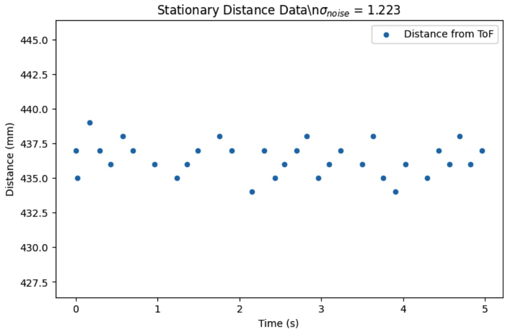
<figcaption style="margin-top: 5px;">Stationary Noise near Target (~430mm): $sigma = 1.223$ mm</figcaption>
</div>
</figure>

To prevent violent derivative kick at high speeds, I tuned the measurement covariance ($\Sigma_z$) for the worst-case scenario.

$$
\Sigma_u = \begin{bmatrix} 100.0 & 0 \\ 0 & 100.0 \end{bmatrix}, \quad \Sigma_z = \begin{bmatrix} 400.0 \end{bmatrix}
$$

The mathematical justification for this decision lies in the Kalman Gain equation:

$$K = \Sigma_p C^T (C \Sigma_p C^T + \Sigma_z)^{-1}$$

By setting $\Sigma_z = 400.0 \gg \Sigma_u = 100.0$, the denominator grows significantly, shrinking the Kalman Gain $K$. According to the state update equation $\mu = \mu_p + K(y - C\mu_p)$, a small $K$ minimizes the impact of noisy sensor residuals. This forces the system to trust the physical prediction ($\mu_p$), allowing the velocity estimate to slice cleanly through the massive noise cloud.

<figure>
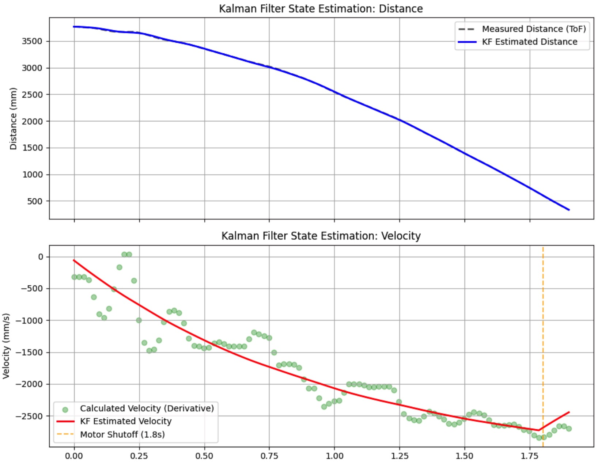
<figcaption>Simulation Attempt 3: Fully tuned Kalman Filter accurately tracking distance and filtering velocity.</figcaption>
</figure>

## Onboard Robot Kalman Integration

The `BasicLinearAlgebra` library was used to port the matrices directly to the Artemis board. The control loop was decoupled from the sensor, executing the prediction step on a strict 50 Hz timer and updating only when the `has_new_data` flag triggered.

```cpp
#include <BasicLinearAlgebra.h>
using namespace BLA;

BLA::Matrix<2,2> Ad = {1.0, 0.0209, 0.0, 0.976}; 
BLA::Matrix<2,1> Bd = {0.0, 0.0587};
BLA::Matrix<1,2> C  = {1.0, 0.0};

BLA::Matrix<2,2> sig_u = {100.0, 0.0, 0.0, 100.0};
BLA::Matrix<1,1> sig_z = {400.0};

BLA::Matrix<2,1> mu = {0.0, 0.0};
BLA::Matrix<2,2> sigma = {10.0, 0.0, 0.0, 10.0};

void update_kalman(bool has_new_data, float measured_distance, float current_pwm) {
    BLA::Matrix<2,1> u = {current_pwm / 150.0f}; // Scale input to unit step
    BLA::Matrix<2,1> mu_p = Ad * mu + Bd * u;
    BLA::Matrix<2,2> sigma_p = Ad * sigma * ~Ad + sig_u;

    if (has_new_data) {
        BLA::Matrix<1,1> y = {measured_distance};
        BLA::Matrix<1,1> S = C * sigma_p * ~C + sig_z;
        BLA::Matrix<1,1> S_inv = S; 
        Invert(S_inv);
        
        BLA::Matrix<2,1> K = sigma_p * ~C * S_inv;
        mu = mu_p + K * (y - C * mu_p);
        sigma = (Eye<2>() - K * C) * sigma_p;
    } else {
        mu = mu_p; sigma = sigma_p;
    }
}
```

```cpp
void executeControl() {
    uint32_t now = micros();
    if (now - last_fast_loop_time >= 20000) { // 50Hz Fast Loop
        last_fast_loop_time = now;

        update_kalman(new_tof_data, dist_k, current_applied_pwm);
        new_tof_data = false;

        float kf_distance = mu(0,0);
        float raw_control_effort = computePID(linear_pid_setpoint, kf_distance);
        int actual_pwm = applyMotorSpeed(raw_control_effort);
        
        current_applied_pwm = actual_pwm; 
    }
}
```

### PID Tuning and Derivative Kick

<figure>
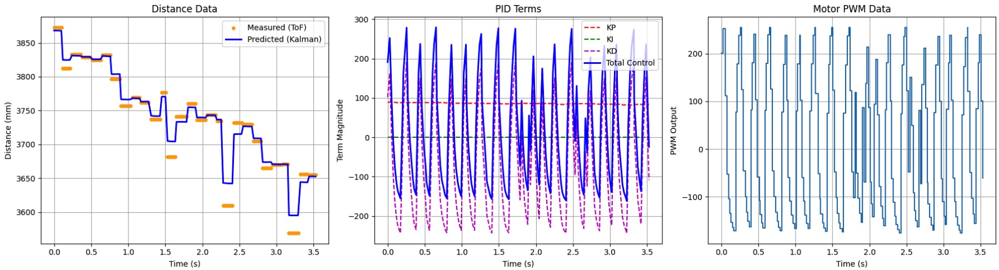
<figcaption>Phase 1: Extreme oscillation caused by Lab 5 derivative gains applied to the fast loop.</figcaption>
</figure>

**Phase 1: Timing Mismatch:** Applying Lab 5 PD gains ($K_p = 0.025$, $K_d = 20000.0$) to the 50 Hz loop caused violent oscillations. This is explained by the discrete derivative math:

$$u_d(t) = K_d \frac{e_k - e_{k-1}}{\Delta t}$$

In Lab 5, $\Delta t \approx 0.098$ s. In Lab 7, $\Delta t \approx 0.020$ s. Reducing $\Delta t$ by a factor of 5 functionally multiplied the derivative kick by 5.

<figure>
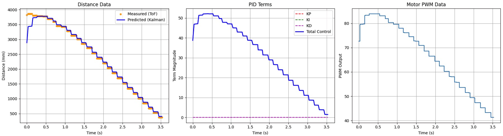
<figcaption>Phase 2: Proportional-only control resulting in a slow approach and failure to stop.</figcaption>
</figure>

**Phase 2: Coasting Baseline:** Disabling the derivative term ($K_d = 0.0$) and using a conservative $K_p = 0.015$ eliminated oscillations. However, lacking a derivative "brake," the robot coasted through the 304 mm target setpoint and crashed.

<figure>
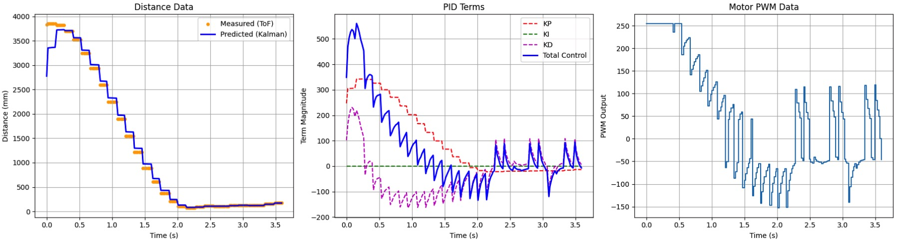
<figcaption>Phase 3: Final tuned response utilizing the Kalman Filter for smooth, aggressive braking.</figcaption>
</figure>

**Phase 3: Kalman Velocity Control:** To resolve the derivative noise without losing braking power, I finalized the control law by directly substituting the Kalman Filter's velocity state ($\mu_1$) for the noisy discrete derivative calculation:

$$u(t) = K_p(x_{target} - \mu_0) - K_d(\mu_1)$$

Because $\mu_1$ is inherently smoothed by the state-space physics model, this eliminates derivative chatter entirely. As the robot approaches the 300 mm mark, the $\mu_1$ term applies a clean, active electronic braking force, bringing the robot to a perfectly controlled stop.

<iframe width="450" height="315" src="[https://youtube.com/embed/HNZxEkrY4M4](https://youtube.com/embed/HNZxEkrY4M4)" allowfullscreen></iframe>
<figcaption>Linear PID Test with Tuned Kalman Filter</figcaption>

## Collaboration

I referred to Jack Long and Aidan McNay's pages for graphing techniques and Kalman Filter C++ architectures. I collaborated with Ananya Jajodia on collecting step response data, and utilized ChatGPT to assist with data visualization and report formatting.