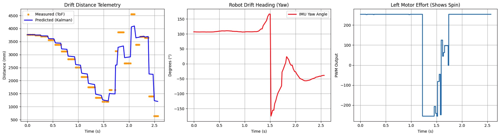

+++
title = "Lab 8: Stunts"
date = 2026-04-06
weight = 5
[taxonomies]
tags = ["Robotics", "C++", "Sensors", "Python", "Embedded Software", "Microcontroller" ]
+++

## Introduction: The Flip to Drift Pipeline

For this lab, I initially tackled Task A: The Flip. While I successfully engineered the state machine to charge the wall and vault the chassis, the run could not be considered perfectly successful because the robot failed to orient itself for the return trip. The flip relies heavily on the lab's sticky pads and added front weight. Due to the difficulty of reliably returning to the start line after the violent maneuver, I ultimately pivoted to Task B: The Drift.

## Part 1: The Flip Attempt

The flip stunt relies on a two-phase state machine that utilizes the Kalman Filter to find the optimal trigger distance, rapidly switching from full forward (255 PWM) to full reverse (-255 PWM) to flip the chassis.

```cpp
if (stunt_state == 0) { 
    actual_pwm = 255; 
    if (kf_distance <= flip_threshold) {
        stunt_state = 1;         
        stunt_timer = millis();  
    }
} 
else if (stunt_state == 1) { 
    actual_pwm = -255; 
    if (millis() - stunt_timer > 2500) {
        run_stunt = false;
        stopMotors();
    }
}
```

<figure style="display: flex; justify-content: space-between; align-items: flex-start; gap: 15px; width: 100%; margin: 0;">
<div style="flex: 1; text-align: center;">
<iframe style="width: 100%; aspect-ratio: 16/9;" src="[https://www.youtube.com/embed/_3aq1grE6aE](https://www.youtube.com/embed/_3aq1grE6aE)" frameborder="0" allowfullscreen></iframe>
<figcaption style="margin-top: 5px; font-size: 0.9em;">Flip Trial 1</figcaption>
</div>
<div style="flex: 1; text-align: center;">
<iframe style="width: 100%; aspect-ratio: 16/9;" src="[https://www.youtube.com/embed/auJoESy14xQ](https://www.youtube.com/embed/auJoESy14xQ)" frameborder="0" allowfullscreen></iframe>
<figcaption style="margin-top: 5px; font-size: 0.9em;">Flip Trial 2</figcaption>
</div>
<div style="flex: 1; text-align: center;">
<iframe style="width: 100%; aspect-ratio: 16/9;" src="[https://www.youtube.com/embed/71280ro7Dq0](https://www.youtube.com/embed/71280ro7Dq0)" frameborder="0" allowfullscreen></iframe>
<figcaption style="margin-top: 5px; font-size: 0.9em;">Flip Trial 3</figcaption>
</div>
</figure>

<figure style="display: flex; justify-content: space-between; align-items: flex-start; gap: 15px; width: 100%; margin: 0;">
<div style="flex: 1; text-align: center;">

<figcaption style="margin-top: 5px; font-size: 0.9em;">Trial 1 Telemetry</figcaption>
</div>
<div style="flex: 1; text-align: center;">

<figcaption style="margin-top: 5px; font-size: 0.9em;">Trial 2 Telemetry</figcaption>
</div>
</figure>

### Flip Analysis

As seen in the videos, the robot successfully and speedily charges the wall, hits the sticky pad, and executes a strong flip. However, once inverted, it fails to orient itself to drive straight back. Looking at the telemetry graphs, the yaw data becomes completely corrupted the moment the physical flip occurs. Because the IMU experiences extreme rotational acceleration, the orientation PID controller receives garbage heading data, causing the erratic PWM spikes seen in the graphs and preventing a clean return trip.

-----

## Part 2: The Drift Implementation

Transitioning to the drift, I initially placed a "fake wall" (a box) at the starting line. Because the robot spins 180 degrees, the front-facing ToF sensor points back at the start line, allowing the Kalman filter to track distance in both directions.

My initial approach used a closed-loop PD controller to execute the 180-degree spin dynamically:

```cpp
float yaw_error = drift_target_yaw - yaw_g_state;
while (yaw_error > 180.0) yaw_error -= 360.0;
while (yaw_error < -180.0) yaw_error += 360.0;

float d_error = (yaw_error - previous_yaw_error) / dt;
previous_yaw_error = yaw_error;

float spin_effort = (drift_Kp_spin * yaw_error) + (drift_Kd_spin * d_error);
spin_effort = constrain(spin_effort, -255.0, 255.0);

left_pwm = -spin_effort;  
right_pwm = spin_effort;  
```

### Failed Closed-Loop Drifts

<figure style="display: flex; justify-content: space-between; align-items: flex-start; gap: 15px; width: 100%; margin: 0;">
<div style="flex: 1; text-align: center;">
<iframe style="width: 100%; aspect-ratio: 16/9;" src="[https://www.youtube.com/embed/PVKqU6e2cDs](https://www.youtube.com/embed/PVKqU6e2cDs)" frameborder="0" allowfullscreen></iframe>
<figcaption style="margin-top: 5px; font-size: 0.9em;">Failed Drift 1</figcaption>
</div>
<div style="flex: 1; text-align: center;">
<iframe style="width: 100%; aspect-ratio: 16/9;" src="[https://www.youtube.com/embed/Zq9pKDQsBf4](https://www.youtube.com/embed/Zq9pKDQsBf4)" frameborder="0" allowfullscreen></iframe>
<figcaption style="margin-top: 5px; font-size: 0.9em;">Failed Drift 2</figcaption>
</div>
</figure>

<figure style="display: flex; justify-content: space-between; align-items: flex-start; gap: 15px; width: 100%; margin: 0;">
<div style="flex: 1; text-align: center;">

<figcaption style="margin-top: 5px; font-size: 0.9em;">Failed Trial 1 Telemetry</figcaption>
</div>
<div style="flex: 1; text-align: center;">

<figcaption style="margin-top: 5px; font-size: 0.9em;">Failed Trial 2 Telemetry</figcaption>
</div>
</figure>

The closed-loop attempts revealed two major failure modes:

1.  **Momentum Carry:** If the robot started spinning before fully arresting its linear momentum, it would slide sideways into the wall, completely throwing off the IMU's perceived yaw.
2.  **Proximity Crashes:** If triggered too late, the wide turning radius of the chassis would clip the wall mid-rotation, resulting in a partial rotation failure.

### The Successful Open-Loop Pivot

After hours of tuning, I realized my left and right motors were highly inconsistent, making a perfectly balanced PD spin incredibly difficult to achieve at high speeds. Due to time constraints, I pivoted to an open-loop sequenced approach: Drive -\> Stop -\> Blind Spin -\> Drive.

<figure style="display: flex; justify-content: space-between; align-items: flex-start; gap: 15px; width: 100%; margin: 0;">
<div style="flex: 1; text-align: center;">
<iframe style="width: 100%; aspect-ratio: 16/9;" src="[https://www.youtube.com/embed/dKT_YRsMmIQ](https://www.youtube.com/embed/dKT_YRsMmIQ)" frameborder="0" allowfullscreen></iframe>
<figcaption style="margin-top: 5px; font-size: 0.9em;">Open Loop Drift 1</figcaption>
</div>
<div style="flex: 1; text-align: center;">
<iframe style="width: 100%; aspect-ratio: 16/9;" src="[https://www.youtube.com/embed/5R7PGEOX3fw](https://www.youtube.com/embed/5R7PGEOX3fw)" frameborder="0" allowfullscreen></iframe>
<figcaption style="margin-top: 5px; font-size: 0.9em;">Open Loop Drift 2</figcaption>
</div>
<div style="flex: 1; text-align: center;">
<iframe style="width: 100%; aspect-ratio: 16/9;" src="[https://www.youtube.com/embed/BBu2gk1pCd8](https://www.youtube.com/embed/BBu2gk1pCd8)" frameborder="0" allowfullscreen></iframe>
<figcaption style="margin-top: 5px; font-size: 0.9em;">Open Loop Drift 3</figcaption>
</div>
</figure>


<figcaption style="text-align: center; margin-top: 5px;">Successful Open-Loop Telemetry</figcaption>

While slower, the open-loop sequence resulted in highly reliable, successful runs. The telemetry graph cleanly shows the initial linear distance drop, a complete physical stop (PWM = 0) allowing momentum to die, a clean open-loop yaw change to \~180 degrees, and a second linear sprint back to the fake wall.


## Blooper Compilation - Enjoy!
<div style="text-align: center; max-width: 600px; margin: 0 auto;">
  <iframe style="width: 100%; aspect-ratio: 16/9;" src="https://www.youtube.com/embed/WsmfVJnj4Uc" frameborder="0" allowfullscreen></iframe>
  <figcaption style="margin-top: 5px;">Fun Blooper Compilation</figcaption>
</div>

## Summary and Challenges

### The Flip

The core challenge of the flip was center-of-mass management. Without enough weight in the front, the robot would just "pop a wheelie" instead of flipping. I had to securely tape steel screws to the front bumper to act as a counterweight. Furthermore, executing the stunt required the high friction of the sticky pad; on standard floors, the tires simply skidded. The most frustrating challenge was the return trip: the violent flip scrambled the IMU, making an orientation-corrected return trajectory nearly impossible.

### The Drift

The primary challenge of the drift was balancing speed with rotation. It is inherently difficult to drive at absolute maximum speed and execute a tight drift simultaneously without sliding out of control. Furthermore, the physical inconsistencies between my left and right motors made high-speed closed-loop PD turning unreliable, forcing me to prioritize consistency via open-loop orchestration over raw speed.

## Collaboration

I collaborated with Ananya Jajodia on the flipping stunt mechanism and weight distribution. I referred to Aidan McNay for Kalman logic on the Flip Stunt, and Jack Long on state machine architecture for the Drift Stunt. Additionally, I utilized ChatGPT to assist with generating the Python Matplotlib plotting code for telemetry debugging.

**Music Attribution:**
The blooper video features the track "APT." by ROSÉ & Bruno Mars. All audio rights belong to The Black Label and Atlantic Records. Used strictly for non-commercial, educational purposes.