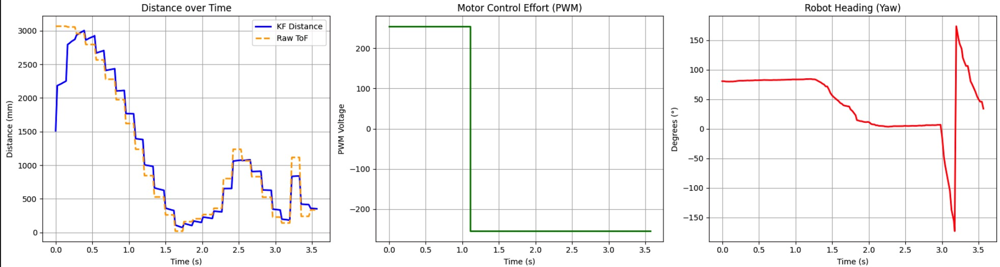
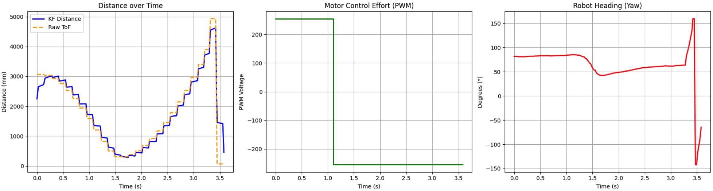
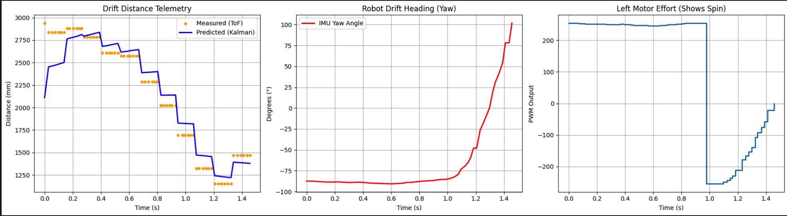
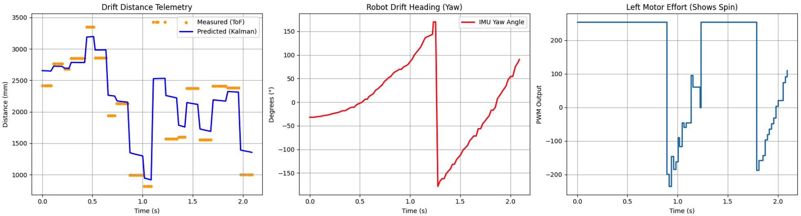

+++
title = "Lab 8: Stunts"
date = 2026-04-06
weight = 5
[taxonomies]
tags = ["Robotics", "C++", "Sensors", "Python", "Embedded Software", "Microcontroller" ]
+++

## Introduction: The Flip to Drift Pipeline

For this lab, I initially tackled Task A: The Flip. While I successfully engineered the state machine to charge the wall and vault the chassis, the run could not be considered perfectly successful because the robot failed to orient itself for the return trip. The flip relies heavily on the lab's sticky pads and added front weight. Due to the difficulty of reliably returning to the start line after the violent maneuver, I ultimately pivoted to Task B: The Drift.

## Part 1: The Flip Attempt

The flip stunt relies on a two-phase state machine. During Phase 0, the robot uses an active proportional heading hold to guarantee it hits the sticky pad perfectly straight. Once the Kalman Filter detects the robot has crossed the flip_threshold, Phase 1 disables the IMU corrections (to prevent erratic motor behavior while flying through the air) and violently throws the motors into full reverse.

Here is the simplified logic driving the maneuver:

```cpp
void executeStunt() {
    if (!run_stunt) return;

    // 1. Run Kalman Filter prediction/update
    update_kalman(new_tof_data, dist_k, current_applied_pwm);
    new_tof_data = false;
    float kf_distance = mu(0,0);
    
    // 2. Evaluate State Machine
    if (stunt_state == 0) { 
        current_applied_pwm = 255; 
        if (kf_distance <= flip_threshold) {
            stunt_state = 1;         
            stunt_timer = millis();  
        }
    } 
    else if (stunt_state == 1) { 
        current_applied_pwm = -255; 
        if (millis() - stunt_timer > 2500) {
            run_stunt = false; 
            stopMotors();
            return;
        }
    }

    // 3. Motor Control & Heading Hold Mechanics
    if (stunt_state == 0) {
        float yaw_error = stunt_target_yaw - yaw_g_state;
        while (yaw_error > 180.0) yaw_error -= 360.0;
        while (yaw_error < -180.0) yaw_error += 360.0;

        float yaw_correction = stunt_Kp_yaw * yaw_error;
        float left_pwm = constrain(255 * left_motor_multiplier - yaw_correction, 0.0, 255.0);
        float right_pwm = constrain(255 * right_motor_multiplier + yaw_correction, 0.0, 255.0);
        
        analogWrite(MOTOR_INL1, left_pwm); analogWrite(MOTOR_INL2, 0);
        analogWrite(MOTOR_INR1, right_pwm); analogWrite(MOTOR_INR2, 0);
    } else {
        analogWrite(MOTOR_INL1, 0); analogWrite(MOTOR_INL2, 255);
        analogWrite(MOTOR_INR1, 0); analogWrite(MOTOR_INR2, 255);
    }
}
```
<div style="text-align: center; max-width: 600px; margin: 0 auto 30px;">
  <iframe style="width: 100%; aspect-ratio: 16/9;" src="https://www.youtube.com/embed/_3aq1grE6aE" frameborder="0" allowfullscreen></iframe>
  <figcaption style="margin-top: 5px;">Flip Trial 1</figcaption>
</div>

<div style="text-align: center; max-width: 600px; margin: 0 auto 30px;">
  <iframe style="width: 100%; aspect-ratio: 16/9;" src="https://www.youtube.com/embed/auJoESy14xQ" frameborder="0" allowfullscreen></iframe>
  <figcaption style="margin-top: 5px;">Flip Trial 2</figcaption>
</div>

<div style="text-align: center; max-width: 600px; margin: 0 auto 30px;">
  <iframe style="width: 100%; aspect-ratio: 16/9;" src="https://www.youtube.com/embed/71280ro7Dq0" frameborder="0" allowfullscreen></iframe>
  <figcaption style="margin-top: 5px;">Flip Trial 3</figcaption>
</div>

<figure style="display: flex; justify-content: space-between; align-items: flex-start; gap: 15px; width: 100%; margin: 0;">
<div style="flex: 1; text-align: center;">

<figcaption style="margin-top: 5px; font-size: 0.9em;">Trial 1 Telemetry</figcaption>
</div>
<div style="flex: 1; text-align: center;">

<figcaption style="margin-top: 5px; font-size: 0.9em;">Trial 2 Telemetry</figcaption>
</div>
</figure>

### Flip Analysis

As seen in the videos, the robot successfully and speedily charges the wall, hits the sticky pad, and executes a strong flip. However, once inverted, it fails to orient itself to drive straight back. Looking at the telemetry graphs, the yaw data becomes completely corrupted the moment the physical flip occurs. Because the IMU experiences extreme rotational acceleration, the orientation PID controller receives garbage heading data, causing the erratic PWM spikes seen in the graphs and preventing a clean return trip.

-----

## Part 2: The Drift Implementation

Beacuse I lost access to the sticky pad, I could not do the flip anymore. Transitioning to the drift, I initially placed a "fake wall" (a box) at the starting line. Because the robot spins 180 degrees, the front-facing ToF sensor points back at the start line, allowing the Kalman filter to track distance in both directions.

My initial approach used a closed-loop PD controller to execute the 180-degree spin dynamically:

```cpp
void executeDrift() {
    if (!run_drift) return;

    // 1. Run Kalman Filter prediction/update
    update_kalman(new_tof_data, dist_k, current_applied_pwm);
    new_tof_data = false;
    float kf_distance = mu(0,0);
    float dt = FAST_LOOP_DT_US / 1000000.0f;

    // 2. Evaluate State Machine
    if (drift_state == 0) { 
        current_applied_pwm = 255; 
        if (kf_distance <= drift_trigger_dist) {
            drift_state = 1;
            previous_yaw_error = drift_target_yaw - yaw_g_state; 
        }
    } 
    else if (drift_state == 1) { 
        current_applied_pwm = 0; 
        float yaw_error = drift_target_yaw - yaw_g_state;
        while (yaw_error > 180.0) yaw_error -= 360.0;
        while (yaw_error < -180.0) yaw_error += 360.0;

        if (abs(yaw_error) < 10.0) {
            drift_state = 2;
            resetPID(); 
            
            analogWrite(MOTOR_INL1, 255); analogWrite(MOTOR_INL2, 255);
            analogWrite(MOTOR_INR1, 255); analogWrite(MOTOR_INR2, 255);
            delay(50); 
        }
    }
    else if (drift_state == 2) {
        current_applied_pwm = 255;
        if (kf_distance <= drift_stop_dist) {
            run_drift = false;
            stopMotors();
            return;
        }
    }

    // 3. Motor Control Mechanics
    float left_pwm = 0;
    float right_pwm = 0;

    if (drift_state == 0 || drift_state == 2) {
        float yaw_error = (drift_state == 0 ? stunt_target_yaw : drift_target_yaw) - yaw_g_state;
        while (yaw_error > 180.0) yaw_error -= 360.0;
        while (yaw_error < -180.0) yaw_error += 360.0;
        
        float yaw_correction = stunt_Kp_yaw * yaw_error;
        left_pwm = constrain(255 * left_motor_multiplier - yaw_correction, 0.0, 255.0);
        right_pwm = constrain(255 * right_motor_multiplier + yaw_correction, 0.0, 255.0);
    } 
    else if (drift_state == 1) {
        float yaw_error = drift_target_yaw - yaw_g_state;
        while (yaw_error > 180.0) yaw_error -= 360.0;
        while (yaw_error < -180.0) yaw_error += 360.0;
        
        float d_error = (yaw_error - previous_yaw_error) / dt;
        previous_yaw_error = yaw_error;
        float spin_effort = (drift_Kp_spin * yaw_error) + (drift_Kd_spin * d_error);

        if (spin_effort > 0 && spin_effort < min_pwm_right) spin_effort = min_pwm_right + 5; 
        else if (spin_effort < 0 && spin_effort > -min_pwm_left) spin_effort = -min_pwm_left - 5;

        spin_effort = constrain(spin_effort, -255.0, 255.0);
        left_pwm = -spin_effort;  
        right_pwm = spin_effort;  
    }

    if (left_pwm >= 0) { analogWrite(MOTOR_INL1, left_pwm); analogWrite(MOTOR_INL2, 0); } 
    else               { analogWrite(MOTOR_INL1, 0); analogWrite(MOTOR_INL2, abs(left_pwm)); }
    
    if (right_pwm >= 0) { analogWrite(MOTOR_INR1, right_pwm); analogWrite(MOTOR_INR2, 0); } 
    else                { analogWrite(MOTOR_INR1, 0); analogWrite(MOTOR_INR2, abs(right_pwm)); }
} 
```

### Failed Closed-Loop Drifts

<div style="text-align: center; max-width: 600px; margin: 0 auto 30px;">
  <iframe style="width: 100%; aspect-ratio: 16/9;" src="https://www.youtube.com/embed/PVKqU6e2cDs" frameborder="0" allowfullscreen></iframe>
  <figcaption style="margin-top: 5px;">Failed Drift 1</figcaption>
</div>

<div style="text-align: center; max-width: 600px; margin: 0 auto 30px;">
  <iframe style="width: 100%; aspect-ratio: 16/9;" src="https://www.youtube.com/embed/Zq9pKDQsBf4" frameborder="0" allowfullscreen></iframe>
  <figcaption style="margin-top: 5px;">Failed Drift 2</figcaption>
</div>

<figure style="display: flex; justify-content: space-between; align-items: flex-start; gap: 15px; width: 100%; margin: 0;">
<div style="flex: 1; text-align: center;">

<figcaption style="margin-top: 5px; font-size: 0.9em;">Failed Trial 1 Telemetry</figcaption>
</div>
<div style="flex: 1; text-align: center;">

<figcaption style="margin-top: 5px; font-size: 0.9em;">Failed Trial 2 Telemetry</figcaption>
</div>
</figure>

The closed-loop attempts revealed two major failure modes:

1.  **Momentum:** If the robot started spinning before fully stopping its linear momentum, it would slide sideways into the wall, completely throwing off the IMU's perceived yaw.
2.  **Proximity:** If triggered too late, the wide turning radius of the chassis would clip the wall mid-rotation, resulting in a partial rotation failure.

### The Successful Open-Loop Pivot

After hours of tuning, I realized my left and right motors were highly inconsistent, making a perfectly balanced PD spin incredibly difficult to achieve at high speeds. Due to time constraints, I pivoted to an open-loop sequenced approach orchestrated directly via Bluetooth Python commands.

```python
# Phase 1: Sprint Forward
print("Enabling motors...")
ble.send_command(CMD.ENABLE_MOTORS, "")
await asyncio.sleep(0.5)

ble.send_command(CMD.CALIBRATE_MOTORS, "1.00|0.75")
ble.send_command(CMD.SET_SPEED, "200")
ble.send_command(CMD.FORWARD, "")
await asyncio.sleep(2.3)

ble.send_command(CMD.STOP, "")
await asyncio.sleep(0.1) # Let linear momentum die

# Phase 2: Blind 180 Spin
ble.send_command(CMD.CALIBRATE_MOTORS, "1.00|1.00")
ble.send_command(CMD.SET_SPEED, "255")
ble.send_command(CMD.LEFT, "")
await asyncio.sleep(1.6)

ble.send_command(CMD.STOP, "")
await asyncio.sleep(0.1) # Let rotational momentum die

# Phase 3: Sprint Return
ble.send_command(CMD.CALIBRATE_MOTORS, "1.00|0.75")
ble.send_command(CMD.SET_SPEED, "200")
ble.send_command(CMD.FORWARD, "")
await asyncio.sleep(2.3)

ble.send_command(CMD.STOP, "")
```

<div style="text-align: center; max-width: 600px; margin: 0 auto 30px;">
  <iframe style="width: 100%; aspect-ratio: 16/9;" src="https://www.youtube.com/embed/dKT_YRsMmIQ" frameborder="0" allowfullscreen></iframe>
  <figcaption style="margin-top: 5px;">Open Loop Drift 1</figcaption>
</div>

<div style="text-align: center; max-width: 600px; margin: 0 auto 30px;">
  <iframe style="width: 100%; aspect-ratio: 16/9;" src="https://www.youtube.com/embed/5R7PGEOX3fw" frameborder="0" allowfullscreen></iframe>
  <figcaption style="margin-top: 5px;">Open Loop Drift 2</figcaption>
</div>

<div style="text-align: center; max-width: 600px; margin: 0 auto 30px;">
  <iframe style="width: 100%; aspect-ratio: 16/9;" src="https://www.youtube.com/embed/BBu2gk1pCd8" frameborder="0" allowfullscreen></iframe>
  <figcaption style="margin-top: 5px;">Open Loop Drift 3</figcaption>
</div>

While slower and less fluid than a continuous closed-loop maneuver, the open-loop sequence resulted in highly reliable, successful runs. As seen in the videos, the robot executes a strong initial linear sprint, comes to a distinct physical stop to kill its forward momentum, and then performs a clean, in-place 180-degree pivot. By allowing the chassis to fully settle between movements, the robot completely avoids the sliding and wall-clipping issues of the dynamic attempts, enabling it to aggressively sprint back to the start line with high repeatability.


## Blooper Compilation - Enjoy!
<div style="text-align: center; max-width: 600px; margin: 0 auto;">
  <iframe style="width: 100%; aspect-ratio: 16/9;" src="https://www.youtube.com/embed/WsmfVJnj4Uc" frameborder="0" allowfullscreen></iframe>
  <figcaption style="margin-top: 5px;">Fun Blooper Compilation</figcaption>
</div>

## Summary and Challenges

### The Flip

The core challenge of the flip was center-of-mass management. Without enough weight in the front, the robot would just "pop a wheelie" instead of flipping. I had to securely tape steel screws to the front bumper to act as a counterweight. Furthermore, executing the stunt required the high friction of the sticky pad; on standard floors, the tires simply skidded. The most frustrating challenge was the return trip: the violent flip scrambled the IMU, making an orientation-corrected return trajectory nearly impossible.

### The Drift

The primary challenge of the drift was balancing speed with rotation. It is inherently difficult to drive at absolute maximum speed and execute a tight drift simultaneously without sliding out of control. Furthermore, the physical inconsistencies between my left and right motors made high-speed closed-loop PD turning unreliable, forcing me to prioritize consistency via open-loop orchestration over raw speed.

## Collaboration

I collaborated with Ananya Jajodia on the flipping stunt mechanism and weight distribution. I referred to Aidan McNay for Kalman logic on the Flip Stunt, and Jack Long on state machine architecture for the Drift Stunt. Additionally, I utilized ChatGPT to assist with generating the Python Matplotlib plotting code for telemetry debugging.

**Music Attribution:**
The blooper video features the track "APT." by ROSÉ & Bruno Mars. All audio rights belong to The Black Label and Atlantic Records. Used strictly for non-commercial, educational purposes.