+++
title = "Lab 9: Mapping"
date = 2026-04-14
weight = 4
[taxonomies]
tags = ["Robotics", "C++", "Sensors", "Python", "Embedded Software", "Microcontroller" ]
+++

## Initial Hardware and Software Challenges

At the start of this lab, I encountered a cascade of system failures lingering from Lab 8. First, after redownloading my IMU library to fix a dependency issue, the DMP (Digital Motion Processor) was accidentally disabled, leaving me without reliable yaw tracking. Concurrently, an accidental reassignment of the ToF sensor's XSHUT pin in my configuration file prevented the sensors from booting entirely. Because troubleshooting these hardware and software bugs consumed a significant portion of my lab time, I collaborated with Ananya Jajodia and utilized her robot to complete a portion of the data collection for this lab.

## Orientation Control Implementation

To begin mapping, I implemented an orientational PID controller utilizing the IMU's DMP. By calculating the error between our target angle and current yaw, the robot could snap to specific orientations.

<iframe width="450" height="315" src="https://youtube.com/embed/qVtZ4U6Ni5k" allowfullscreen></iframe>
<figcaption>Pre-Tuning PID: Shows a decent turn, but with excessive overshoot and oscillation.</figcaption>

<iframe width="450" height="315" src="https://youtube.com/embed/0nv9n97dZTE" allowfullscreen></iframe>
<figcaption>Post-Tuning PID: Decreased P term and increased D term result in a very crisp, reliable turn.</figcaption>

Orientation control proved highly effective for reliable on-axis turns. By commanding the robot through a series of $90^\circ$ turns and driving straight, I tested its odometry by mapping a 2x3 feet rectangular path. The results below show a clean, stable path with minimal rotational drift, validating that the positional PID was well-tuned.

<figure>
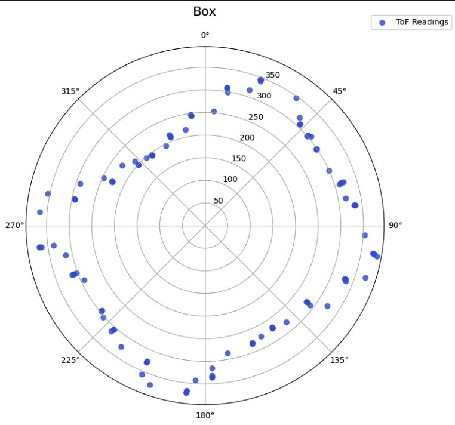
<figcaption>2x3 Feet Rectangle On-Axis Turn Test</figcaption>
</figure>

If we were to execute an on-axis turn in the middle of an empty 4x4 meter room, an angular drift of just $3^\circ$ would translate to a positional error of approximately $2\text{m} \times \tan(3^\circ) \approx 0.1\text{m}$ (10 cm) at the walls. Assuming the drift averages out symmetrically across a full $360^\circ$ sweep, the average mapping error would remain extremely low, while the maximum worst-case error at the corners would peak around 10-15 cm.

### Angular Speed Control (Alternative)

While positional control worked well, I also wrote a continuous angular speed controller to compare mapping methodologies. This logic utilized a low-pass filter on the Gyro's Z-axis to maintain a constant rotational velocity (e.g., $45^\circ/s$). Due to time constraints recovering from the initial hardware bugs, I did not fully implement or tune this on the physical robot, but the architecture is shown below.

```cpp
void runSpeedPID(float target_speed) {
    float current_speed = get_gyro_z_lpf(); 
    float e = target_speed - current_speed;
    
    error_total = constrain(error_total + e, -500, 500);
    
    float p_term = Kp_spd * e;
    float i_term = Ki_spd * error_total;
    int motor_out = (int)(p_term + i_term);
    
    if (motor_out > 0) {
        motor_out = constrain(motor_out, 120, 255);
        setMotors(motor_out, -motor_out);
    } else {
        motor_out = constrain(motor_out, -255, -120);
        setMotors(-motor_out, motor_out);
    }
}
```
Distance Data Collection

To construct the map, I wrote two distinct methods for distance data collection to see which yielded better results.
Method 1: The Quick Scan (360∘)

The first approach was a fast, single-rotation scan using a single ToF sensor. The robot used the positional PID to step in 12∘ increments, rotating a total of 360∘ (30 steps). To prioritize speed, I implemented a tight ±3∘ error tolerance. Once the robot entered this window, it immediately recorded the distance and moved to the next setpoint without explicitly killing the motors.
C++

// --- QUICK SCAN 360 LOGIC ---
while (rot_counter <= 30 && BLE.central().connected()) {
    readIMUFIFO();
    get_roll_pitch_yaw(0); 
    float curr_yaw = yaw_readings[0];

    float e = curr_yaw - target_turn;
    if (e > 180.0) e -= 360.0;
    else if (e < -180.0) e += 360.0;

    // 3-degree error tolerance for fast scanning
    if (abs(e) > 3.0) {
        // Run Positional PID to reach target
        int motor_out = runPID(e); 
        setMotors(motor_out, -motor_out);
    } else {
        // Inside tolerance: immediately sample and move on
        if (distanceSensor1.checkForDataReady()) {
            tof_data[rot_counter] = distanceSensor1.getDistance();
            distanceSensor1.clearInterrupt();
        }
        yaw_data[rot_counter] = curr_yaw;
        
        // Increment target for the next step without fully stopping
        target_turn += 12.0;
        if (target_turn > 180.0) target_turn -= 360.0;
        
        rot_counter++;
    }
}
stopMotors();

While fast, this method occasionally captured noisy data because the chassis was still actively vibrating when the ToF reading was triggered.

<iframe width="450" height="315" src="https://youtube.com/embed/rwoKBCO3qzA" allowfullscreen></iframe>
<figcaption>Robot Scanning Using Method 1</figcaption>

<figure>
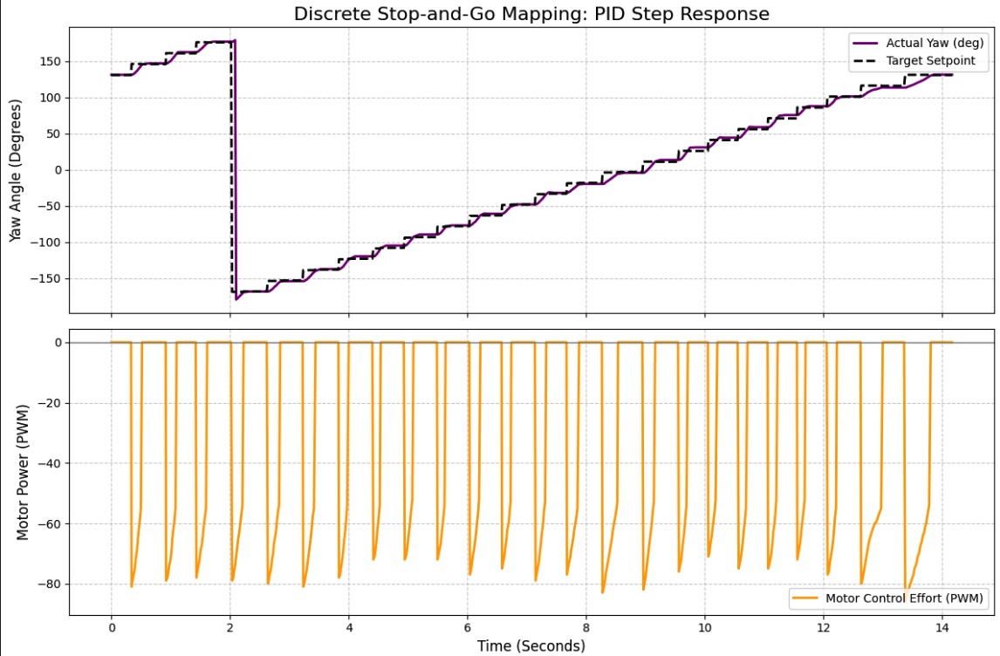
<figcaption>Yaw and Motor PWM telemetry during Method 1 data collection</figcaption>
</figure>

<figure>
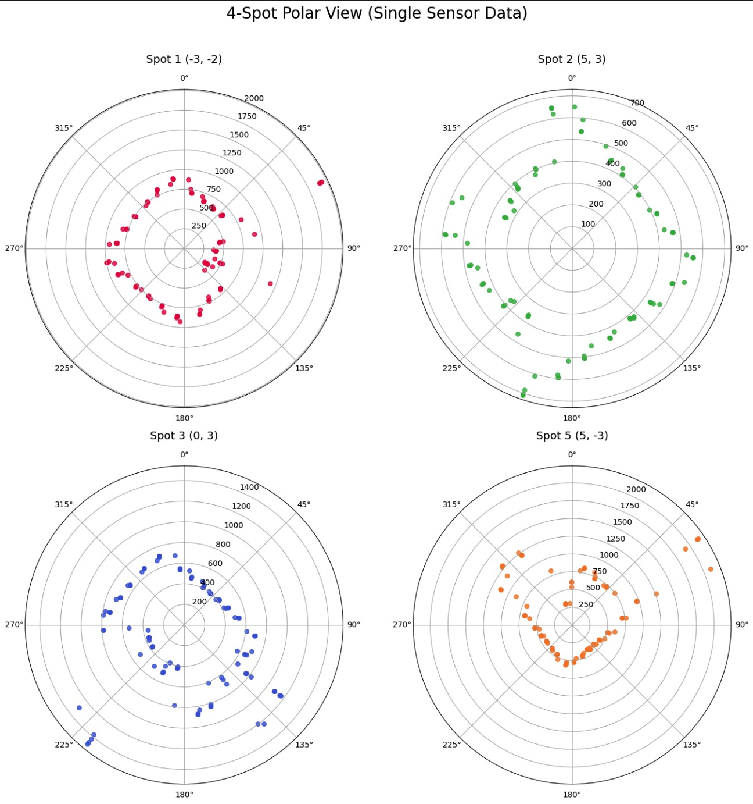
<figcaption>Polar Plot of Method 1 data across 4 primary spots</figcaption>
</figure>
Data Merging and Final Mapping

Because the robot is equipped with two ToF sensors (Front and Side offset by −90∘), I executed the full 720∘ rotation at multiple locations in the arena. I grouped the wrapped angles and took the .median() of the overlapping points to mathematically filter out odometry drift and transient sensor noise.

To convert the raw ToF data into the global arena coordinate system, two transformation matrices were required. First, I accounted for the physical offset of the Front ToF sensor relative to the robot's center of rotation (30mm along the x^ axis).
Tsensor_robot​=​100​010​3001​​

Next, a rotational transformation matrix was applied to convert the robot's local angular yaw coordinate into global x^ and y^​ map coordinates.
Trobot_world​(θ)=​cosθsinθ0​−sinθcosθ0​robot_xrobot_y1​​

<figure>
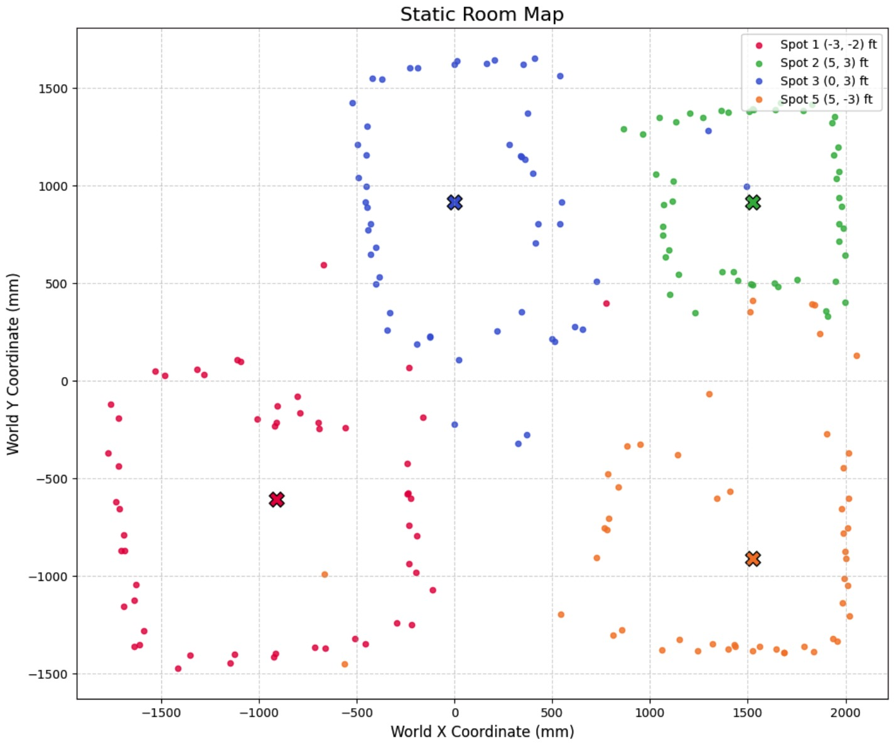
<figcaption>Method 1 Global Map (4 spots, excluding origin)</figcaption>
</figure>

<figure>
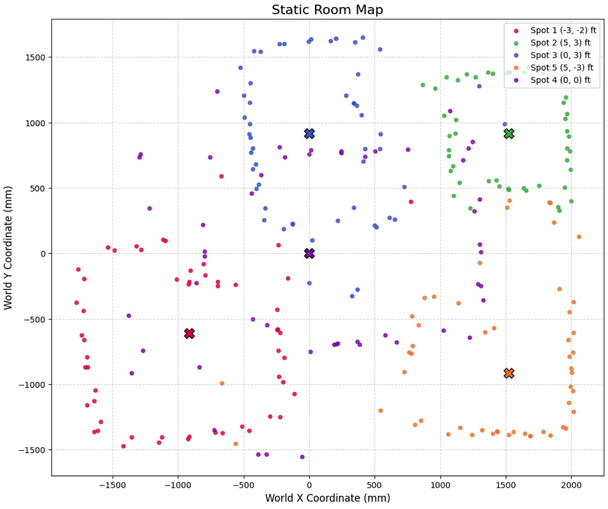
<figcaption>Method 1 Global Map (4 spots + origin point)</figcaption>
</figure>
Hardware Inversions and Angle Correction

When initially applying these matrices, the resulting map was mathematically mirrored across the y=−x diagonal and rotated incorrectly. This distortion occurred due to two physical hardware quirks:

    Z-Axis Inversion: The IMU is mounted with its Z-axis pointing toward the floor. By the right-hand rule, it reads positive values when rotating clockwise. However, standard trigonometry strictly expects counter-clockwise angles to be positive.

    Starting Orientation: The robot began its scans facing the +X axis (0∘), but the base transformation matrix assumed it started facing the +Y axis (90∘).

To fix this globally, I inverted the raw yaw data in Python and locked the target starting angle to 0∘. I also inverted the Side sensor's physical offset to prevent it from projecting backward into the mirrored coordinate space.
Python

# 1. Global Hardware Fix (Z-axis points down)
df['Yaw_deg'] = -df['Yaw_deg']

# 2. Lock starting angle to +X axis (0 degrees)
initial_yaw = df['Yaw_deg'].iloc[0]
yaw_bias = 0.0 - initial_yaw
df['Biased_Yaw_deg'] = df['Yaw_deg'] + yaw_bias

# 3. Apply inverted offset for Sensor 2
base_tof2_offset = 90.0 

Method 2: The Dual-Sensor 720∘ Sweep

To maximize accuracy, I wrote a more robust data collection method that continuously logged PID telemetry at 20Hz while recording discrete map points every two seconds over a full 720∘ rotation. The code checks the status of both ToF sensors and saves their distances alongside the exact current yaw from the IMU, ensuring the transformation matrices are mathematically precise.
C++

// --- 2. RECORD CONTINUOUS TELEMETRY (Every 50ms / 20Hz) ---
if (current_time - last_cont_time >= 50 && cont_idx < MAX_CONT_SAMPLES) {
    time_cont[cont_idx] = current_time;
    yaw_cont[cont_idx] = curr_yaw;
    motor_cont[cont_idx] = motor_out;
    p_cont[cont_idx] = p_term;
    i_cont[cont_idx] = i_term;
    d_cont[cont_idx] = d_term;
    
    cont_idx++;
    last_cont_time = current_time;
}

// --- 3. RECORD DISCRETE ToF DATA & TURN (Every 2000ms / 2s) ---
if (current_time - last_rot_time >= 2000 && disc_idx < MAX_DISC_SAMPLES) {
    // Check Sensor 1
    if (distanceSensor1.checkForDataReady()) {
        tof1_disc[disc_idx] = distanceSensor1.getDistance();
        distanceSensor1.clearInterrupt();
    } else { tof1_disc[disc_idx] = -1; }
    
    // Check Sensor 2
    if (distanceSensor2.checkForDataReady()) {
        tof2_disc[disc_idx] = distanceSensor2.getDistance();
        distanceSensor2.clearInterrupt();
    } else { tof2_disc[disc_idx] = -1; }
    
    time_disc[disc_idx] = current_time;
    yaw_disc[disc_idx] = curr_yaw; // Record exact angle!
    disc_idx++;

    // Set up next 12 degree step
    target_turn += 12.0;
    if (target_turn > 180.0) target_turn -= 360.0;
    
    rot_counter++;
    last_rot_time = current_time;
}

<iframe width="450" height="315" src="https://youtube.com/embed/oM6GScy9wHg" allowfullscreen></iframe>
<figcaption>Robot Scanning Using Method 2</figcaption>

<figure>
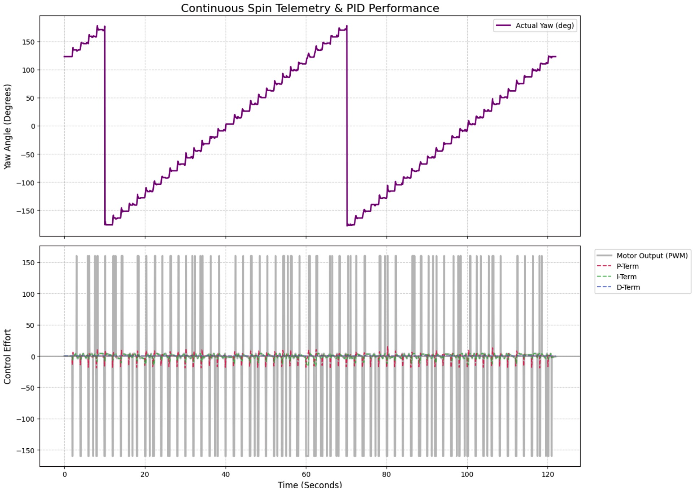
<figcaption>Continuous telemetry from Method 2, detailing motor effort and the P, I, and D components tracking the setpoint.</figcaption>
</figure>

<figure>
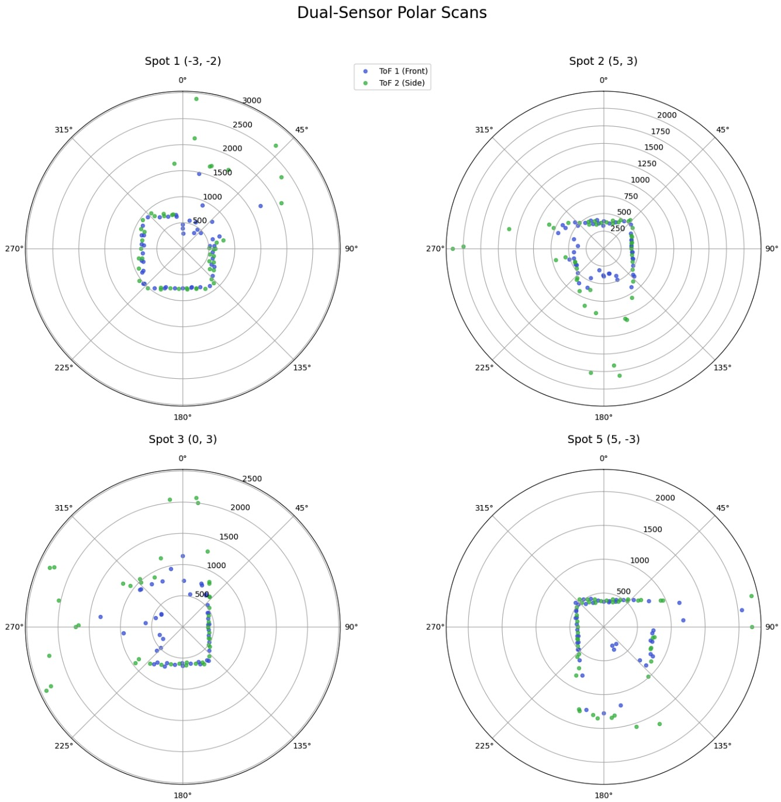
<figcaption>Polar plot overlaying both ToF sensors across the 4 primary locations.</figcaption>
</figure>

<figure>
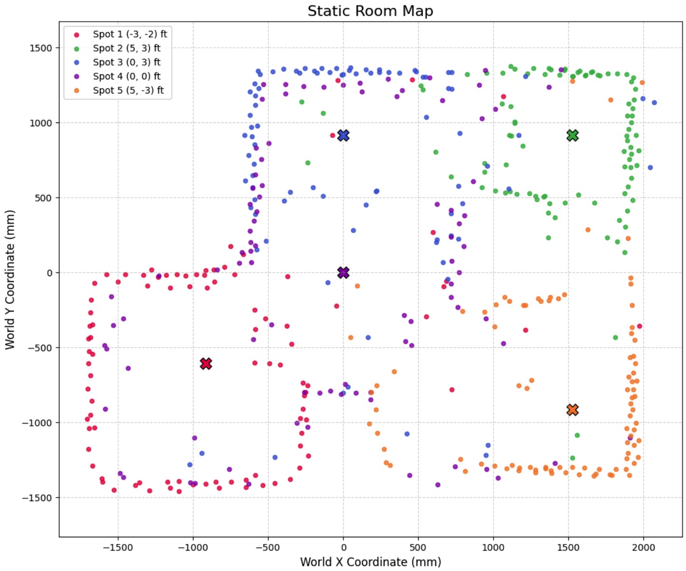
<figcaption>Baseline Cartesian map using Method 2 data (4 spots + origin).</figcaption>
</figure>

<figure>
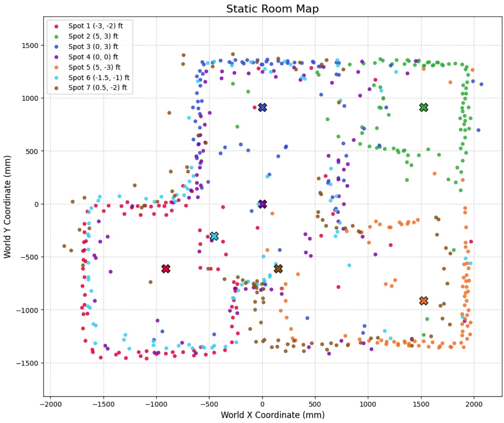
<figcaption>Map including two additional spots at (0.5, -2) and (-1.5, -1). This is the best mapping as it reveals the narrow outlet at the bottom of the arena.</figcaption>
</figure>

<figure>
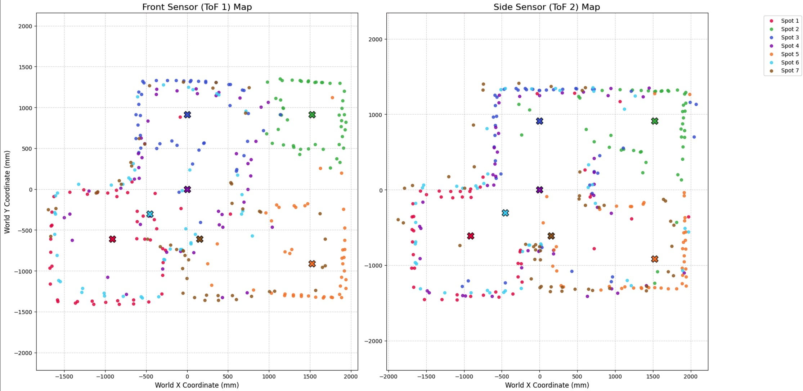
<figcaption>Comparing ToF1 vs ToF2 independently shows the front sensor detected the bottom outlet better, while the side sensor captured the top-left square more cleanly. Combining them yields the optimal result.</figcaption>
</figure>

<figure>
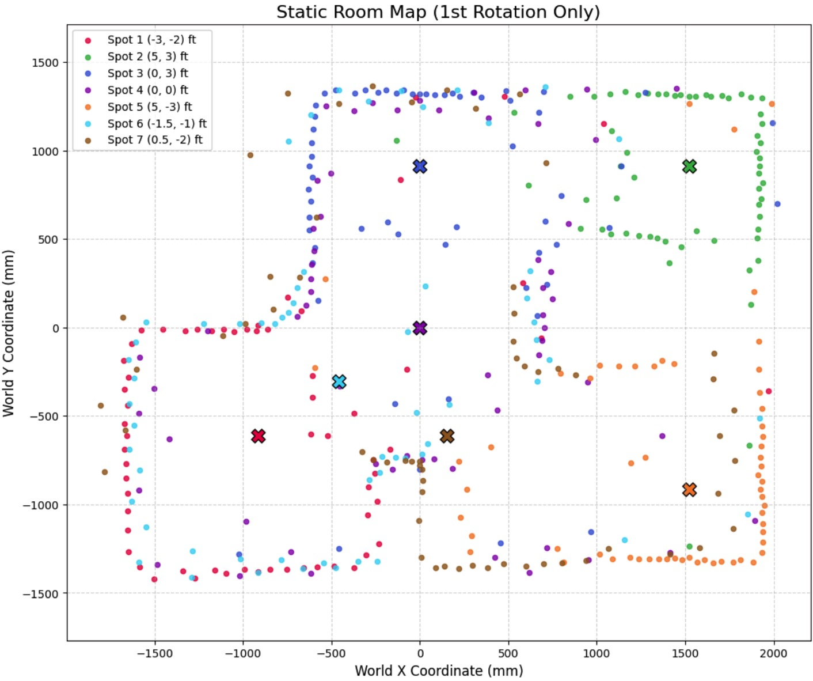
<figcaption>Filtering the dataset to use only the first 360∘ rotation resulted in surprisingly less noise, as it avoided accumulated odometry drift.</figcaption>
</figure>

<figure>
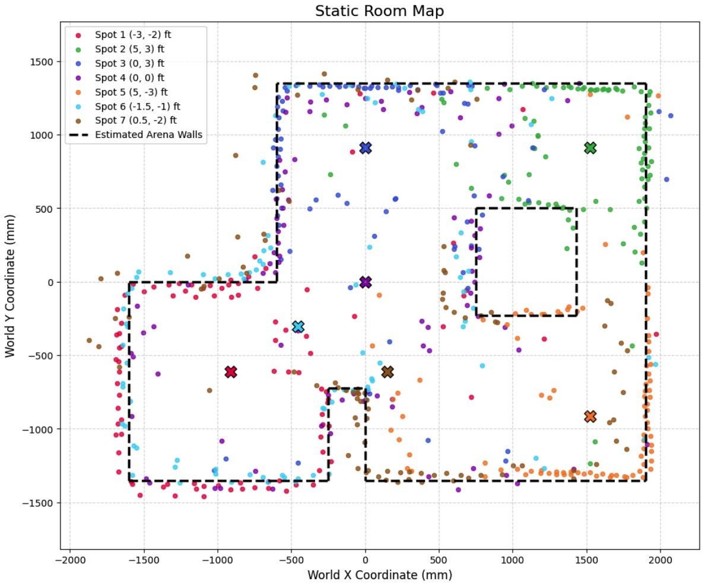
<figcaption>Final comprehensive map with overlaid wall segments derived from our optimal dataset.</figcaption>
</figure>
Collaboration

I collaborated extensively on this project with Ananya Jajodia, and referred to Jack Long and Lucca Correia's site for quality mapping verification. ChatGPT was utilized to assist in formatting Python plotting scripts and organizing graph subplots.
