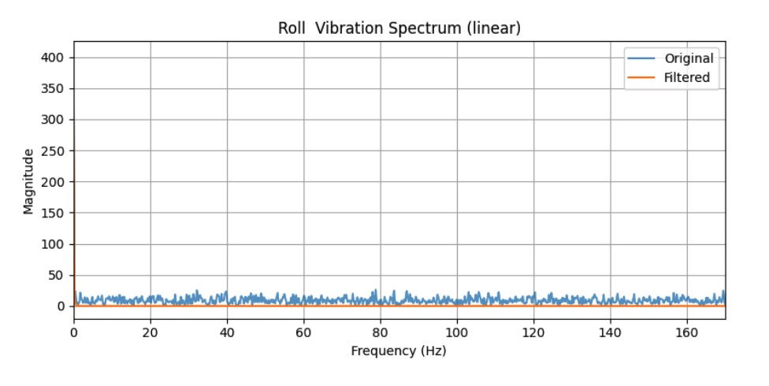
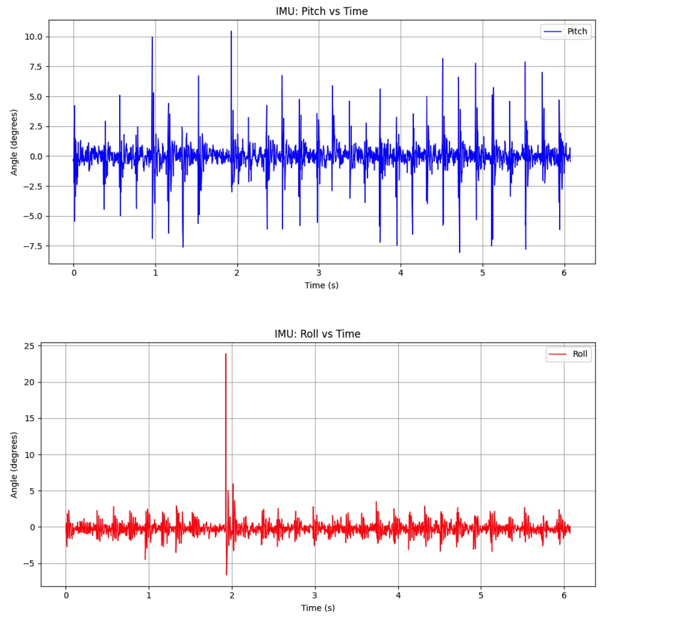
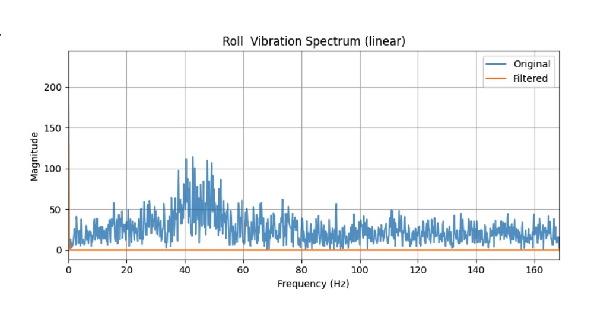
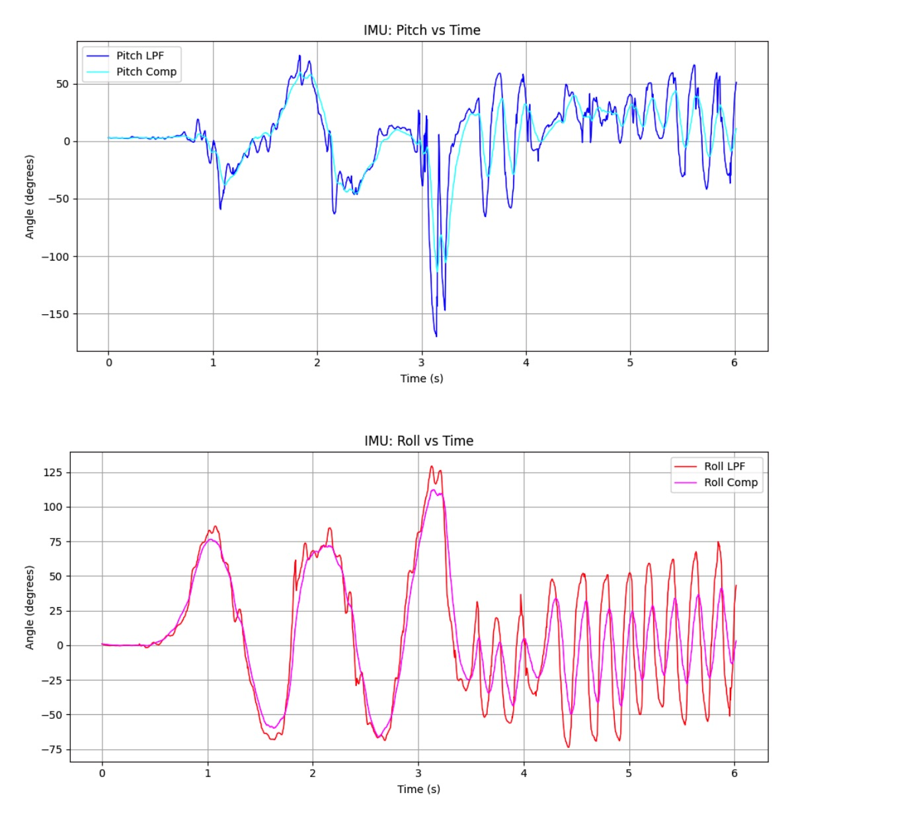

+++
title = "Lab 2: IMU"
date = 2026-02-10
weight = 11
[taxonomies]
tags = ["Robotics", "C++", "Sensors", "Python", "Embedded Software", "Microcontroller" ]
+++

## Overview

In Lab 2, I integrated a 9DOF IMU with the SparkFun RedBoard Artemis Nano, computed orientation estimates from accelerometer and gyroscope data, analyzed accelerometer noise in the frequency domain, implemented a low-pass filter (LPF), and fused accelerometer + gyroscope estimates with a complementary filter. Finally, I powered the RC car from battery and recorded driving “stunts” to establish a baseline for future autonomous behavior.

## IMU Setup

### Hardware connections

I connected the SparkFun ICM-20948 IMU breakout to the Artemis using the QWIIC connectors (I2C). Below image shows this setup. I also added a visual indicator by blinking the Artemis LED 3 times on boot, there is an image for this as well.

<figure>
  
  <figcaption>Artemis + IMU wiring via QWIIC</figcaption>
</figure>

<figure>
  
  <figcaption>Artemis with blue LED indicator</figcaption>
</figure>

### Example code works

I verified basic IMU functionality using the SparkFun library example:

- Library: **SparkFun 9DoF IMU Breakout - ICM 20948 - Arduino Library**
- Example: `Example1_Basics`

I did modify the code in the example slightly in order to get better print and plotter to work nicely. But this didn't impact the actual values, so there is minimum impact. 
I confirmed that acceleration (mg) and gyroscope (DPS) values updated as expected while rotating and translating the board.

<iframe width="450" height="315" src="https://youtube.com/embed/zQG1ElMjfRQ" allowfullscreen></iframe> <figcaption>Example Code IMU Test</figcaption>

### AD0_VAL (what it is + what it should be)

`AD0_VAL` represents the least significant address-selection bit for the IMU’s I2C address (effectively selecting between the two possible I2C addresses depending on the AD0/ADR pin state). In practice:

- If the IMU ADR/AD0 line is left at its default, `AD0_VAL` should match that default.
- If the ADR jumper is bridged/closed, `AD0_VAL` must be changed accordingly.

In my setup, `AD0_VAL = 1` because I am just using the default configuration.

### Initial sensor behavior (what changes and why)

From the example output + calculated roll, pitch and yaw values for both acceleraometer and gyroscope(shown in later videos):

- **Accelerometer:** changes with linear acceleration and also reflects gravity. When the board is still but tilted, the acceleration vector changes because gravity is distributed differently across axes. I also notice that the accelerometer's data is very noisy. This is expected, since accelerometers are highly sensitive to small vibrations, mechanical disturbances, and electrical noise.
- **Gyroscope:** changes with angular velocity. When I rotate about an axis, I see a spike primarily on the corresponding gyro axis; when stationary, gyro values return near zero. For the above example, you can see my gyroscope value stay mostly zero, because my motion is mostly slow, resulting in a small angular velocity being measured.

Another important thing is the parameters chagnes based on the axis being rotated about, so when you rotate about the x-axis, you see that pitch is changed the most compare to the other 2 axis. 

## Accelerometer

### Pitch and roll from acceleration

Using the lecture equations, I converted raw accelerometer readings into pitch and roll (degrees). I used `atan2()` for robust quadrant handling.

```c++
#include <math.h>

pitch_a = atan2(accX, accZ) * 180.0 / M_PI;
roll_a  = atan2(accY, accZ) * 180.0 / M_PI;
```

The video below showcase, how obtained 0, -90 and 90 degrees for the pitch and roll from the accelerometer. 

<iframe width="450" height="315" src="https://youtube.com/embed/uuNqYMH4rGA" allowfullscreen></iframe> <figcaption>Roll and Pitch IMU Test</figcaption>

Specifically, these 5 images below are the static image of me hitting those specific angles. 
As the images indicates, the accuracy of the accelerometer's is pretty decent, as the values are close to their true values, but not super precise. I did using 2 point calibration to attempt make it a bit better. Specifically for pitch, true 0 degree is about 2 degree, true -90 degree is about -88 degree. This is easy to fix. You just need to add 2 degree offset. The roll value is a bit more complicate. Because true 0 degree is roughly -1.5, true -90 degree is about -91, and true 90 degree is about 92 degree. Using slope functions, we get this, where a is the slope, and b is the offset:
```c++
a = (y2 - y1) / (x2 - x1) = 180 / 183 = 0.9836065574
b = y2 - a*x2 = 90 - 0.9836065574*92 = -0.4918032787
```
### Accuracy of the accelerometer
<div style="display:flex; gap:15px; justify-content:center; flex-wrap:wrap;">
  <figure style="margin:0;">
    
    <figcaption>0 degree - both</figcaption>
  </figure>
  <figure style="margin:0;">
    
    <figcaption>pitch 90 degree</figcaption>
  </figure>
  <figure style="margin:0;">
    
    <figcaption>pitch -90 degree</figcaption>
  </figure>
  <figure style="margin:0;">
    
    <figcaption>roll 90 degree</figcaption>
  </figure>
  <figure style="margin:0;">
    
    <figcaption>roll -90 degree</figcaption>
  </figure>
</div>

```c++
  pitch = pitch -2;
  roll = 0.9836066 * roll - 0.4918033;
```


<div style="display:flex; gap:15px; justify-content:center; flex-wrap:wrap;">
  <figure style="margin:0;">
    
    <figcaption>0 degree - pitch</figcaption>
  </figure>
  <figure style="margin:0;">
    
    <figcaption>0 degree - roll</figcaption>
  </figure>
  <figure style="margin:0;">
    
    <figcaption>pitch 90 degree</figcaption>
  </figure>
  <figure style="margin:0;">
    
    <figcaption>pitch -90 degree</figcaption>
  </figure>
  <figure style="margin:0;">
    
    <figcaption>roll 90 degree</figcaption>
  </figure>
  <figure style="margin:0;">
    
    <figcaption>roll -90 degree</figcaption>
  </figure>
</div>

The calibrated result end up looks pretty good for pitch and roll at different critical values. 

### Data from Accelerometer

I made a new command in Artemis code to collect the IMU sensor data with a certain number of samples, in this case 2048 samples, and transmitter them to the python server. Once the data arrives as string, I parse them into separate array by type of data(ie. pitch_a, roll_a, etc.). I then used them to plot graphs for analysis and result purposes. 

```c++
case GET_IMU_READINGS: {
    
              float Micros = 0;
              float pitch = 0;
              float roll = 0;

              if (!success) {
                  return;
              }

              // First, collect all data
              for (int i = 0; i < MAX_SAMPLES; i++) { 
                    while (!myICM.dataReady()) {}
                    myICM.getAGMT();

                    Micros = micros();
                    pitch = atan2(myICM.accX(), myICM.accZ()) * 180 / M_PI; 
                    roll  = atan2(myICM.accY(), myICM.accZ()) * 180 / M_PI; 
                    
                    time_buffer[i] = Micros;
                    roll_buffer[i] = roll;
                    pitch_buffer[i] = pitch;
          }

          // Then, send the collected data
          for (int x = 0; x < MAX_SAMPLES; x++) { 
              tx_estring_value.clear();
              tx_estring_value.append(time_buffer[x]);
              tx_estring_value.append(":");
              tx_estring_value.append(pitch_buffer[x]);
              tx_estring_value.append(":");
              tx_estring_value.append(roll_buffer[x]);
              tx_characteristic_string.writeValue(tx_estring_value.c_str());
          }
          Serial.print("Done");
          break;
          }
```
Then I use a similar notification handler as Lab 1 for reading the data.
```python 
def make_notification_handler(controller):
    def handler(sender: int, byte_array: bytearray):
        try:
            msg = controller.bytearray_to_string(byte_array)
            sep = msg.find(":")
            if sep != -1: 
                times.append(msg[:sep])
                sep2 = msg.find(":", sep+1)
                pitches.append(msg[sep+1:sep2])
                rolls.append(msg[sep2+1:])
        except Exception:
            msg = bytes(byte_array).decode(errors="ignore")
        # Strip common C-string padding / line endings
        msg = msg.strip("\x00\r\n ")
    return handler

    handler = make_notification_handler(ble)
    ble.stop_notify(ble.uuid['RX_STRING'])
    ble.start_notify(ble.uuid['RX_STRING'], handler)
    print("Listening for notifications") 

    ble.send_command(CMD.GET_ACC_READINGS, "") 

```

Here is an example plotting code I used for plotting different graphs.
```python
import pandas as pd
import matplotlib.pyplot as plt

times = [int(t) for t in times]
pitches = [float(p) for p in pitches]
rolls = [float(r) for r in rolls]

pitches = [p-2 for p in pitches]
rolls = [(0.9836066 * r - 0.4918033) for r in rolls]

t_s = (np.array(times) - times[0]) / 1000000.0  # ms -> s, relative to start

plt.figure(figsize=(10,5))
plt.plot(t_s, pitches, label='Pitch', linewidth=1, color='blue')
plt.xlabel('Time (s)')
plt.ylabel('Angle (degrees)')
plt.title('IMU: Pitch vs Time')
plt.legend()
plt.grid(True)
plt.tight_layout()
plt.show()

plt.figure(figsize=(10,5))
plt.plot(t_s, rolls,  label='Roll',  linewidth=1, color='red')
plt.xlabel('Time (s)')
plt.ylabel('Angle (degrees)')
plt.title('IMU: Roll vs Time')
plt.legend()
plt.grid(True)
plt.tight_layout()
plt.show()
```

<figure>
  
  <figcaption>Raw pitch and roll vs. time with RC car in proximity</figcaption>
</figure>

The plots above show raw accelerometer-derived pitch and roll over about 6 seconds. Both signals stay near 0° but exhibit high-frequency oscillations—roughly ±1° for both pitch and roll, indicating sensor noise and vibration from a proximity of the RC car. This raw data is what drives the use of a low-pass filter to reduce noise, which I will analyze in the next section.

### FFT and Low-Pass Filter

I performed FFT analysis to characterize accelerometer noise and chose a cutoff frequency for the low-pass filter. 

## Using the Frequency Spectrum to Choose a Cutoff Frequency

To determine an appropriate cutoff frequency for the low-pass filter, I analyzed the accelerometer-derived pitch and roll signals in the frequency domain using the Fast Fourier Transform (FFT). Before computing the FFT, I subtracted the mean of each signal to remove the dominant DC component caused by gravity, allowing the vibration and noise content to be more clearly observed.

The resulting frequency spectra show that the majority of the signal energy is concentrated at very low frequencies, corresponding to slow changes in orientation. Beyond this region, the spectrum becomes relatively flat and noisy, indicating high-frequency vibrations rather than meaningful motion. When the RC car was running nearby, noticeable energy appeared primarily below approximately **0 - 10 Hz**, with no strong, structured peaks at higher frequencies. 

Based on this observation, I decided to pick a middle value for the a cutoff frequency near **5 Hz** for the low-pass filter. This cutoff preserves the low-frequency components associated with real robot motion while attenuating higher-frequency noise. Choosing a cutoff that is too low would oversmooth the signal and suppress legitimate motion (such as a quick tilt or turn), while choosing a cutoff that is too high would allow excessive vibration noise to remain in the signal.


## Low-Pass Filter Design and Effect on the Data

To implement the low-pass filter, I used a 4th-order Butterworth filter, which provides a smooth passband and strong attenuation beyond the cutoff frequency. The filter was designed using the inferred sampling frequency of the IMU data and applied using a zero-phase `filtfilt` operation to avoid phase distortion.

In the time domain, the effect of the low-pass filter is clearly visible. The raw pitch and roll signals exhibit rapid, high-frequency oscillations on the order of ±1°, even when the sensor remains near a constant orientation. After filtering, these oscillations are significantly reduced, while the overall trend of the signal is preserved. This confirms that the removed components primarily correspond to noise rather than meaningful motion.

The FFT of the filtered signal further validates this choice: frequency components above the cutoff frequency are strongly attenuated, while low-frequency content remains largely unchanged. Together, the frequency-domain and time-domain results demonstrate that the selected cutoff frequency effectively balances noise reduction and signal fidelity.

## Relation to Filter Parameters in Code

The cutoff frequency directly determines the filter coefficients used in the Butterworth design. As explained in lecture too, the cutoff frequency $\( f_c \)$ is related to the time constant $ \( RC \)$  by

$ \[
f_c = \frac{1}{2\pi RC}
\] $

and the smoothing factor $\( \alpha \)$ is related to the sampling period $\( T \)$ by

$\[
\alpha = \frac{T}{T + RC}
\]$

Solving this theorical value, I use this code:
```python
t_array = np.array(times) / 1e6
fs = 1 / np.mean(np.diff(t_array))
T = 1 / fs

fc = 5.0

RC = 1 / (2 * math.pi * fc)
alpha = T / (T + RC)
```
And I get alpha = 0.083869 using the cutoff frequency of 5 Hz.
In practice, rather than explicitly computing $\( \alpha \)$, I implemented the low-pass filter using a digital Butterworth filter, which internally accounts for the sampling frequency and cutoff frequency. This approach provides a more consistent frequency response and better attenuation characteristics than a simple first-order filter.


Below are the frequency-domain plots and raw vs. LPF comparisons.

<figure>
  
  <figcaption>FFT of accelerometer data — car in proximity</figcaption>
</figure>

<figure>
  
  <figcaption>Raw vs. low-pass filtered accelerometer data</figcaption>
</figure>

<div style="display:flex; gap:15px; justify-content:center; flex-wrap:wrap;">
  <figure style="margin:0;">
    
    <figcaption>Pitch: raw vs. LPF</figcaption>
  </figure>
  <figure style="margin:0;">
    
    <figcaption>Roll: raw vs. LPF</figcaption>
  </figure>
</div>

Additional vibration and FFT analysis:

To deliberately induce vibrational noise, I placed the IMU on the lab table and gently tapped the table with my hand. As you might notice, the peaks in the following graphs are vibration noise from those impacts—the accelerometer picks up the mechanical shock as high-frequency spikes in pitch and roll. And these spike are generated just by my finger taps. This setup helps characterize how impulsive disturbances affect the raw signal and how well the low-pass filter attenuates them. And you can see the raw signal contains a lot of the vibration noise, but the low-pass filter is able to smooth them out. 
<figure>
  
  <figcaption>Vibration Pitch and Roll — table taps</figcaption>
</figure>

<figure>
  
  <figcaption>Vibration frequency analysis — table taps</figcaption>
</figure>

<div style="display:flex; gap:15px; justify-content:center; flex-wrap:wrap;">
  <figure style="margin:0;">
    
    <figcaption>Vibration FFT — pitch (table taps)</figcaption>
  </figure>
  <figure style="margin:0;">
    
    <figcaption>Vibration FFT — roll (table taps)</figcaption>
  </figure>
</div>

<figure>
  
  <figcaption>Raw vs. low-pass filtered — table-tap vibration noise</figcaption>
</figure>

<figure>
  
  <figcaption>Pitch and roll — vibration spikes from table taps</figcaption>
</figure>

## Gyroscope

### Pitch, roll, and yaw from gyroscope

I integrated angular velocity (DPS) over time to obtain pitch, roll, and yaw angles from the gyroscope:

```c++
delta = (micros() - curr_time) / 1000000.0;
curr_time = micros();
pitch = pitch + myICM.gyrX() * delta;
roll = roll + myICM.gyrY() * delta;
yaw = yaw  + myICM.gyrZ() * delta;
```

### Gyroscope vs. accelerometer

The gyroscope and accelerometer use different axis conventions on the ICM-20948 as we learned in lecture. The gyro pitch/roll axes correspond to the accel roll/pitch axes (with a sign flip for pitch). So I had to corrected this mapping in code with this code edit:

```c++
float pitch_rate = -myICM.gyrY();
float roll_rate  =  myICM.gyrX();
float yaw_rate   =  myICM.gyrZ();

pitch_g += pitch_rate * dt;
roll_g  += roll_rate  * dt;
yaw_g   += yaw_rate   * dt;
```

<figure>
  
  <figcaption>Gyroscope vs Accelerometer in orientation</figcaption>
</figure>


For the most part, the gyroscope tracks quick rotations smoothly but drifts over time due to integration error. The accelerometer is more accurate at low frequencies but is noisy. A complementary filter would combines both to get stable and accurate orientation. 

Currently, I am at the higest sampling frequency with no delay, I tried to putting `sleep` in the sample data call, which would decrease the sampling frequency. In general, the estimated angles showed increased lag and reduced responsiveness to quick motions, this makes sense, because at larger time steps, you miss the rapid changes, and this made my  high-frequency vibrations to appear as low-frequency drift.

## Complementary Filter

I fused the low-pass filtered accelerometer angles with the integrated gyroscope angles using a complementary filter:

```c++
roll_comp[i]  = (roll_comp[i-1]  + roll_G[i]  * dt) * (1 - alpha) + rollLPF[i]  * alpha;
pitch_comp[i] = (pitch_comp[i-1] + pitch_G[i] * dt) * (1 - alpha) + pitchLPF[i] * alpha;
```

With an alpha (0.05) used for both the LPF and the filter weights the gyroscope for short-term stability and the accelerometer for long-term accuracy, I get something like this: 
```c++
const float alphaLPF  = 0.05f;
const float alphaComp = 0.05f;
```

<figure>
  
  <figcaption>Complementary filter: gyro vs. LPF accelerometer vs. fused</figcaption>
</figure>

However, you could notice that graph of the complementary filter is smooth, but not too accracy or it didn't respond to the change with LPF's graph, so that mean I need to increase the contribution of the LPF of the accelerometer, giving smooth and drift-corrected roll and pitch.
```c++
const float alphaLPF  = 0.10f;
const float alphaComp = 0.05f;
```

<figure>
  
  <figcaption>Best Complementary filter: gyro vs. LPF accelerometer vs. fused</figcaption>
</figure>
Now this looks better! 

### Working range and accuracy

**Working range:** The complementary filter performs well across the typical operating range of pitch and roll—roughly ±90°. Beyond that, for the positi the accelerometer-based angles become ill-defined (e.g., when the board is nearly vertical, the atan2 formulation approaches singularities), and the gyroscope integration accumulates more drift. This was knowledge from microcontroller class.

**Accuracy:** With `alphaComp = 0.05` and `alphaLPF = 0.10`, the fused output tracks the LPF accelerometer really well while staying smoother than the raw accel. The filter accuracy is ultimately limited by the accelerometer (calibration, noise) at low frequencies and by the gyroscope (bias, integration error) at high frequencies. But I think from my graph, it seems to have really good accuracy.


## Sampling Data

### Speed up

I optimized the main loop to sample the IMU as fast as possible:

1. **Non-blocking data collection:** Instead of blocking on `myICM.dataReady()` inside the command handler, I check `dataReady()` in the main loop and call `collectIMU()` only when new data is available. Data is stored in arrays and sent over Bluetooth in a separate command.
2. **Removed debug prints** in the IMU read path to reduce overhead.
3. **Start/stop flags** so recording only runs when requested via Bluetooth commands.

The main loop runs much faster than the IMU produces data, so the IMU is the bottleneck. Comparing `loop_count` (main loop count) to `imu_samples` (samples collected) shows the loop cycles many times per IMU sample.

```c++
void
loop()
{
    // Listen for connections
    BLEDevice central = BLE.central();
    if (central) {
        // While central is connected
        while (central.connected()) {

          loop_count++;   

            // Non-blocking IMU sampling
            if (recordIMU && sample_idx < MAX_SAMPLES) {
              if (myICM.dataReady()) {
                myICM.getAGMT();

                // Timing
                uint32_t now_us = micros();
                float dt = (now_us - t_last_us) / 1e6f;
                t_last_us = now_us;

                // Protect against weird dt (first sample / overflow / etc.)
                if (dt <= 0 || dt > 0.1f) dt = 0.0f;

                // Accel -> pitch/roll (deg)
                float pitch_a = atan2(myICM.accX(), myICM.accZ()) * 180.0f / M_PI;
                float roll_a  = atan2(myICM.accY(), myICM.accZ()) * 180.0f / M_PI;

                // Gyro rates (deg/s) with your axis mapping:
                float pitch_rate = -myICM.gyrY();
                float roll_rate  =  myICM.gyrX();
                float yaw_rate   =  myICM.gyrZ();

                // Initialize persistent states ONCE per recording
                if (!imu_state_initialized) {
                  pitch_g_state = pitch_a;
                  roll_g_state  = roll_a;
                  yaw_g_state   = 0.0f;

                  // pitch_lpf_state = pitch_a;
                  // roll_lpf_state  = roll_a;

                  // pitch_comp_state = pitch_a;
                  // roll_comp_state  = roll_a;

                  imu_state_initialized = true;
                }

                // Integrate gyro angles
                pitch_g_state += pitch_rate * dt;
                roll_g_state  += roll_rate  * dt;
                yaw_g_state   += yaw_rate   * dt;

                // // Low-pass accel angles
                // pitch_lpf_state = alphaLPF * pitch_a + (1.0f - alphaLPF) * pitch_lpf_state;
                // roll_lpf_state  = alphaLPF * roll_a  + (1.0f - alphaLPF) * roll_lpf_state;

                // // Complementary filter (gyro prediction + accel correction)
                // pitch_comp_state = (1.0f - alphaComp) * (pitch_comp_state + pitch_rate * dt) + alphaComp * pitch_lpf_state;
                // roll_comp_state  = (1.0f - alphaComp) * (roll_comp_state  + roll_rate  * dt) + alphaComp * roll_lpf_state;

                // Store into arrays
                int i = sample_idx;
                time_buffer[i]      = now_us;

                pitch_buffer[i]     = pitch_a;          // raw accel angle
                roll_buffer[i]      = roll_a;

                pitchg_buffer[i]    = pitch_g_state;    // integrated gyro angle
                rollg_buffer[i]     = roll_g_state;
                yawg_buffer[i]      = yaw_g_state;

                // pitchLPF_buffer[i]  = pitch_lpf_state;  // filtered accel
                // rollLPF_buffer[i]   = roll_lpf_state;

                // pitchcomp_buffer[i] = pitch_comp_state; // fused
                // rollcomp_buffer[i]  = roll_comp_state;

                sample_idx++;
                imu_samples++;

                // Stats
                dt_last = dt;
                dt_avg = dt_avg + (dt - dt_avg) / imu_samples;         
              }
            }
            // Send data
            write_data();

            // Read data
            read_data();
        }
    }
}
```

Notice I only decided to send time, raw pitch and roll from accelerometer and pitch, roll and yaw from gyroscope, this is because, I could compute the low pass filtered values and complementary values in the python server. This design choice is made to allow me to push through more data as quickly as possible. 

### Data storage

I use separate float arrays for time(this is int), raw accel roll/pitch and gyro roll/pitch/yaw. With 4 bytes per float(6) + delimiting character (5) , that is 44 bytes per sample. In particular, comparing to alternative option, for example representing float or int as string take up more space if the number is more than 4 digits. And this is true for all of our data, therefore, I believe I am using the most efficient way to store these value. 

Lab 2 global variables use 131,832 bytes. The Artemis has 384 kB RAM, leaving roughly 252 kB for dynamic allocation. At 44 bytes per sample, this allows storing about 5700 samples. At ~330 Hz(see below for the calculation) sample rate, that corresponds to roughly 17 seconds of continuous IMU data.

### 5 seconds of IMU data

I collected at least 5 seconds of IMU data and sent it over Bluetooth to verify the pipeline. 
In this section, it both demonstrate I can send at 5 second of IMU data, and showing the stored IMU data array with timestamp with a start and end flag. 

```
ble.send_command(CMD.START_IMU, "") # start flag 
time.sleep(5)
ble.send_command(CMD.STOP_IMU, "") # end flag
time.sleep(0.2)               
ble.send_command(CMD.SEND_IMU, "") # actual method for sending data over BLE
```

Here is the beginning and end of the csv for the data I collected for about 5.1 second. 
<figure>
  
  <figcaption>Beginning of the IMU data collected for 5+ seconds</figcaption>
</figure>
<figure>
  
  <figcaption>End of the IMU data collected for 5+ seconds</figcaption>
</figure>

There is a total of 1663 samples collected in 5 seconds, this gives about 1663/5 = 332.6 Hz for data transfer. 

## RC Stunts

Below are videos of the RC car stunts powered by battery.

<iframe width="450" height="315" src="https://www.youtube.com/embed/FyHCUjPrKYg" allowfullscreen></iframe>
<figcaption>RC car stunt 1</figcaption>

<iframe width="450" height="315" src="https://www.youtube.com/embed/e-gonb3QiyY" allowfullscreen></iframe>
<figcaption>RC car stunt 2</figcaption>

### Collaboration

I collaborated with: Ananya Jajodia.

I referenced: Lucca Correia's site for FFT debugging and Sampling data section.

ChatGPT was used for: code debugging + plot generation + website formatting.